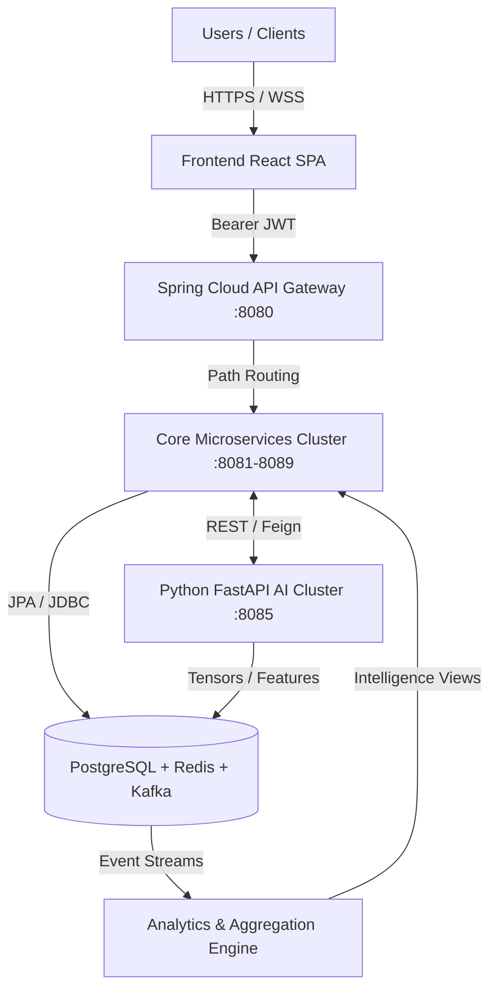

# 🏢 WorkSphere Enterprise: AI-Powered Activity Intelligence Platform

> A full-stack, AI-powered enterprise employee monitoring, analytics, and workstation management system built for MNC-scale organizations (e.g., Zoho, Accenture, Cognizant).


---## 📋 Table of Contents

1. [Project Overview](#1-project-overview)
2. [Comprehensive Monorepo Directory Structure](#2-comprehensive-monorepo-directory-structure)
3. [The 18 Enterprise Roles & Modular Ecosystem](#3-the-18-enterprise-roles--modular-ecosystem)
4. [Technology Stack & Core Architecture](#4-technology-stack--core-architecture)
5. [Enterprise Security & Advanced Features](#5-enterprise-security--advanced-features)
6. [Deployment & Installation Guide](#6-deployment--installation-guide)
7. [Operational Task Guide](#7-operational-task-guide)
8. [Support & System Configuration](#8-support--system-configuration)

---

## 1. 🌐 Project Overview

**WorkSphere Enterprise** (formerly LiveGuard Pro) is a high-performance workstation monitoring agent, productivity analytics platform, and modular role-based command center. Built for zero-latency tracking, unbreakable data integrity, and strict enterprise compliance, it bridges the gap between low-level system events and high-level executive insights.

The platform provides an exhaustive "Single Pane of Glass" operational experience across 18 specialized enterprise departments, combining real-time hardware telemetry, AI-driven productivity scoring, biometric access control, and deep forensic cybersecurity auditing.

---

## 2. 📁 Comprehensive Monorepo Directory Structure

The WorkSphere monorepo follows an advanced, enterprise-grade multi-package architecture. It cleanly separates the low-level desktop monitoring agent, Next.js web portals, Node.js telemetry servers, Spring Boot microservices cluster, Python AI inference engines, React Native mobile clients, and multi-cloud infrastructure manifests.

```text
worksphere-monorepo/
│
├── apps/
│   ├── agent/                                # 🖥️ Core Monitoring Engine (Electron Desktop Agent)
│   │   ├── main.js                           # Kernel-level window telemetry & active app polling
│   │   ├── get_gps.ps1                       # WinRT native hardware geolocation locking script
│   │   ├── package.json                      # Agent dependencies & build configuration
│   │   └── README.md                         # Agent operational & polling configuration guide
│   │
│   ├── dashboard/                            # 📊 Enterprise Analytics & Intelligence Command Center
│   │   ├── web/                              # Next.js 16.2 Web Analytics Portal
│   │   │   ├── src/app/                      # App Router core layouts, pages, and API routes
│   │   │   │   ├── api/                      # Next.js serverless route handlers
│   │   │   │   │   ├── logout/               # JWT session termination endpoint
│   │   │   │   │   └── telemetry/            # Inbound telemetry ingestion webhook
│   │   │   │   ├── components/               # High-fidelity glassmorphic dashboard components
│   │   │   │   │   ├── LiveTrackingMap.tsx   # Leaflet multi-node fleet tracking map
│   │   │   │   │   ├── SystemGuardian.tsx    # Biometric facial capture & geofencing verifier
│   │   │   │   │   └── SystemMonitor.tsx     # Hardware integrity gauges (CPU/RAM/GPU/FPS)
│   │   │   │   ├── page.tsx                  # Main 18-role dynamic dashboard entry point
│   │   │   │   ├── layout.tsx                # Root HTML layout & Next.js providers
│   │   │   │   └── globals.css               # TailwindCSS 4.0 design system tokens & utilities
│   │   │   ├── public/                       # Static web assets, logos, and favicons
│   │   │   ├── next.config.ts                # Turbopack & Webpack externalDir configuration
│   │   │   ├── tsconfig.json                 # TypeScript path aliasing & compiler options
│   │   │   └── package.json                  # Next.js web dependencies & build scripts
│   │   │
│   │   └── backend/                          # 📡 Telemetry Hub & Reporting Server (Node.js/Express)
│   │       ├── server.js                     # Express REST API & WebSocket broadcast hub
│   │       ├── report_engine.js              # jsPDF & html2canvas automated report generator
│   │       ├── simulate_data.js              # Mock telemetry generator for testing environments
│   │       ├── API.md                        # WebSocket event schemas & REST API documentation
│   │       └── package.json                  # Telemetry backend dependencies
│   │
│   └── enterprise-monitoring-system/         # 🏢 Enterprise Microservices & Consolidated Infrastructure
│       ├── ai-services/                      # 🤖 Python FastAPI & PyTorch Deep Learning Cluster
│       │   ├── anomaly_detection/            # Keystroke velocity & firewall packet anomaly models
│       │   ├── behavior_analysis/            # User behavioral profiling & risk scoring
│       │   ├── face_recognition/             # Zero-input biometric facial capture matching
│       │   ├── productivity_prediction/      # Neural network predicting active working efficiency
│       │   ├── recommendation_engine/        # AI-driven workflow optimization recommendations
│       │   ├── report_ai/                    # LLM-assisted executive summary generation
│       │   ├── sentiment_analysis/           # Enterprise communication sentiment scoring
│       │   ├── tracking_analysis/            # Geolocation anomaly & proxy-suppression models
│       │   ├── violence_detection/           # Webcam feed visual workplace safety monitoring
│       │   ├── main.py                       # FastAPI ASGI gateway & PyTorch inference endpoints
│       │   ├── requirements.txt              # Python ML/AI cluster dependencies
│       │   └── Dockerfile                    # Multi-stage containerization for AI inference cluster
│       │
│       ├── backend/                          # ☕ Spring Boot 3 Central Enterprise Hub
│       │   ├── src/main/java/com/company/enterprise/
│       │   │   ├── audit/                    # System audit logging & compliance interceptors
│       │   │   ├── config/                   # Security, Kafka, Redis, WebSocket, & CORS configs
│       │   │   ├── controller/               # REST endpoints for 18 enterprise role departments
│       │   │   ├── dto/                      # Data Transfer Objects & validation schemas
│       │   │   ├── entity/                   # JPA / Hibernate relational database entities
│       │   │   ├── exception/                # Global exception handlers & error responses
│       │   │   ├── kafka/                    # Apache Kafka event producers & consumers
│       │   │   ├── logs/                     # Write-Ahead Logging (WAL) & log stream handlers
│       │   │   ├── mapper/                   # MapStruct DTO-to-Entity conversion mappers
│       │   │   ├── redis/                    # Redis caching & distributed pub/sub handlers
│       │   │   ├── repository/               # Spring Data JPA repositories
│       │   │   ├── scheduler/                # Cron jobs for automated backup & report dispatch
│       │   │   ├── security/                 # JWT filters, CustomUserDetailsService, & RBAC
│       │   │   ├── service/                  # Core business logic & departmental service layers
│       │   │   ├── websocket/                # Spring WebSocket / STOMP real-time handlers
│       │   │   └── EnterpriseApplication.java # Spring Boot main startup application class
│       │   ├── pom.xml                       # Maven dependencies & build configuration
│       │   └── Dockerfile                    # Containerization manifest for Spring Boot hub
│       │
│       ├── microservices/                    # 🕸️ Decoupled 10-Service Spring Boot Cluster
│       │   ├── ai-service/                   # AI inference bridge & orchestration microservice
│       │   ├── analytics-service/            # Real-time productivity & KPI aggregation engine
│       │   ├── auth-service/                 # Centralized JWT authentication & RBAC microservice
│       │   ├── employee-service/             # Employee profile, attendance, & task microservice
│       │   ├── gateway-service/              # Spring Cloud Gateway centralized routing hub
│       │   ├── gps-service/                  # Multi-node fleet tracking & geofencing microservice
│       │   ├── hr-service/                   # Headcount, payroll, & ATS recruitment microservice
│       │   ├── monitoring-service/           # Hardware telemetry & active window ingestion engine
│       │   ├── notification-service/         # Real-time Kafka-to-WebSocket toast alert dispatcher
│       │   └── report-service/               # Automated PDF/Excel forensic report microservice
│       │
│       ├── frontend/                         # 🌐 Consolidated Enterprise Frontend Modular Ecosystem
│       │   ├── dashboards/                   # Departmental view layouts & dynamic view switcher
│       │   │   └── DepartmentView.tsx        # High-order component managing departmental UI state
│       │   ├── models/                       # Global TypeScript interfaces & RBAC definitions
│       │   │   └── types.ts                  # 18 Role Enums, 13 Permissions, & DTO interfaces
│       │   ├── modules/                      # Core enterprise communication & collaboration suite
│       │   │   ├── chat/                     # Real-time encrypted enterprise chat module
│       │   │   ├── meeting/                  # WebRTC video conferencing & screen share module
│       │   │   └── webmail/                  # Secure enterprise webmail & attachment module
│       │   ├── projects/                     # Project management Kanban & burndown components
│       │   │   └── ProjectManager.tsx        # Interactive Kanban boards & sprint tracking
│       │   ├── roles/                        # 18 Dedicated Departmental Command Dashboards
│       │   │   ├── admin/                    # System configuration & user provisioning view
│       │   │   ├── ceo/                      # Executive macro-level revenue & burn dashboard
│       │   │   ├── cto/                      # Engineering velocity & cloud infrastructure view
│       │   │   ├── devops_engineer/          # Kubernetes cluster health & CI/CD pipeline view
│       │   │   ├── employee/                 # Personal attendance & task checklist view
│       │   │   ├── finance_manager/          # Live OPEX/CAPEX budget burn & invoice view
│       │   │   ├── hr_executive/             # Onboarding checklists & grievance ticket view
│       │   │   ├── hr_manager/               # Headcount charts & ATS recruitment funnel view
│       │   │   ├── intern/                   # Learning path progress & mentor feedback view
│       │   │   ├── marketing_manager/        # Campaign ROI tracking & ad spend telemetry view
│       │   │   ├── project_manager/          # Sprint planning & task burndown tracking view
│       │   │   ├── qa_engineer/              # Automated test coverage & bug ticket triage view
│       │   │   ├── sales_manager/            # ARR/MRR quota attainment & deal Kanban view
│       │   │   ├── security_analyst/         # Live telemetry signal stream & malware scan view
│       │   │   ├── software_engineer/        # Git commit velocity & active working hours view
│       │   │   ├── super_admin/              # Global tenant orchestration & RBAC matrix view
│       │   │   ├── support_agent/            # Customer ticket triage & SLA compliance view
│       │   │   └── tech_lead/                # PR review queues & squad engineering velocity view
│       │   ├── src/                          # Shared React components, hooks, services, & utilities
│       │   │   ├── api/                      # Axios interceptors & REST API service clients
│       │   │   ├── app/                      # Redux Toolkit store, rootReducer, & rootSaga
│       │   │   ├── assets/                   # Enterprise icons, images, videos, & typography
│       │   │   ├── auth/                     # Biometric login, MFA, & session timeout components
│       │   │   ├── components/               # Reusable UI library (Buttons, Modals, Charts, Tables)
│       │   │   ├── context/                  # React Context providers for theme & socket state
│       │   │   ├── hooks/                    # Custom React hooks (usePermissions, useTelemetry)
│       │   │   ├── layouts/                  # Role-specific structural layout wrappers
│       │   │   ├── routes/                   # ProtectedRoute, RoleBasedRoute, & PermissionRoute
│       │   │   ├── services/                 # WebSocket, GPS, AI inference, & JWT service helpers
│       │   │   ├── styles/                   # Core CSS modules & Tailwind utility classes
│       │   │   ├── utils/                    # Constants, RBAC validators, formatters, & helpers
│       │   │   ├── websocket/                # WebSocket client connection managers
│       │   │   ├── App.jsx                   # React application root component
│       │   │   └── main.jsx                  # React DOM mounting & provider initialization
│       │   ├── public/                       # Static frontend assets
│       │   ├── package.json                  # Frontend dependencies & workspace package config
│       │   ├── tsconfig.json                 # TypeScript compiler configuration & path aliases
│       │   └── vite.config.js                # Vite bundler configuration
│       │
│       ├── database/                         # 🗄️ Enterprise Relational Schema & Persistence Layer
│       │   ├── schema/                       # PostgreSQL 15 DDL & DML seed scripts
│       │   │   ├── users.sql                 # User credentials & authentication schema
│       │   │   ├── roles.sql                 # 18 Enterprise Role hierarchy definitions
│       │   │   ├── permissions.sql           # 13 Granular RBAC permission definitions
│       │   │   ├── employees.sql             # Employee profiles, departments, & metadata
│       │   │   ├── monitoring.sql            # Hardware active/idle session telemetry logs
│       │   │   ├── tracking.sql              # High-precision GPS coordinates & geofences
│       │   │   ├── reports.sql               # Automated report generation audit history
│       │   │   ├── analytics.sql             # Aggregated productivity & KPI analytics tables
│       │   │   └── seed.sql                  # Complete initial database seed data script
│       │   ├── procedures/                   # Stored procedures for automated KPI aggregation
│       │   ├── triggers/                     # Database triggers for audit logging & alerts
│       │   └── backup/                       # Automated PostgreSQL dump & restore scripts
│       │
│       ├── mobile-app/                       # 📱 Enterprise React Native Mobile Client
│       │   ├── android/                      # Native Android project configuration
│       │   ├── ios/                          # Native iOS project configuration
│       │   ├── src/                          # Mobile app source code
│       │   │   ├── components/               # Native mobile UI components & charts
│       │   │   ├── navigation/               # React Navigation stack & tab navigators
│       │   │   ├── redux/                    # Mobile Redux Toolkit state management
│       │   │   ├── screens/                  # Mobile screens for employee & executive views
│       │   │   └── services/                 # Mobile API client & biometric auth wrappers
│       │   ├── App.tsx                       # React Native root application component
│       │   ├── app.json                      # Expo / React Native app configuration manifest
│       │   ├── index.js                      # Mobile app entry point register
│       │   ├── package.json                  # Mobile dependencies & build scripts
│       │   └── tsconfig.json                 # Mobile TypeScript compiler configuration
│       │
│       ├── deployment/                       # 🌩️ Multi-Cloud Infrastructure as Code (IaC) & CI/CD
│       │   ├── aws/                          # AWS EKS, RDS, & CloudFront deployment manifests
│       │   ├── azure/                        # Azure AKS, SQL Database, & App Service configs
│       │   ├── gcp/                          # Google Cloud GKE, Cloud SQL, & Storage manifests
│       │   ├── kubernetes/                   # StatefulSet, Deployment, Ingress, & Service YAMLs
│       │   ├── terraform/                    # Multi-cloud Terraform modules for provisioning
│       │   └── ci-cd/                        # GitHub Actions & Jenkins automated CI/CD pipelines
│       │
│       ├── docker/                           # 🐳 Local Container Orchestration Suite
│       │   ├── backend/                      # Spring Boot backend Docker configuration
│       │   ├── frontend/                     # Next.js & Vite frontend Docker configuration
│       │   ├── kafka/                        # Apache Kafka & Zookeeper container setup
│       │   ├── monitoring/                   # Prometheus & Grafana monitoring configuration
│       │   ├── nginx/                        # Nginx reverse proxy & SSL termination setup
│       │   ├── postgres/                     # PostgreSQL database container configuration
│       │   ├── redis/                        # Redis distributed cache container configuration
│       │   └── docker-compose.yml            # Complete multi-container orchestration manifest
│       │
│       ├── docs/                             # 📚 Comprehensive Technical Documentation
│       │   └── ARCHITECTURE.md               # 7-Tier architecture, sequence diagrams, & specs
│       │
│       ├── gateway/                          # 🚪 Standalone Gateway Service Configurations
│       ├── nginx/                            # 🌐 Nginx Reverse Proxy & Load Balancer Configs
│       ├── scripts/                          # 📜 Utility & Automation Scripts
│       └── websocket-server/                 # 🔌 Standalone WebSocket Broadcast Server Configs
│
├── Enterprise_Platform_README.docx           # 📄 Comprehensive Executive Summary (Word Document)
├── NEW_PROJECT.md                            # 📘 Detailed Project Architecture & Scaffolding Guide
├── full_project_over_view.md                 # 📙 Exhaustive End-to-End System Overview
└── run_all.bat                               # 🚀 Universal Single-Click Batch Orchestration Launcher
```

---

## 3. 🏢 The 18 Enterprise Roles & Modular Ecosystem

WorkSphere Enterprise implements strict Role-Based Access Control (RBAC) across 18 distinct organizational roles. Each role is equipped with a tailored, glassmorphic command dashboard built to monitor specific departmental KPIs, workflows, and telemetry streams.

| Role | Primary Responsibility & Dashboard Focus | Key Telemetry / Feature Integration |
| :--- | :--- | :--- |
| **`SUPER_ADMIN`** | Platform orchestration, tenant management, global RBAC permissions matrix. | Full system audit logs, tenant resource allocation, global security overrides. |
| **`ADMIN`** | System configuration, user provisioning, global IT infrastructure monitoring. | Hardware node discovery, active session management, biometric override logs. |
| **`CEO`** | Executive strategic oversight, company-wide revenue & productivity health. | Executive Privacy Shield exemption, macro-level revenue burn, global headcount KPIs. |
| **`CTO`** | Engineering velocity, enterprise architecture health, cloud infrastructure burn. | Git commit velocity, CI/CD deployment frequency, cloud server cost telemetry. |
| **`HR_MANAGER`** | Enterprise headcount telemetry, payroll disbursement verification, ATS recruitment pipeline. | Attendance check-in/out logs, leave distribution charts, ATS funnel conversion rates. |
| **`HR_EXECUTIVE`** | Employee onboarding, daily attendance verification, grievance ticket resolution. | Daily check-in compliance, employee onboarding checklists, active grievance tracker. |
| **`FINANCE_MANAGER`** | Departmental budget burn, invoice processing, OPEX/CAPEX real-time monitoring. | Live budget vs. spent charts, pending invoice approvals, payroll disbursement logs. |
| **`MARKETING_MANAGER`** | Campaign ROI tracking, lead generation funnels, ad spend budget allocation. | Live ad spend telemetry, MQL/SQL conversion funnels, campaign performance charts. |
| **`SALES_MANAGER`** | Sales pipeline velocity, ARR/MRR quota attainment, regional deal closing tracking. | Deal stage Kanban boards, sales rep quota tracking, regional revenue heatmaps. |
| **`PROJECT_MANAGER`** | Sprint planning, task burndown tracking, team resource allocation. | Interactive Kanban boards, sprint burndown charts, team productivity scoring. |
| **`TECH_LEAD`** | Code review queue management, git commit tracking, squad engineering velocity. | GitHub PR review tables, daily commit vs. LOC velocity charts, SonarQube audit triggers. |
| **`DEVOPS_ENGINEER`** | CI/CD pipeline monitoring, Kubernetes cluster health, cloud server uptime. | Live pod status tables, server CPU/RAM pressure gauges, automated deployment logs. |
| **`QA_ENGINEER`** | Automated test coverage tracking, bug ticket triage, release candidate verification. | Test suite pass/fail ratios, active bug tracking tables, Cypress/Selenium execution logs. |
| **`SOFTWARE_ENGINEER`** | Personal sprint task checklists, git commit velocity, active working hours logging. | Personal Kanban board, daily commit & LOC charts, hardware active/idle telemetry. |
| **`SECURITY_ANALYST`** | Real-time threat detection, deep-kernel malware scanning, firewall anomaly alerts. | Live telemetry signal stream console, auto-rectification logs, IP anomaly heatmaps. |
| **`SUPPORT_AGENT`** | Customer ticket resolution, SLA compliance tracking, live chat queue management. | Active ticket triage tables, average resolution time (ART) gauges, CSAT score tracking. |
| **`EMPLOYEE`** | Daily attendance clock-in, personal productivity scoring, task checklist management. | Biometric attendance verification, active working hours logs, assigned task view. |
| **`INTERN`** | Learning path progress tracking, mentor feedback review, assigned task completion. | Onboarding milestone checklists, mentor evaluation scores, daily learning task view. |

---

## 4. 🛠️ Technology Stack & Core Architecture

### **1. Core Monitoring Engine (Desktop Agent)**
* **Electron & Node.js**: Provides a robust, cross-platform runtime for background execution.
* **Kernel-Level Tracking**: Utilizes native window telemetry for active application tracking across Windows, macOS, and Linux.
* **High-Frequency Sampling**: Polling intervals optimized for sub-500ms detection of browser tab switches and application transitions.
* **Persistent JSONL Storage**: Implements a write-ahead logging (WAL) style storage using JSON Lines (`activity_log.jsonl`) to ensure zero data loss during system crashes.

### **2. Intelligence Analytics Portal (Next.js & Vite Frontend)**
* **React 18 & Next.js 16.2 (App Router)**: Leveraging advanced React server/client components and Turbopack/Webpack external directory compilation (`experimental.externalDir`).
* **TailwindCSS 4.0**: High-fidelity, glassmorphic UI design system featuring deep dark mode support, vibrant accents, and responsive grid layouts.
* **Recharts Engine**: Dynamic, interactive charting for real-time productivity metrics, sprint burndown charts, and resource allocation pies.
* **Advanced Export Suite**: Precision-engineered PDF generation using `jsPDF` and `html2canvas` for audit-ready executive reports.

### **3. Telemetry Hub & Enterprise Backend**
* **Spring Boot 3 & Node.js (Express)**: Dual-engine backend architecture providing robust REST APIs and high-speed data ingestion.
* **Socket.io & WebSockets**: Bi-directional, real-time communication broadcasting live GPS coordinates, system metrics, and security threats to connected dashboards.
* **PostgreSQL 15 & Redis 7**: Enterprise persistence layer combined with ultra-fast in-memory caching for session management and active node discovery.
* **Python FastAPI & PyTorch**: AI microservice executing deep learning models for anomaly detection, keystroke velocity analysis, and productivity scoring.

---

## 5. 🛡️ Enterprise Security & Advanced Features

### **1. Biometric Access Control & Geolocation Verification**
* **Mandatory Facial Capture**: Replaces traditional password entry with a secure, zero-input biometric facial recognition login flow.
* **Location Geofencing**: Verifies employee physical coordinates against authorized corporate geofences before granting workstation access.

### **2. Cybersecurity & Malware Auto-Rectification**
* **Deep-Kernel Malware Scan**: Scans active process signatures and high-risk file paths for viruses, Trojans, miners, and exploits.
* **Automatic Quarantining**: Identified threats are instantly isolated, terminated, and logged as "RECTIFIED" within the Security Analyst command center.
* **Live Signal Stream Console**: A millisecond-precision terminal console rendering raw inbound telemetry packets and firewall events.

### **3. Multi-User Fleet Intelligence & GPS Tracking**
* **Real-Time Map Synchronization**: High-fidelity Leaflet map tracking concurrent fleet nodes via hardware-exclusive GPS sensors.
* **Signal Integrity Engine**: Suppresses unreliable IP proxy data, enforcing strict reliance on WinRT hardware positioning locks.
* **Active Node Discovery**: Automatically populates the fleet sidebar with all currently online employee workstations.

### **4. Hardware Integrity & Resource Gauges**
* **GPU & CPU Telemetry**: Live monitoring of Dedicated vs. Integrated graphics VRAM, processor temperatures, RAM pressure, and network bandwidth.
* **FPS & Lag Detection**: Real-time workstation performance auditing to ensure smooth application execution.

---

## 6. 🚀 Deployment & Installation Guide

### **1. Prerequisites**
* **Node.js**: v18.17.0+ (LTS Recommended)
* **Git**: Version control client
* **Python**: v3.10+ (For AI microservices)
* **OS**: Windows 10/11 (Native tracking optimized for Windows WinRT APIs)

### **2. Monorepo Setup Instructions**

Clone the repository and install dependencies across the modular workspace:

```powershell
# 1. Install Desktop Agent Environment
cd apps/agent
npm install

# 2. Install Next.js Web Analytics Portal
cd ../dashboard/web
npm install

# 3. Install Backend Telemetry Hub
cd ../backend
npm install
```

### **3. Universal System Launcher**

Use the provided universal batch orchestration script for a seamless, one-click startup experience:

```powershell
.\run_all.bat
```

This script automatically initializes the Node.js telemetry server, launches the Electron desktop monitoring agent in the background, and spins up the Next.js analytics dashboard at `http://localhost:3005`.

---

## 7. 📑 Operational Task Guide

### **Task A: Role-Based Dashboard Navigation**
1. Open the analytics portal at `http://localhost:3005`.
2. Complete the biometric facial scan authentication flow.
3. Use the **Enterprise Role Switcher** in the top navigation bar to seamlessly transition between departmental portals (e.g., switching from `CEO` view to `Tech Lead` or `HR Manager`).
4. Explore tailored widgets, Kanban boards, and financial metrics specific to the active role.

### **Task B: Live Fleet Surveillance**
1. Navigate to the **Live Tracking** tab in the Sidebar.
2. Verify the **Active Node Count** in the header summary card.
3. Click on any employee node in the **Fleet Intelligence** sidebar to instantly center the map on their verified hardware coordinates.
4. Toggle between Satellite and Street view layers for tactical geographic visibility.

### **Task C: Full System Security Audit**
1. Select the **System Audit** tab.
2. Click **"Run Full Audit"** to initiate the multi-stage heuristic malware scan.
3. Monitor the **Live Telemetry Signal Stream** (Terminal console) at the bottom of the screen to observe raw sensor data pulses.
4. If a threat is detected, observe the automated toast alert as the system executes the **Automatic Rectification** protocol to quarantine the file.

### **Task D: Exporting Evidence-Grade Reports**
1. Navigate to the **Reports** tab.
2. Click **Export Audit Logs (PDF)**.
3. The generated forensic document includes full system diagnostics, attendance compliance tables, and a complete log of rectified malware threats.

---

## 8. 🛡️ Support & System Configuration

For advanced architectural configuration:
* **Telemetry Endpoints**: Refer to `apps/dashboard/backend/API.md` for WebSocket event schemas and REST payload structures.
* **Agent Polling Intervals**: Modify `apps/agent/main.js` to adjust kernel sampling frequencies.
* **RBAC Permissions Matrix**: Update `apps/new_project/models/types.ts` to configure custom access control rules.

---

**Developed & Maintained by Gagan CB (WorkSphere Enterprise Solutions)**

---

## 🏛️ Enterprise 7-Tier Architecture & Request Flow



The WorkSphere platform operates on a highly decoupled, production-ready 7-tier microservices architecture. For the exhaustive architectural specification, data flow sequences, and component breakdowns, please review the [Full Architecture Documentation](apps/enterprise-monitoring-system/docs/ARCHITECTURE.md).
