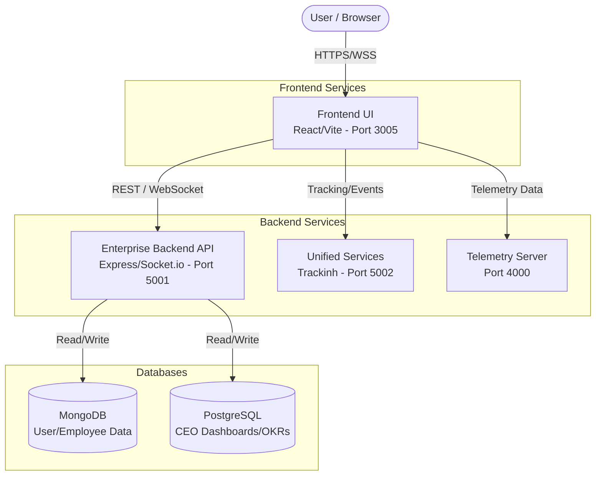

# WorkSphere Enterprise — Activity Intelligence Platform

Enterprise workforce monitoring, analytics, and management platform with role-based dashboards for 18 roles.

## Architecture & Project Flow

The following diagram illustrates the architecture and data flow of the WorkSphere platform when running locally:



## Quick Start (Localhost)

The project has been configured to run entirely on your local machine using the `localhost` endpoints. 

### Prerequisites
- Node.js 18+
- MongoDB (running on `localhost:27017`)
- PostgreSQL (running on `localhost:5432` — optional, falls back to SQLite `dev.db`)

### Running the Entire Project

The easiest way to start the full stack is to run the provided batch script at the root of the project:

```cmd
run_all.bat
```

This script will automatically:
1. Install dependencies for all microservices
2. Start the Telemetry Server (`http://localhost:4000`)
3. Start the Unified Services (`http://localhost:5002`)
4. Start the Enterprise Backend API (`http://localhost:5001`)
5. Start the Frontend UI (`http://localhost:3005`)
6. Open your default web browser to the dashboard

### Login Credentials
- **Super Admin:** `admin@worksphere.com` / `Admin@123`
- **CEO:** `ceo@worksphere.com` / `123456`
- **HR Manager:** `hr@worksphere.com` / `123456`
- **Employee:** `employee@worksphere.com` / `123456`
- 14 more roles available on the login page

---

## File Structure & Services

The platform consists of several loosely coupled services:

```text
/
├── frontend/                ← React/Vite UI Application (Runs on 3005)
│   ├── src/pages/           ← Marketing landing pages
│   ├── src/auth/            ← Role selection & login
│   ├── src/routes/          ← Application routing
│   └── src/modules/         ← 18 separate role dashboard modules
│
├── backend/                 ← Enterprise Backend API (Runs on 5001)
│   ├── src/server.ts        ← Express + Socket.io entry
│   ├── src/routes/          ← Auth, HR, CEO, Location APIs
│   ├── src/services/        ← Business logic layer
│   └── prisma/schema.prisma ← Database schema
│
├── trackinh/                ← Unified Services Server (Runs on 5002)
│
├── apps/
│   ├── dashboard/backend/   ← Telemetry Server (Runs on 4000)
│   └── agent/               ← Agent services
│
├── run_all.bat              ← Master startup script
└── README.md                ← Project documentation
```

## Environment Configuration

All frontend and backend `.env` files are pre-configured to use `localhost` routing for local development:
- Frontend points its API requests to `http://localhost:5001/api` and `ws://localhost:5001`
- Frontend telemetry endpoints point to `http://localhost:4000`
- CORS on backend allows origins from `http://localhost:3005`
