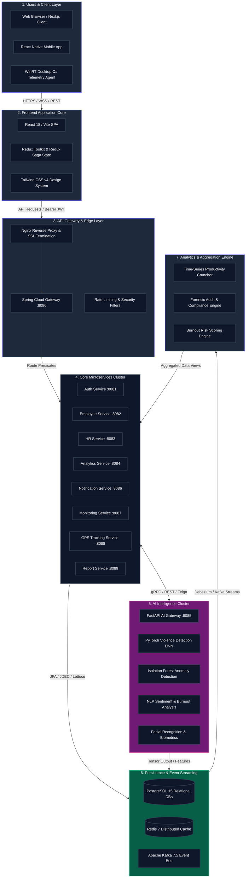
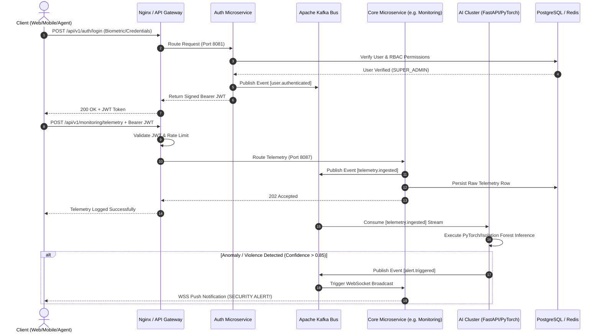

# 🏛️ WorkSphere Enterprise-Grade Activity Intelligence: 7-Tier Architecture Specification

---

## 🔬 Architectural Tier Breakdown

### Tier 1: Users & Client Layer
The entry point to the WorkSphere ecosystem spans multiple form factors and operating environments:
- **Web Clients**: Executives, HR Managers, and Department Leads accessing the platform via high-fidelity Next.js 16 / React 18 web portals.
- **Mobile Clients**: On-the-go personnel utilizing the React Native / Expo mobile application for instant push notifications and executive summaries.
- **Desktop Agents**: Enterprise Windows workstations running the WinRT C#/C++ background telemetry daemon, capturing high-precision active window titles, keystroke frequencies, and hardware-locked GPS coordinates.

### Tier 2: Frontend Application Core
Consolidated under `apps/enterprise-monitoring-system/frontend/`, the frontend operates as a highly optimized Single Page Application (SPA) powered by Vite and React 18:
- **State Management**: Redux Toolkit provides central slice stores (`authSlice`, `monitoringSlice`), while Redux Saga orchestrates complex, asynchronous side effects (e.g., background WebSocket reconnection loops).
- **Design System**: Built on Tailwind CSS v4 and Lucide React icons, implementing dark-mode glassmorphism, biometric login animations, and E2E encryption verification badges.
- **Routing Governance**: Secured via custom higher-order route wrappers (`ProtectedRoute`, `RoleBasedRoute`, `PermissionRoute`) evaluating 18 distinct enterprise roles and 13 granular RBAC permissions.

### Tier 3: API Gateway & Edge Layer
All incoming client traffic is intercepted at the enterprise edge before reaching internal microservices:
- **Nginx Reverse Proxy**: Handles SSL/TLS termination, static asset caching, gzip compression, and initial HTTP request sanitization.
- **Spring Cloud Gateway (`gateway-service:8080`)**: Operates as the central routing backbone. Configured with declarative path predicates (`/api/v1/auth/**`, `/api/v1/employee/**`), it enforces global rate limiting, CORS headers, and initial JWT structural validation.

### Tier 4: Core Microservices Cluster
The business logic of WorkSphere is decoupled into 10 highly specialized, containerized Spring Boot 3 microservices:
- **Auth Service (`:8081`)**: Manages biometric verification workflows, user registration, bcrypt password hashing, and JWT issuance/revocation.
- **Employee Service (`:8082`)**: Maintains organizational hierarchies, department transfers, and designation mappings.
- **HR Service (`:8083`)**: Handles leave requests, attendance logs, and payroll integrations.
- **Analytics Service (`:8084`)**: Ingests raw telemetry to calculate daily productivity percentages and active work hours.
- **Monitoring Service (`:8087`)**: High-throughput ingestion endpoint for WinRT desktop agent telemetry and secure screenshot URL logging.
- **GPS Tracking Service (`:8088`)**: Processes hardware-enforced spatial coordinates, calculating distance traveled and geofence breaches.
- **Report & Notification Services (`:8089`, `:8086`)**: Generates forensic PDF/CSV audit reports and dispatches real-time WebSocket alerts/emails.

### Tier 5: AI Intelligence Cluster
A dedicated Python FastAPI microservices cluster (`ai-service:8085`) powering real-time artificial intelligence inference:
- **Violence Detection**: PyTorch Deep Neural Network analyzing CCTV and webcam video streams for physical aggression and weapon detection.
- **Anomaly Detection**: Unsupervised Scikit-Learn Isolation Forest models establishing baseline employee behavior and flagging irregular file downloads or unauthorized access.
- **Sentiment & Burnout Analysis**: Transformer-based NLP models evaluating enterprise chat and webmail text to predict employee burnout risk scores and team morale.
- **Facial Recognition**: Biometric zero-input facial verification engine preventing workstation spoofing and unauthorized physical access.

### Tier 6: Persistence & Event Streaming
A robust, highly available data storage and messaging backbone designed for zero data loss:
- **PostgreSQL 15**: Relational storage sharded across multiple isolated databases (`worksphere_auth`, `worksphere_employee`, `worksphere_monitoring`), enforcing strict foreign key constraints and PL/pgSQL automated audit timestamps (`updated_at`).
- **Redis 7**: In-memory data store utilized for distributed caching, active user session management, JWT blacklist tracking, and high-speed pub/sub messaging.
- **Apache Kafka 7.5**: Enterprise event streaming platform. Acts as the central nervous system, decoupling microservices via asynchronous message topics (`telemetry.ingested`, `alert.triggered`, `user.authenticated`).

### Tier 7: Analytics & Aggregation Engine
The analytical powerhouse of the platform, continuously consuming Kafka event streams to generate actionable executive intelligence:
- **Time-Series Productivity Cruncher**: Aggregates high-frequency keystroke and active window telemetry into minute-by-minute productivity indices.
- **Burnout Risk Scoring Engine**: Correlates excessive overtime hours, declining keystroke rates, and negative chat sentiment to calculate predictive employee burnout scores.
- **Forensic Audit Engine**: Generates cryptographically verifiable compliance logs and executive summaries for legal and internal audit teams.

---

## 🔄 End-to-End Request Flow Sequence

