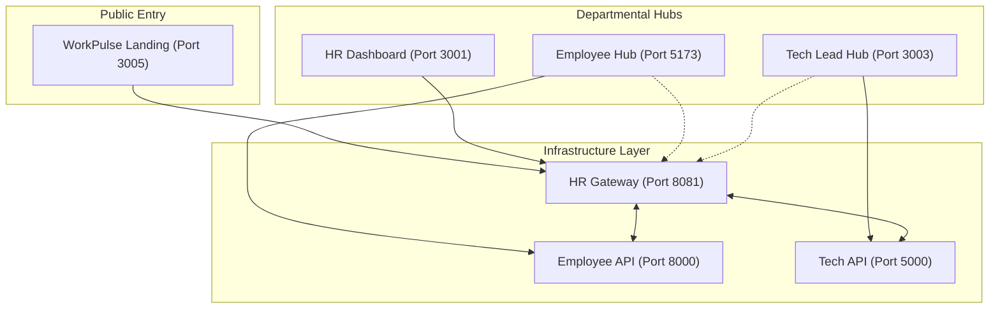

# Full Project File Structure & Architecture Guide

This document provides a comprehensive overview of the **WorkPulse Enterprise Ecosystem**, detailing the multi-service architecture, model layers, and connectivity configurations.

## 1. Executive Summary
The platform is a modular, distributed system consisting of distinct functional hubs. It uses a **Unified Authentication Gateway** (NexusHR) to provide single sign-on capabilities across HR, Employee, Tech Lead, and support portals.

---

## 2. Detailed Project File Structure

```text
Hr/ (Project Central Hub)
├── backend/                        # HR Backend (Unified Gateway - Node.js/TS) - Port 8081
├── frontend/                       # Master Hub & Landing Page (React/Vite) - Port 3005
├── master-dashboard/               # Dedicated HR Operations Dashboard - Port 3001
├── Employee/                       # Employee Ecosystem (Django/React)
│   ├── backend/                    # Employee Backend (Django) - Port 8000
│   └── frontend/                   # Employee Hub UI (React) - Port 5173
├── tech_lead/                      # Tech Lead Ecosystem (Node.js/React)
│   ├── backend/                    # Tech Lead Backend (Express) - Port 5000
│   └── frontend/                   # Tech Lead Hub UI (React) - Port 3003
├── marketing_sales/                # Marketing Module - Port 3006
├── IT Helpdesk Ticketing System/   # Helpdesk Module - Port 3004
├── location/                       # Real-time Location Tracker - Port 3007
├── docs/                           # System documentation and diagrams
├── startup_master.js               # Global service orchestrator
├── RUN_PROJECT.bat                 # Master launch script (Windows)
└── full_project_structure.md       # (This file)
```

---

## 3. Service Connectivity Map

| Service Name | Port | Base URL | Role |
| :--- | :--- | :--- | :--- |
| **WorkPulse Hub** | **3005** | `http://127.0.0.1:3005` | **Public Landing & Platform Hub** |
| **HR Dashboard** | **3001** | `http://127.0.0.1:3001` | **Dedicated HR Operations Only** |
| **HR Gateway** | 8081 | `http://127.0.0.1:8081` | Central Auth & API Gateway |
| **Employee Hub** | 5173 | `http://127.0.0.1:5173` | Employee Portal (Vite/React) |
| **Employee API** | 8000 | `http://127.0.0.1:8000` | Employee Data Service (Django) |
| **Tech Lead Hub** | 3003 | `http://127.0.0.1:3003` | Engineering Metrics Hub |
| **Tech Lead API** | 5000 | `http://127.0.0.1:5000` | Tech Analysis Service (Node) |
| **Helpdesk** | 3004 | `http://127.0.0.1:3004` | IT Support Management |
| **Marketing Hub** | 3006 | `http://127.0.0.1:3006` | AI Marketing & Sales Hub |
| **Location Tracker**| 3007 | `http://127.0.0.1:3007` | Real-time GPS Tracking |

---

## 4. Core Architecture Layers



---

## 5. Model Inventory

### 5.1 Employee Service (Django)
Located in `Employee/backend/apps/`. Handles daily workforce operations.

- **Accounts**: UUID-based Auth, Role management.
- **Attendance**: Real-time clocking and leave requests.
- **Tasks**: Task assignment, status tracking, and subtasks.
- **Performance**: KPI management and review cycles.

### 5.2 HR Gateway (Node.js/TS)
Located in `backend/src/types.ts`. Shared interfaces for enterprise-wide intelligence.

- **Recruitment**: Applicant Tracking System (ATS) models.
- **Finance**: Payroll and Budgeting records.
- **Telemetry**: Shared activity feeds and audit logs.

---

## 6. Unified Authentication System

The platform uses a **JWT-based Cross-Port Strategy** for seamless transitions.

- **Core Authority**: HR Gateway (Port 8081).
- **Session Transport**: Tokens are passed via URL parameters during cross-departmental handshakes (e.g., from 3005 to 3001).
- **Security**: Backends verify tokens using the shared secret `nexushr-super-secret-2026`.

---

## 7. Startup Instructions

The entire project is managed by the `startup_master.js` orchestrator located in the `Hr/` directory.

### To Launch the Platform:
1. Open terminal in the `Hr` folder.
2. Run `npm run dev`.
3. Access the **WorkPulse Hub** at `http://127.0.0.1:3005`.
