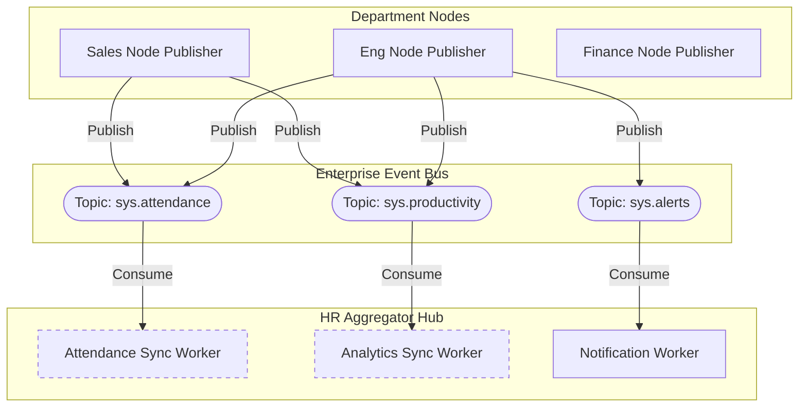

# Queue & Event Sync Flow

> [!IMPORTANT]
> The backbone of the decentralized architecture is the Enterprise Event Bus (Kafka/RabbitMQ). It ensures data flows seamlessly from isolated department nodes to the central HR Hub without data loss.

## 1. Distributed Event Architecture

## 2. Synchronization Mechanisms

1. **At-Least-Once Delivery**: Department nodes publish events using acknowledgments. If the Kafka cluster goes down, the node buffers events in its local Postgres Outbox table and retries until success.
2. **Schema Registry**: To prevent malformed data from crashing the HR Aggregator, all JSON payloads must conform to an Apache Avro/Protobuf schema registry before being published to the queue.
3. **Consumer Groups**: The HR Aggregator scales horizontally. `C_PROD` represents a consumer group; if traffic spikes, Kubernetes spins up more instances of the Analytics Sync Worker to drain the queue faster.
4. **Data Isolation in Topics**: Topics can optionally be partitioned by `department_id`, ensuring strict message ordering for a single department's timeline.
