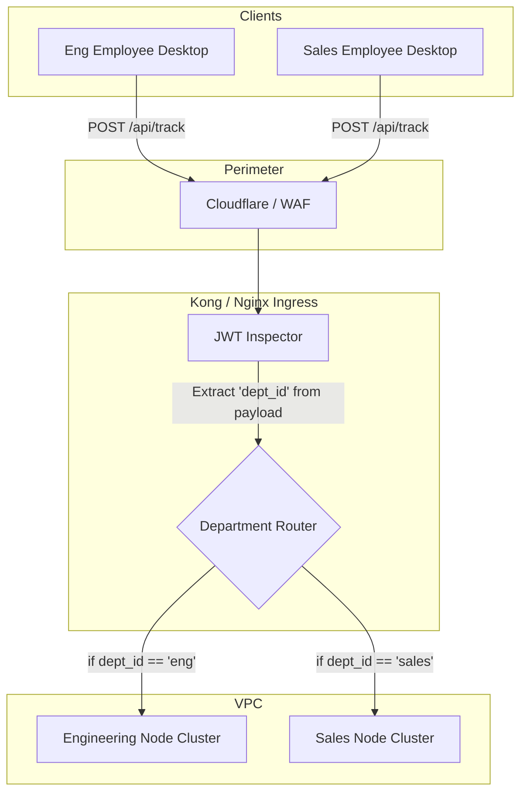

# Distributed API Gateway Flow

> [!NOTE]
> In a decentralized setup, the Enterprise API Gateway must intelligently route traffic to the correct independent Department Node based on the employee's authentication token.

## 1. Decentralized Routing Logic

## 2. Dynamic Routing Capabilities

The central API gateway does **not** process data; it acts as a highly efficient traffic cop.

- **Token Inspection**: When an employee logs in, the Auth Service injects their `dept_id` into their JWT.
- **Routing Rules**: The Gateway reads the JWT header (without needing to query a database) and forwards the HTTP request to the specific Kubernetes Service URL for that department (e.g., `http://eng-node.local/api/track`).
- **Load Balancing**: The Gateway load balances traffic *across* the nodes. If the Sales Node is overwhelmed during the end-of-quarter rush, it autoscales the Sales cluster independently without starving the Engineering cluster of resources.
- **Edge Throttling**: If a rogue employee agent starts spamming 1000 requests per second, the Gateway drops the traffic at the perimeter before it ever hits the Department Node.
