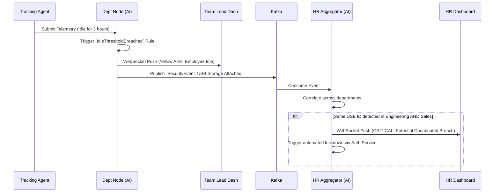

# Enterprise Notification Flow

> [!WARNING]
> Alerts must be generated efficiently. Localized issues (e.g., a single employee idling) should be handled by the Department Node, while systemic issues (e.g., cross-department data exfiltration) must be handled by the HR Aggregator.

## 1. Split-Level Notification Architecture

## 2. Notification Tiering

1. **Edge Alerts (Department Node)**
   - Processed instantly on local data.
   - Pushed directly to the Team Lead or Department Manager.
   - Examples: Extended idle time, late clock-in, localized unproductive app usage.
   - Benefit: Does not clog the global HR pipeline with micro-management alerts.

2. **Core Alerts (HR Aggregator)**
   - Processed by analyzing the combined dataset from all departments.
   - Pushed to Enterprise HR and Super Admins.
   - Examples: Multi-department credential sharing, unusual geographical login patterns across the enterprise, global productivity trends dropping 20% week-over-week.
