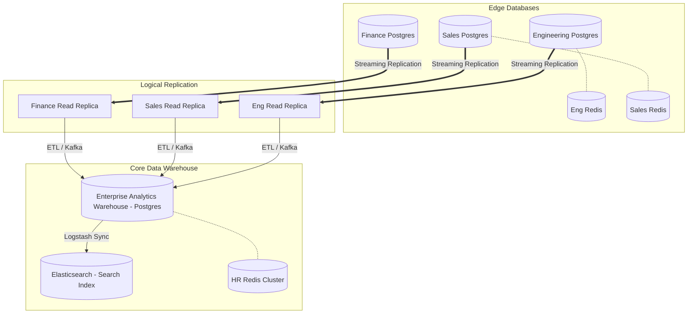

# Distributed Database Flow

> [!CAUTION]
> The decentralized architecture replaces the massive single PostgreSQL monolith with independent departmental databases, utilizing Read Replicas and Elasticsearch for the HR Aggregator.

## 1. Decentralized Data Storage Architecture

## 2. Database Responsibilities

### Department PostgreSQL
- **Write Heavy**: Handles the intense IOPS required to save thousands of telemetry rows per second from local employees.
- **Data Retention**: Stores highly granular data (e.g., every mouse click event) for a short period (e.g., 30 days) before pruning, to keep the DB fast and lean.

### Enterprise Analytics Warehouse
- **Read Heavy**: Optimized for complex JOINs and aggregations across departments.
- **Data Retention**: Stores aggregated summaries (e.g., "Employee X had an 80% focus score on May 8th") indefinitely for historical reporting. It does **not** store the raw granular mouse clicks.

### Elasticsearch
- **Global Search**: The HR Dashboard provides an "Omni-Search" bar. HR can type an employee name or app name (e.g., "Slack") and instantly search across the entire enterprise workforce because the data is indexed in Elasticsearch.
