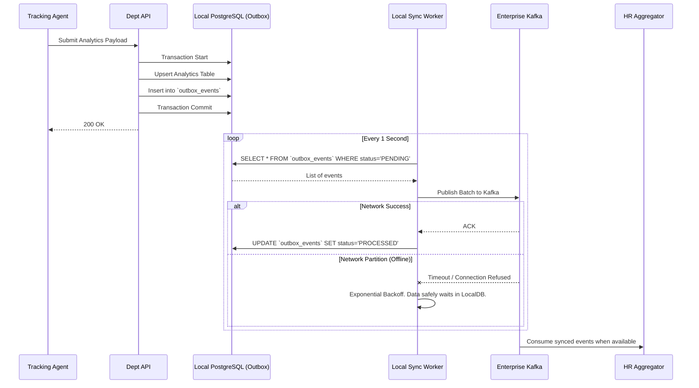

# Department Synchronization Flow

> [!IMPORTANT]
> A decentralized system must handle network partitions gracefully. This document details the local queuing mechanism that ensures zero data loss if a Department Node loses connection to the HR Aggregator.

## 1. Resilient Synchronization Pipeline

## 2. The Transactional Outbox Pattern

The **Transactional Outbox Pattern** is critical for this architecture. 

If the Department API updated its local analytics table and then immediately tried to publish to Kafka, a network failure halfway through would result in the local DB being updated, but the HR Aggregator never receiving the update.

By wrapping both the local update and the creation of an "Outbox Event" in a single ACID-compliant PostgreSQL database transaction, we guarantee that if the data is saved locally, it *will* eventually be synced to the HR Aggregator. The background `Sync Worker` acts as the reliable delivery mechanism.
