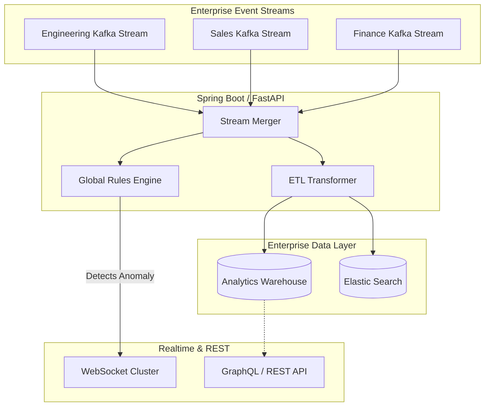

# HR Aggregator Core Flow

> [!TIP]
> The HR Aggregator is the brain of the enterprise. It does not track employees directly; instead, it consumes, merges, and analyzes the processed intelligence streams coming from all independent Department Nodes.

## 1. Aggregator Internal Architecture

## 2. Aggregator Responsibilities

1. **Merge Distributed Workforce Data**: It takes the disparate JSON payloads from different departments and normalizes them into a unified schema for the Enterprise Analytics Warehouse.
2. **Global Rules Engine**: 
   - Detects cross-department anomalies. If an employee logs into the Engineering Node from an IP in New York, and 5 minutes later logs into the Sales Node from an IP in Tokyo, the Rules Engine fires an "Impossible Travel" alert.
3. **Cross-Department Reporting**: Powers the GraphQL queries used by the HR Dashboard to compare the efficiency of remote vs. hybrid teams across the entire organization.
4. **Realtime Synchronization**: Immediately pushes critical alerts (detected by the Rules Engine) to the HR WebSocket cluster, ensuring HR is notified of severe policy violations within seconds of them occurring at the edge.
