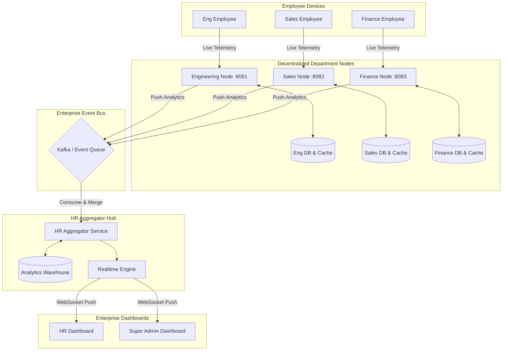

# Complete Decentralized System Architecture

> [!IMPORTANT]
> This diagram illustrates the enterprise-wide transition from a centralized monitoring monolith to a highly scalable, decentralized hub-and-spoke architecture.

## 1. Enterprise Hub-and-Spoke Flow

Instead of thousands of employees hammering a single tracking server, traffic is distributed to isolated Department Nodes. The HR Aggregator acts as the intelligence hub.

## 2. Core Architectural Pillars

1. **Decentralized Tracking**: Every department manages its own tracking ingress and data processing. Engineering traffic never impacts Sales traffic.
2. **Department-Level Autonomy**: If the HR Aggregator goes offline, department nodes continue to monitor, process, and buffer data locally using their independent databases.
3. **Cross-Department Aggregation**: The HR Aggregator subscribes to the Kafka streams from all departments, merging the data into the unified Analytics Warehouse.
4. **Fault Isolation**: A spike in traffic (e.g., thousands of support staff clocking in simultaneously) is isolated to the `Support Node` and its dedicated DB.
