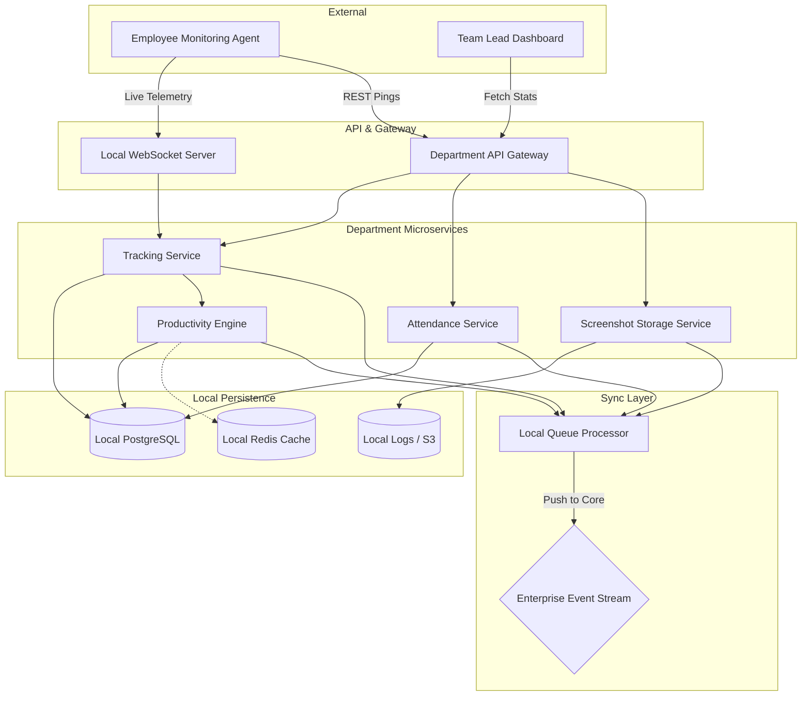

# Department Node Architecture

> [!NOTE]
> This document details the internal architecture of a single Department Node (e.g., the Engineering Department). Every department runs an identical, isolated instance of this stack.

## 1. Node Topology

A Department Node is a self-contained micro-ecosystem capable of ingesting, analyzing, and storing telemetry without external dependencies.

## 2. Component Responsibilities

1. **Tracking Service**: Ingests raw telemetry (keyboard, mouse, active window). High-throughput, low-latency API.
2. **Attendance Service**: Calculates clock-in, clock-out, and shift timings. Handles late login flags.
3. **Productivity Engine**: Processes the raw tracking data locally to calculate focus scores and map application usage (e.g., `vscode.exe` = Productive for Engineering).
4. **Screenshot Storage**: Saves encrypted screenshot captures locally or to a department-specific S3 bucket to ensure data privacy.
5. **Local Queue Processor**: Batches the processed analytics (not raw keystrokes) and securely publishes them to the Enterprise Kafka cluster for the HR Aggregator to consume.
6. **Local Database (PostgreSQL)**: Stores all granular data for that specific department, maintaining strict data isolation.
