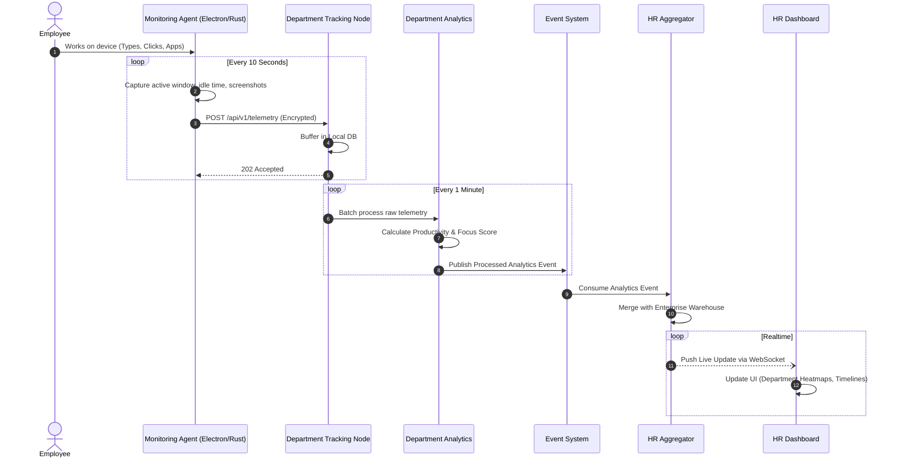

# Employee Tracking Flow

> [!TIP]
> This outlines the end-to-end journey of telemetry data originating from the employee's device up to the global HR Dashboard.

## 1. Tracking Data Journey

The tracking agent must be incredibly lightweight. It captures 12 specific data points and routes them through the decentralized pipeline.

## 2. Tracked Data Points

The Monitoring Agent (built in Rust for minimal CPU footprint) tracks:
1. **Keyboard Activity**: Keystroke velocity (not the actual keys logged).
2. **Mouse Activity**: Click rates and movement metrics.
3. **Active Window**: The foreground application title.
4. **Browser Usage**: Active URLs (via browser extensions).
5. **App Usage**: Process executable names (e.g., `excel.exe`).
6. **Attendance**: Machine unlock/lock events tied to shift timing.
7. **Idle Detection**: Time since last hardware interrupt.
8. **Productivity**: Mapped locally by the Department AI.
9. **Screenshots**: Captured based on policy (e.g., every 5 mins).
10. **Internet Usage**: Network bandwidth monitoring.
11. **Device Information**: IP address, MAC, OS version.
12. **Login/Logout**: Explicit session tracking.
