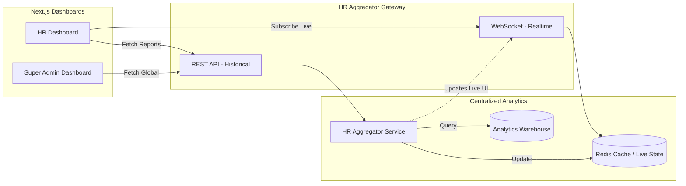

# HR Dashboard Flow

> [!WARNING]
> The HR Dashboard is the visualization layer for the entire enterprise. It pulls aggregated data, never querying a Department Node directly.

## 1. Dashboard Data Retrieval Flow

## 2. Dashboard Visualizations & Capabilities

The HR Dashboard consumes the aggregated data to display:
- **Live Employee Monitoring**: Real-time dots (Green=Active, Yellow=Idle, Red=Offline) across all departments.
- **Department Heatmaps**: Visual comparison of productivity density between Engineering vs. Sales.
- **Attendance Analytics**: Enterprise-wide late login trends and overtime accumulation.
- **Employee Timelines**: A Gantt-chart style timeline showing exactly when an employee was working, idle, or on break.
- **Performance Reports**: Deep-dive PDFs generated from the Analytics Warehouse.
- **Active Application Tracking**: Identifying the most used software across the enterprise (e.g., tracking total hours spent in Slack vs. Jira).
- **Idle Employee Alerts**: Push notifications when an employee exceeds their department's idle threshold.
- **Screenshots**: A centralized gallery for auditing suspicious activity captures.
