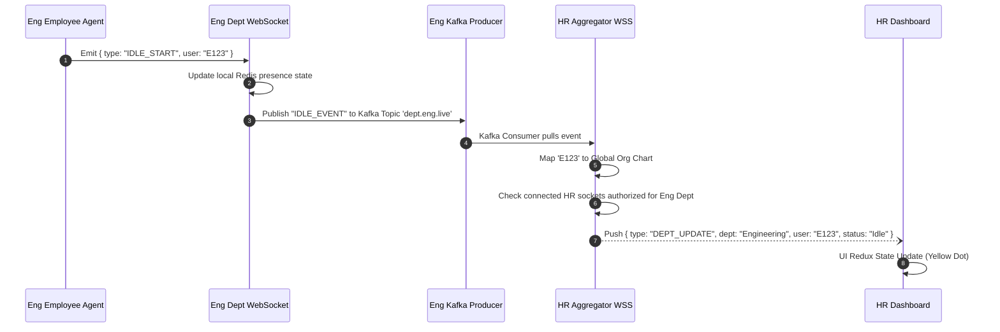

# Realtime WebSocket Flow

> [!TIP]
> This outlines the decentralized WebSocket architecture, showing how events jump from the employee's machine, through the department node, to the global HR dashboard seamlessly.

## 1. Decentralized Realtime Data Relay

## 2. WebSocket Responsibilities

### Department Level (Edge WebSockets)
- Handles the massive ingress of ping/pong traffic from thousands of tracking agents.
- Operates primarily to receive data.
- If the global Aggregator connection drops, the edge WebSocket server continues updating the local Department Redis Cache so department-level real-time views still function.

### HR Aggregator Level (Core WebSockets)
- Does **not** communicate directly with employee tracking agents.
- Subscribes to the Kafka event streams from all Department Nodes.
- Manages connections only from HR Managers and Super Admins.
- Broadcasts high-level events like "Department X Productivity dropping" or global anomaly alerts.
