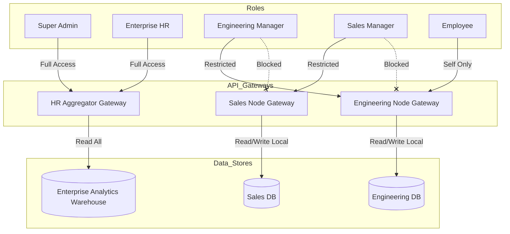

# Enterprise Role-Based Access Control (RBAC)

> [!CAUTION]
> In a decentralized topology, RBAC must enforce strict department-level isolation while allowing the HR Aggregator to provide a unified cross-department view.

## 1. Decentralized Access Isolation Flow

## 2. Role Capabilities

1. **Super Admin**: Connects to the HR Aggregator. Can manage system topology, add new Department Nodes, configure Kafka cluster keys, and view global audit logs.
2. **HR Manager**: Connects to the HR Aggregator. Has access to all employee analytics across all departments, cross-department productivity comparisons, and global attendance registers.
3. **Department Manager / Team Lead**: Connects directly to their specific **Department Node** dashboard. They cannot query the HR Aggregator. An Engineering Lead only sees Engineering data hitting `DB_ENG`.
4. **Employee**: Connects to their Department Node to view self-analytics and timesheets. RLS (Row Level Security) prevents them from viewing peer data within the same local DB.
