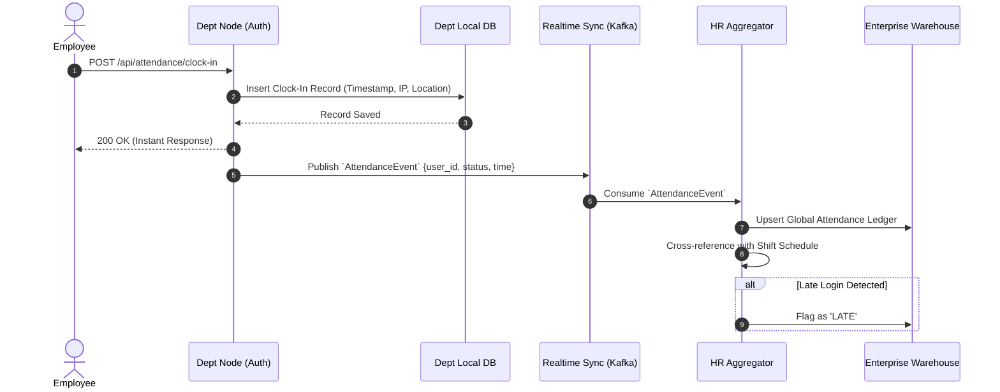

# Decentralized Attendance Flow

> [!NOTE]
> By processing attendance at the edge (Department Node), the system prevents login bottlenecks during peak hours (e.g., 9:00 AM) that crash centralized servers.

## 1. Distributed Clock-In Architecture

## 2. Benefits of the Decentralized Approach

1. **Zero Downtime Logins**: Even if the central HR server is undergoing maintenance, employees interacting with the Engineering Node will seamlessly clock in. Their records are queued locally and synced later.
2. **Local Overtime Processing**: The Department Node calculates exact hours worked locally. Only the final daily totals and shift flags are transmitted to the HR Aggregator, drastically reducing network bandwidth between the edge and the core.
3. **Resilience to Network Partitions**: If the Sales office loses internet connection to the central cloud, the local Sales Node processes attendance via the local intranet perfectly.
