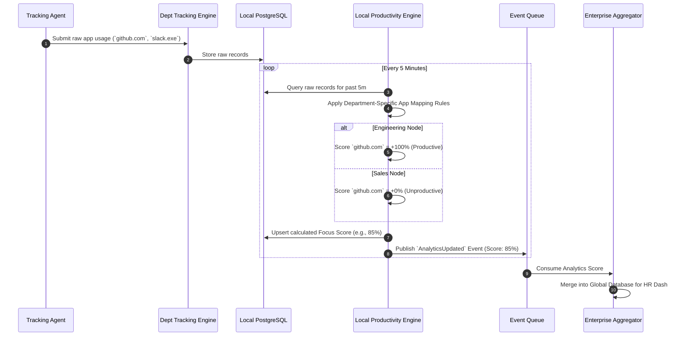

# Productivity Analytics Flow

> [!TIP]
> Productivity scoring is highly contextual. "VS Code" is productive for Engineering but unproductive for Sales. The decentralized model allows each Department Node to apply its own local AI categorization rules.

## 1. Localized Productivity Calculation

## 2. Department Comparison Flow

Once the local scores are synced to the HR Aggregator, HR can run enterprise-wide analytics without crunching raw data.

- **The Problem with Centralization**: If HR wanted to compare Engineering vs. Sales in the old model, the central server had to run MapReduce across millions of raw tracking rows, applying contextual `if/else` statements for every department, leading to massive database locks.
- **The Decentralized Solution**: The heavy lifting is already done at the edge. The HR Aggregator simply runs an average on the pre-calculated `Focus Score` integers.
- **Result**: The HR Dashboard renders heatmaps comparing 5,000 employees across 10 departments in under 50ms.
