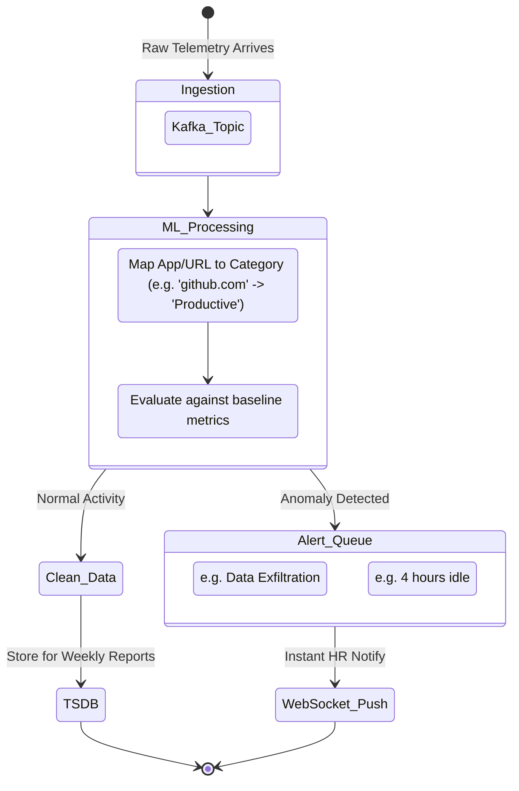

# Activity Monitoring & Intelligence Flow

> [!CAUTION]
> This document details the AI-driven Activity Monitoring, Time Tracking, and Anomaly Detection pipelines.

## 1. AI Monitoring Engine Flow

## 2. Time Tracking Architecture

Time tracking is distinct from monitoring. Monitoring is passive; time tracking is active.

- **Task Assignment Flow**: A Project Manager creates a Task in the Dashboard. This writes to the `TASKS` table in Postgres.
- **Clock In**: The Employee selects the Task in their desktop agent and clicks "Start Timer". This sends a `TIME_START` event.
- **Continuous Validation**: While the timer runs, the Activity Monitoring pipeline verifies that the active window context matches the task description using NLP categorization.
- **Clock Out**: Employee clicks "Stop Timer". A `TIME_STOP` event is sent. The backend calculates total time.
- **Analytics Generation**: The Analytics Engine compares the "Logged Time" against the "Productive Monitored Time" to generate an Efficiency Score.

## 3. How Analytics are Calculated

1. **App Categorization**: Every tracked executable/URL is passed through an AI categorizer (or manual rule list). `vscode.exe` = Productive. `netflix.com` = Unproductive. `slack.exe` = Neutral.
2. **Time Boxing**: The day is split into 10-minute boxes.
3. **Scoring Algorithm**:
   - `Focus Score = (Time in Productive Apps / Total Active Time) * 100`
   - `Idle Ratio = Total Idle Time / Total Shift Time`
4. **Aggregation**: These scores are rolled up daily, weekly, and monthly, allowing HR and Team Leads to view trend lines in the Next.js Dashboard.
