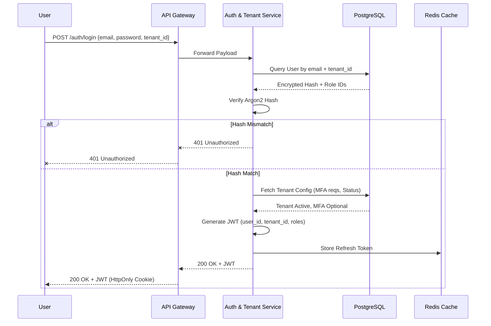

# Authentication & Tenant Management Flow

> [!IMPORTANT]
> A multi-tenant enterprise system requires robust tenant isolation during the authentication phase. This document details how authentication flows across services.

## 1. End-to-End Authentication Flow

## 2. Tenant Management Architecture

WorkSphere supports **Logical Isolation (Shared DB, Isolated Schema/Rows)**. 

- **Tenant Identification**: A tenant can be identified by the login subdomain (e.g., `acme.worksphere.com`) or explicitly via an organizational ID during login.
- **Cross-Tenant Prevention**: Users cannot login across tenants. A user with `email@example.com` in Tenant A is treated as entirely distinct from `email@example.com` in Tenant B.
- **Tenant States**: Tenants can be marked as `ACTIVE`, `SUSPENDED` (billing failure), or `ARCHIVED`. The Auth Service checks this state during login. A suspended tenant prevents all its users from authenticating.

## 3. Session Management

- **Short-Lived Access Tokens**: JWTs expire quickly (e.g., 15 minutes). This limits the window of opportunity if a token is stolen.
- **Refresh Tokens**: A cryptographically random string stored securely in the browser and in Redis on the server. When the Access Token expires, the client sends the Refresh Token to the Auth Service to get a new Access Token, without requiring the user to type their password again.
- **Global Sign-Out**: Super Admins or HR Managers can click "Revoke All Sessions" for a user. This deletes all associated Refresh Tokens in Redis, forcing the user to log in again once their 15-minute access token expires.
