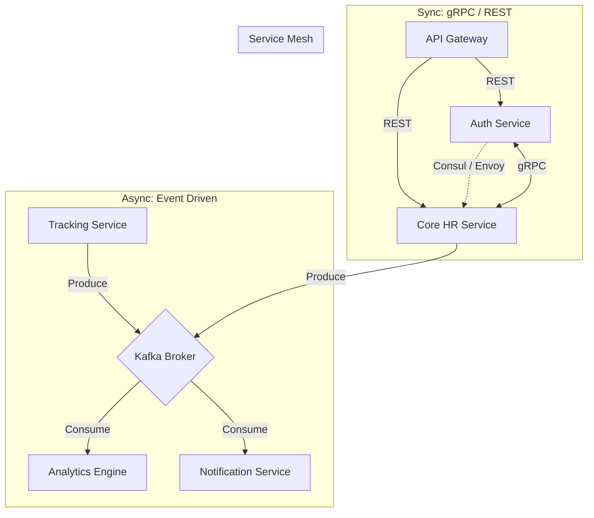

# Backend-to-Backend Communication Flow

> [!NOTE]
> In a microservices architecture, internal communication must be fault-tolerant and lightning fast. This document outlines how our backend services interact.

## 1. Inter-Service Communication Topology

## 2. Communication Protocols

### Synchronous (gRPC & Internal REST)
- Used when a service requires an immediate response to proceed.
- **Example**: When the HR Service needs to verify if an Employee ID is valid and active, it makes an ultra-fast gRPC call to the Auth/User Service.
- gRPC is preferred internally for its binary payload (Protobufs), which is significantly faster to serialize/deserialize than JSON.

### Asynchronous (Kafka Event Streaming)
- Used for operations that do not require blocking the main thread.
- **Example**: When a new employee is onboarded, the HR Service saves to DB, then fires an `EmployeeCreatedEvent` to Kafka.
- The Notification Service consumes this and sends a welcome email.
- The Tracking Service consumes this and provisions a tracking profile.
- This ensures the HR Service returns a 200 OK instantly, without waiting for emails to send.

## 3. Data Synchronization Between Services

Because each microservice manages its own database (Database-per-service pattern), data synchronization is handled via **Eventual Consistency**:

1. **Saga Pattern / Outbox Pattern**: When the HR service updates an employee's department, it updates its local PostgreSQL database and simultaneously writes an event to an Outbox table in the same transaction.
2. A separate relay process reads the Outbox table and guarantees delivery to Kafka.
3. The Analytics Service consumes the `DepartmentChangedEvent` and updates its localized read-replicas or caches so that future analytics queries map the employee to the correct new department.
