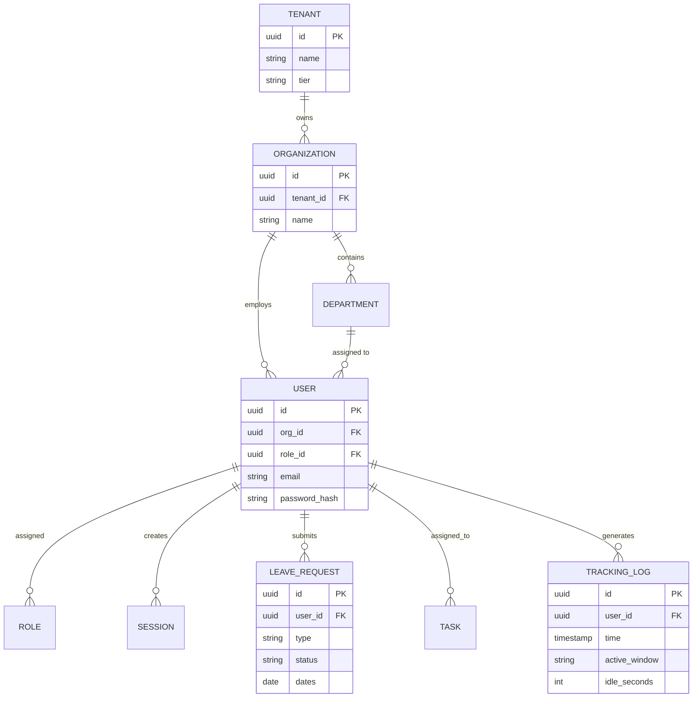

# Database Relation Flow & Architecture

> [!WARNING]
> Schema definitions and database relationships are crucial for data integrity. The system strictly adheres to foreign-key constraints across the primary PostgreSQL instances.

## 1. Core Entity Relationship Diagram (ERD)

The enterprise architecture separates relational data from high-volume telemetry data.

## 2. Polyglot Persistence Architecture

1. **PostgreSQL (Primary DB)**
   - **Role**: Source of truth for relational state.
   - **Data**: Users, Roles, Permissions, Leave, Payroll, Hierarchy.
   - **Integrity**: Enforces ACID properties and strict referential integrity.

2. **Time-Series Database (TSDB - e.g., TimescaleDB or InfluxDB)**
   - **Role**: Handling massive write volumes of telemetry.
   - **Data**: `TRACKING_LOG` containing active window, idle time, and screenshot metadata.
   - **Linkage**: Correlated to the primary DB via the `user_id` uuid. It does not enforce foreign keys to maintain ultra-fast write speeds.

3. **Redis (Cache & State DB)**
   - **Role**: Ephemeral storage.
   - **Data**: User Sessions (`SESSION`), JWT blacklists, WebSocket connection mappings, and cached RBAC policies.
   - **Persistence**: AOF (Append Only File) configured for recovery, but data is treated as reconstructible.

## 3. Data Synchronization Flow

- **Write Operations**: Standard writes go directly to PostgreSQL. Telemetry goes to TSDB.
- **Cache Invalidation**: If an HR Manager updates an Employee's Role in PostgreSQL, a CDC (Change Data Capture) event triggers an invalidation of that user's session cache in Redis, forcing a re-fetch of permissions on their next request.
