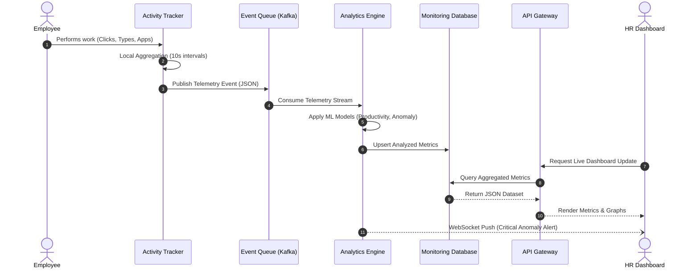

# Data Flow Diagrams

> [!IMPORTANT]
> This document details the end-to-end data movement across the system, segmented by the three primary actors: Employees, HR Managers, and Super Admins.

## 1. End-to-End Enterprise Data Flow

## 2. Employee Side Data Flow

The Employee side flow is designed to be asynchronous and non-blocking, ensuring zero impact on the employee's machine performance.

1. **Employee App**: The UI where the employee logs in, checks tasks, and requests leave.
2. **Activity Tracker (Agent)**: Runs silently in the background, capturing active window titles, idle time, and keystroke metrics (without capturing actual keys).
3. **Monitoring Agent**: Packages the raw data into encrypted payloads.
4. **Event Queue**: The agent pushes payloads to the Kafka Event Queue. If offline, it buffers locally and syncs upon reconnection.
5. **Analytics Engine**: Consumes raw data from the queue and calculates productivity scores.
6. **Monitoring Database**: Stores the processed time-series data.
7. **HR Dashboard**: Consumes the final processed data.

## 3. HR Side Data Flow

The HR side focuses on consuming aggregated data and executing business logic.

1. **HR Dashboard**: Initiates a request (e.g., "Get Employee X's weekly productivity").
2. **API Gateway**: Receives the request, validates the HR Manager's JWT and RBAC permissions.
3. **Monitoring & Analytics Service**: The API Gateway routes the request to the specific service.
4. **Reporting Engine**: Compiles complex queries joining Employee Database (for names/roles) and Tracking Database (for metrics).
5. **Real-Time Monitoring Stream**: For live views, the HR Dashboard subscribes to a WebSocket channel, receiving live updates as employees generate activity.

## 4. Super Admin Side Data Flow

Super Admins have a global view across all tenants and system infrastructure.

1. **Super Admin Dashboard**: Requests system-wide metrics.
2. **Global Monitoring**: Aggregates data across all underlying databases and caches.
3. **Permission Control**: Super Admins modify access rights, which instantly invalidates cached tokens in Redis, enforcing new rules on the next API call.
4. **Audit System**: Every action taken by HR or System services is written to an immutable Audit Log database, which the Super Admin can query for compliance.
