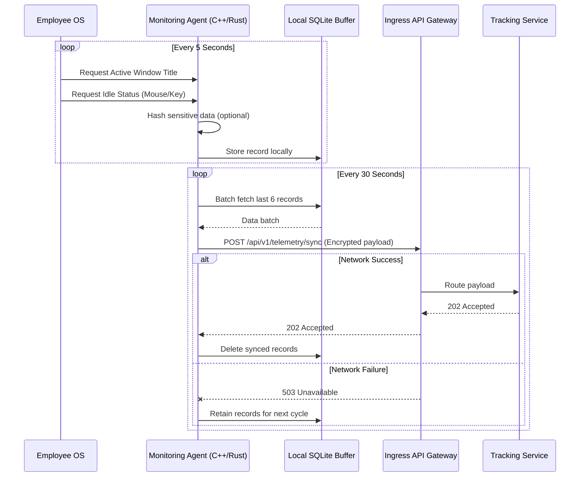

# Employee Tracking & Monitoring Flow

> [!CAUTION]
> Employee tracking must adhere strictly to compliance and privacy laws. The system implements a "Silent Monitoring" architecture that is non-intrusive and configurable based on organizational policy.

## 1. Silent Monitoring Flow

## 2. How Silent Monitoring Works

1. **Lightweight Edge Agent**: A highly optimized desktop agent (built in C++ or Rust for low memory footprint) runs as a background service. It does not have a heavy UI.
2. **Data Capture**: It hooks into OS-level APIs to fetch the currently active window title, the executable name (e.g., `chrome.exe`), and system idle time based on hardware interrupts. It **does not** use keylogging.
3. **Local Buffering**: To handle offline scenarios and prevent network spam, data is written to a local encrypted SQLite database first.
4. **Asynchronous Sync**: Every X seconds (configurable), the agent flushes the buffer over an encrypted TLS connection to the cloud backend.

## 3. Telemetry Data Synchronization

When the backend Tracking Service receives the payload:
- It decrypts and decompresses the JSON array.
- It validates the agent's authentication token.
- It pushes the data onto the Kafka Event Stream.
- The Time-Series Database consumer pulls this data and executes bulk inserts, ensuring the primary database is protected from high IOPS loads.
