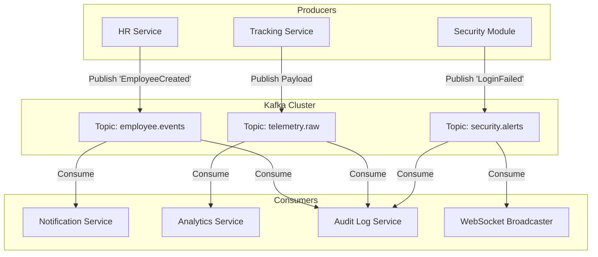

# Event-Driven Architecture Flow

> [!TIP]
> The system relies heavily on Event-Driven Architecture (EDA) to decouple services, ensure high availability, and process heavy workloads asynchronously.

## 1. Core Event Flow

## 2. Event Types & Topics

The Kafka cluster is segmented into logical Topics. Services subscribe only to the topics they care about.

1. **`employee.events`**: Contains domain events like `EmployeeOnboarded`, `LeaveRequested`, `RoleChanged`.
2. **`telemetry.raw`**: A high-throughput topic receiving all agent pings.
3. **`security.alerts`**: Contains high-priority events like `GeofenceBreach` or `MultipleFailedLogins`.

## 3. Asynchronous Workflows

By using an Event Bus, we achieve complex workflows without blocking the user.

**Example: The Onboarding Flow**
1. HR Manager clicks "Add Employee". The Next.js UI calls `POST /hr/employee`.
2. The HR Service creates the database record and returns a `201 Created` instantly. The UI shows "Success".
3. Concurrently, the HR Service publishes an `EmployeeCreated` event to Kafka.
4. The **Notification Service** consumes the event and sends the welcome email with temporary passwords.
5. The **Analytics Service** consumes the event and creates an empty timeseries profile for the new user.
6. The **Audit Service** consumes the event and logs the action for compliance.

If the email server goes down, the Notification Service will simply pause consuming. Once back online, it resumes from its last Kafka offset, ensuring no emails are lost, and without having impacted the HR Manager's ability to use the dashboard.
