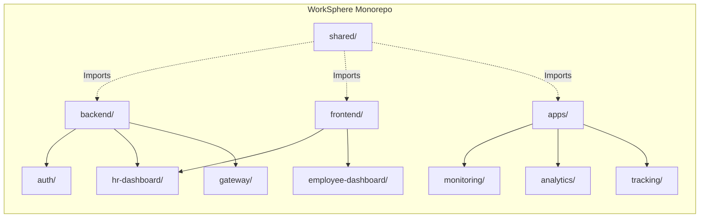

# Enterprise File Structure Flow

> [!NOTE]
> WorkSphere follows a monorepo architecture for its codebase, organizing the frontend, backend microservices, and shared libraries efficiently.

## 1. Monorepo Folder Structure Overview

## 2. Directory Deep Dive

### `/apps`
Contains the heavy data-processing engines and native applications.
- `/monitoring`: The C++/Rust based desktop agent that runs silently on employee machines.
- `/analytics`: Python/Go based data processing pipelines for crunching Kafka streams into productivity scores.
- `/tracking`: The high-throughput ingestion API service for receiving agent payloads.

### `/backend`
Contains the core Node.js/Express (or Spring Boot) microservices serving REST/gRPC.
- `/auth`: Identity Access Management (IAM), JWT generation, RBAC, and Tenant logic.
- `/core-hr`: CRUD APIs for Employees, Departments, Leave requests, and Payroll generation.
- `/gateway`: Configurations for the Nginx/Kong API Gateway, including custom Lua plugins for rate limiting.

### `/frontend`
Contains the user-facing web applications.
- `/hr-dashboard`: Next.js application tailored for HR Managers and Super Admins. Heavy on data tables, charts, and SSR.
- `/employee-dashboard`: React SPA for employees to view tasks, submit leaves, and read company announcements.

### `/shared`
Shared code to prevent duplication across the monorepo.
- `/types`: TypeScript interfaces shared between frontend and backend (e.g., `EmployeeData`). Ensures end-to-end type safety.
- `/ui-components`: A custom internal design system (React components like `<EnterpriseTable />`) used by both dashboards.
- `/utils`: Formatting, validation schemas (Zod/Yup), and logger configurations.

## 3. Build & CI/CD Flow
The monorepo uses tools like Nx or Lerna. When a developer modifies code in `/backend/core-hr`, the CI/CD pipeline intelligently determines that only the `core-hr` Docker container needs to be rebuilt and deployed, leaving the `auth` service and frontends untouched.
