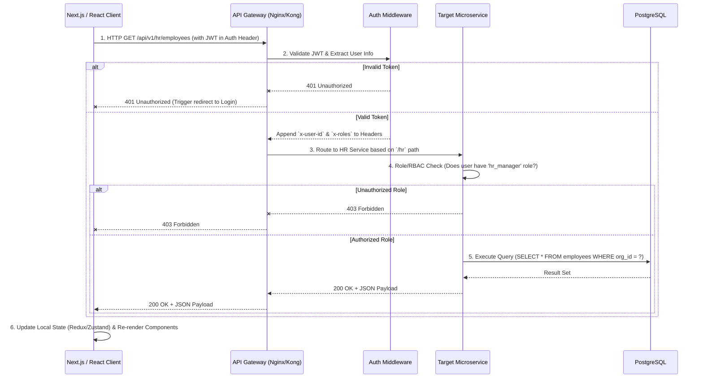

# Frontend to Backend Communication Flow

> [!TIP]
> This document explains the API request lifecycle and real-time update flow from the Next.js/React frontend to the backend microservices.

## 1. API Request Lifecycle

## 2. Real-Time Update Lifecycle (WebSockets)

For live monitoring, polling is inefficient. We use WebSockets for bi-directional communication.

1. **Connection Initiation**: Upon successful login, the React client initiates a `wss://` connection to the Gateway.
2. **Upgrade**: The Gateway upgrades the HTTP connection to WebSocket and passes it to the WebSocket Cluster.
3. **Authentication**: The first message sent by the client must be an authentication payload (`{ "type": "AUTH", "token": "jwt_here" }`).
4. **Subscription**: Once authenticated, the WebSocket server subscribes the user to specific Redis Pub/Sub channels based on their role and organization (e.g., `channel:org:123:alerts`).
5. **Pushing Data**: When backend services (like the AI Engine) detect an anomaly, they publish to Redis. The WebSocket server receives this and pushes a JSON event (`{ "type": "ANOMALY_DETECTED", "data": {...} }`) down to the specific connected client.
6. **Frontend Handling**: The React application listens to these socket events and dispatches actions to update the UI without requiring a page refresh.
