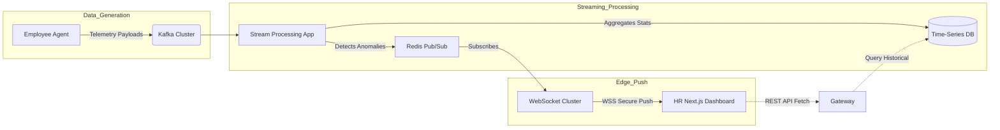

# HR Monitoring Flow

> [!TIP]
> This document details how HR receives live employee tracking data and handles analytics through the monitoring dashboard.

## 1. HR Live Dashboard Pipeline

The HR Dashboard is designed to never require manual page refreshes. All monitoring data is pushed in real-time.

## 2. Receiving Live Tracking Data

1. **Ingestion**: When an employee's machine sends telemetry (active window, idle status, URL visited), it lands in Kafka.
2. **Stream Processing**: A Node.js stream processor evaluates this data instantly. If it determines a status change (e.g., from `ACTIVE` to `IDLE`), it publishes an event to a Redis Pub/Sub topic specifically for that organization (e.g., `org:123:presence`).
3. **WebSocket Push**: The WebSocket cluster is subscribed to these Redis topics. When the event arrives, it maps the organization ID to the connected HR Managers and pushes the JSON payload over the secure WebSocket connection.
4. **UI Update**: The React state within the Next.js HR dashboard updates instantly, changing the employee's dot from green to yellow, or updating the "Live Screens" view.

## 3. Analytics Calculation & Delivery

HR doesn't just need raw data; they need actionable intelligence.

- **Batch Processing**: At the end of the day, an Analytics Service runs MapReduce jobs against the Time-Series DB.
- **Productivity Scoring**: It calculates focus time (time spent in 'Productive' tagged apps) versus distracted time, generating a normalized score (0-100).
- **Report Generation**: This processed data is saved to the primary PostgreSQL DB. When HR clicks the "Analytics" tab, it fetches these pre-calculated scores rather than crunching raw telemetry, ensuring sub-100ms API responses.
