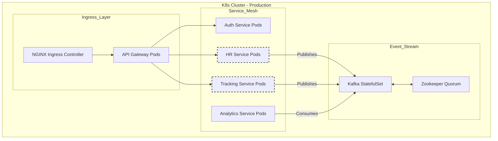

# Microservice Architecture & Orchestration

> [!NOTE]
> WorkSphere operates on a containerized microservice architecture. This document details service orchestration, scaling, and fault tolerance mechanisms.

## 1. Microservice Topology

## 2. Containerization (Docker)

Every microservice is built into a standalone Docker image containing its runtime (e.g., Node.js 18), dependencies, and application code. This guarantees that code runs identically regardless of the environment.

## 3. Orchestration (Kubernetes)

We utilize Kubernetes (K8s) to manage the lifecycle of these Docker containers across a cluster of virtual machines.

- **Deployments**: Each service is managed by a K8s Deployment, defining the desired state (e.g., "Run 3 replicas of the HR Service").
- **HPA (Horizontal Pod Autoscaler)**: Services like the `Tracking Service` experience massive spikes during morning check-ins. The HPA monitors CPU/Memory utilization and automatically spins up additional Pods to handle the load, scaling back down during off-hours to save costs.
- **Service Discovery**: Microservices communicate internally using K8s DNS (e.g., `http://auth-service.default.svc.cluster.local:8080`). They do not hardcode IP addresses.
- **Self-Healing**: If a Node.js process crashes due to an unhandled exception, Kubernetes detects the pod failure via readiness/liveness probes and automatically restarts it.

## 4. Fault Tolerance & Circuit Breaking

When Service A calls Service B, and Service B is degraded, Service A must not hang indefinitely.
We implement **Circuit Breakers** (using libraries like `Opossum` or via Istio Service Mesh).
If the Auth Service begins timing out, the API Gateway "trips" the circuit, instantly returning 503 Service Unavailable to new requests rather than waiting for timeouts, preventing cascading failures across the entire cluster.
