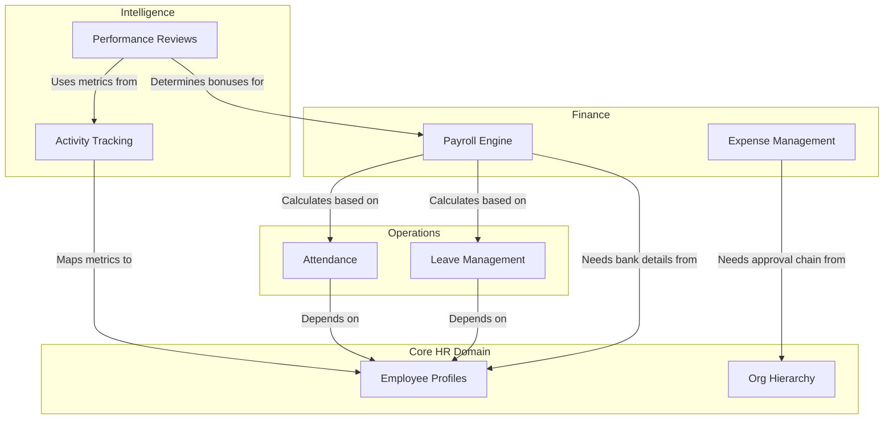

# Module Dependency & Domain Flow

> [!TIP]
> This document maps how the different business domains (Core HR, Payroll, Leave, Tracking) depend on each other within the system.

## 1. Domain Dependency Architecture

## 2. Dependency Management Strategy

In a microservices architecture, tightly coupling domains creates a distributed monolith. We manage these dependencies through:

1. **API Composition**: When the UI needs to show a "Full Employee Profile", it doesn't just call the HR Service. It calls an API Gateway aggregation endpoint, which fetches the base profile from `Core HR`, the current tracking metrics from `Intelligence`, and the latest payslip from `Finance`, stitching them together in memory before returning to the UI.
2. **Event Sourcing**: The Payroll Engine doesn't constantly query the Leave Management service. Instead, it maintains a read-replica of leave balances updated via Kafka events from the Leave service.
3. **Resilience**: If the `Intelligence` domain goes down, the `Finance` domain can still process base payrolls because it operates on its localized, eventually-consistent data copies.
