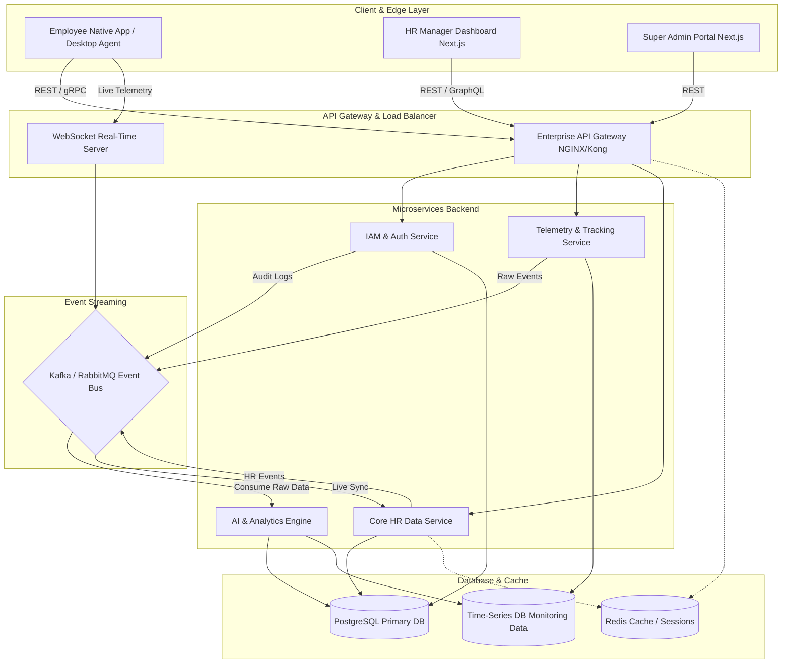

# WorkSphere Enterprise Activity Intelligence System

> [!IMPORTANT]
> **Confidential & Proprietary**
> This documentation package contains the enterprise architectural blueprints for the WorkSphere Enterprise Monitoring System. Distribution is restricted to authorized personnel.

## 1. Project Overview
The WorkSphere Enterprise Monitoring System is a highly scalable, distributed HR Data and Activity Intelligence Hub. Designed with a microservices-oriented architecture, it handles thousands of concurrent telemetry streams, silent employee activity monitoring, AI-based leave and performance analytics, and real-time dashboarding for enterprise HR and executive roles.

## 2. Master Architecture Flow

## 3. Enterprise Architecture
The architecture is built on a multi-tier, event-driven pattern designed for resilience and low latency:
- **Frontend**: React and Next.js applications for highly responsive, SSR-capable dashboards.
- **Backend APIs**: Node.js and Express services providing RESTful endpoints, alongside gRPC for high-speed inter-service communication.
- **Real-Time Layer**: WebSockets powered by Redis Pub/Sub for immediate data propagation.
- **Data Persistence**: PostgreSQL for relational ACID transactions, Redis for session state, and a Time-Series Database (TSDB) for telemetry data.

## 4. Folder Structure Overview
The `hr-data` documentation repository is structured as follows:
- `/diagrams`: Mermaid sequence, state, and component diagram source files.
- `/flows`: Detailed flow documentation (Employee, HR, Super Admin).
- `/architecture`: Infrastructure and deployment topology documents.
- `/schemas`: Database ERDs and API schema definitions.
- `/images`: Output placeholder directory for rendered architectural graphics.
- `/docs`: Auxiliary reference material.

## 5. Security & Deployment Architecture
- **Security**: JWT-based stateless authentication, strict Role-Based Access Control (RBAC), and tenant-isolation at the schema level.
- **Deployment**: Fully containerized using Docker, orchestrated via Kubernetes across multi-AZ clusters for high availability.

## 6. Real-Time Monitoring & AI Analytics
The system employs an AI Monitoring Engine that silently ingests tracking data via the Event Bus, calculates productivity metrics, identifies anomalies, and pushes actionable insights to the HR Dashboard via WebSockets.

---
*For detailed breakdowns of specific domains, please refer to the specialized documentation files within this package.*
