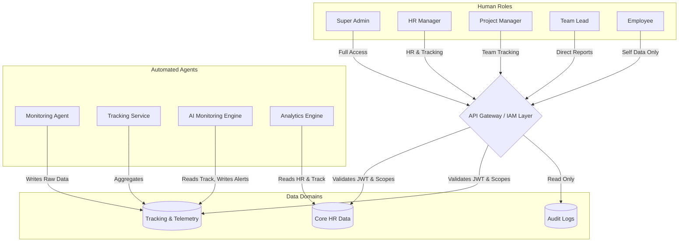

# Role Connection & RBAC Flow

> [!NOTE]
> This document explains the Role-Based Access Control (RBAC) system and how each role connects to the HR Dashboard and underlying data services.

## 1. Role Interaction Architecture

## 2. Detailed Role Capabilities & Access

### Super Admin
- **Access**: Global infrastructure, tenant settings, cross-tenant audit logs.
- **Permissions**: Full CRUD across all system APIs. Can impersonate roles for debugging.
- **APIs**: `/api/v1/admin/*`, `/api/v1/system/*`
- **Database**: Access to system configuration, tenant tables, and immutable audit logs.

### HR Manager
- **Access**: All employee data within their assigned organization/tenant.
- **Permissions**: Manage onboarding, view aggregated telemetry, approve global leaves, configure HR policies.
- **APIs**: `/api/v1/hr/*`, `/api/v1/analytics/org`
- **Database**: Full read/write to Core HR tables; Read-only to processed Tracking tables.

### Project Manager & Team Lead
- **Access**: Restricted to employees mapped under their specific projects or team hierarchy.
- **Permissions**: Approve task assignments, view team velocity, view team attendance.
- **APIs**: `/api/v1/teams/*`, `/api/v1/projects/*`
- **Database**: Read access filtered dynamically by `manager_id` or `project_id` foreign keys.

### Employee
- **Access**: Strictly limited to their own profile, tasks, and timesheets.
- **Permissions**: Update personal info, submit leave requests, view own metrics.
- **APIs**: `/api/v1/employee/me/*`
- **Database**: Row-level security enforces they can only read rows where `user_id = token.id`.

### Automated System Roles
- **Monitoring Agent**: An edge client that acts with an `agent` token. Permitted only to push telemetry payloads to the ingress APIs. Cannot read data.
- **Tracking Service**: Backend service that processes raw payloads into structured time-series data.
- **Analytics Engine**: Reads historical data to generate aggregated reports (e.g., Weekly Productivity).
- **AI Monitoring Engine**: Continuously streams data to detect anomalies (e.g., credential sharing, impossible travel) and automatically triggers alerts to the HR Dashboard.

## 3. Data Routing Mechanics

Role-based routing works via JWT Claims. When a user authenticates, their JWT contains a `roles` array and an `org_id`. The API Gateway parses this token, and middleware on every backend route verifies if the user's role satisfies the required permissions before accessing the database.
