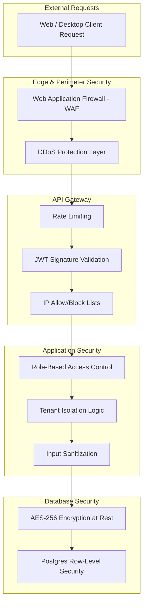

# Security Architecture & Authentication Flow

> [!CAUTION]
> Enterprise systems handling sensitive HR and tracking data must implement defense-in-depth strategies. This document details the security layers, authentication, and authorization flows.

## 1. Security Layer Flow

## 2. Authentication Flow (JWT)

1. **Login**: User submits email/password to `/api/v1/auth/login`.
2. **Verification**: Auth Service hashes the input password (using Argon2 or bcrypt) and compares it against the DB.
3. **Token Generation**: If successful, a JSON Web Token (JWT) is generated. The payload contains `user_id`, `org_id`, and an array of `roles`. It is signed with an RSA private key.
4. **Token Delivery**: The JWT is sent back to the client, typically stored in a secure, `HttpOnly` cookie to prevent XSS attacks.
5. **Subsequent Requests**: The API Gateway intercepts incoming requests, verifies the JWT signature using the public key. If valid, it forwards the request; if expired or manipulated, it returns 401.

## 3. Session Management & Revocation

JWTs are stateless, meaning they cannot be inherently "logged out" before they expire.
- To handle immediate revocation (e.g., HR terminates an employee), we implement a **Redis Blacklist**.
- When an employee is terminated, their `user_id` is written to Redis.
- The API Gateway checks the Redis blacklist for every request. If the ID exists, the request is blocked, effectively terminating the session instantly.

## 4. Multi-Tenant Architecture & Data Isolation

WorkSphere supports multiple organizations (tenants) on the same infrastructure.
- **Tenant ID Injection**: Every valid request has the `org_id` extracted from the JWT by the gateway and appended to internal headers.
- **Query Level Isolation**: Every backend query MUST include `WHERE org_id = ?`.
- **Database Level Isolation**: For maximum security, PostgreSQL Row-Level Security (RLS) policies are applied. Even if a developer writes a query forgetting the `org_id` filter, the DB engine will intercept and enforce the isolation, preventing cross-tenant data leaks.
