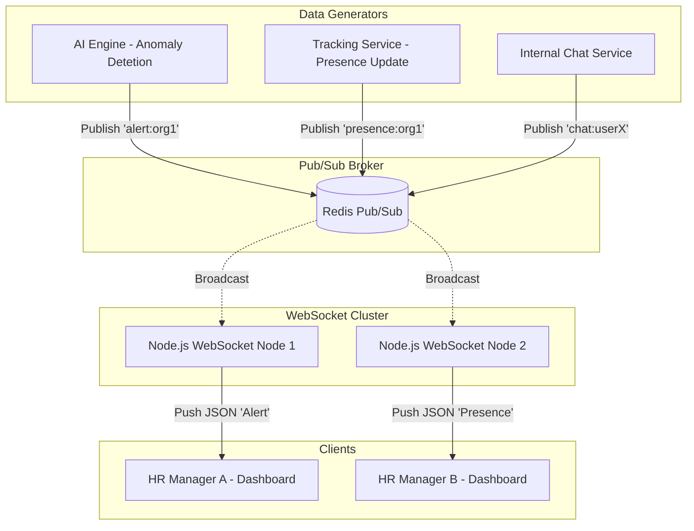

# WebSocket Real-Time Push Flow

> [!TIP]
> To achieve a "live" HR dashboard, the system utilizes WebSockets backed by Redis Pub/Sub to instantly push monitoring updates to clients.

## 1. Real-Time Push Architecture

## 2. How WebSockets Push Live Updates

1. **Stateful Connections**: Unlike HTTP, a WebSocket connection remains open. The client (HR Dashboard) holds a persistent TCP connection to one of the WebSocket Nodes (`WS1` or `WS2`).
2. **Distributed Architecture**: Because WebSockets are stateful, a load balancer cannot easily move a connection. If `HR1` is connected to `WS1`, only `WS1` can push data to `HR1`.
3. **The Pub/Sub Solution**: To solve the distributed problem, all WebSocket Nodes subscribe to the central Redis Pub/Sub cluster.
4. **The Push Event**: 
   - The AI Engine detects an employee using a restricted app. It publishes an event to Redis: `PUBLISH "org:123:alerts" "{"type": "APP_VIOLATION", ...}"`.
   - Redis broadcasts this to all connected WebSocket nodes.
   - Every node checks its internal memory mapping: "Do I have any active connections subscribed to `org:123:alerts`?"
   - `WS1` sees `HR1` is connected and authorized. It pushes the JSON payload through the open socket.
   - The React UI receives the message and triggers a Redux action to display an alert toast.

## 3. Handling Disconnects

- **Ping/Pong**: The server sends a Ping every 30 seconds. If the client fails to Pong, the connection is dropped to save resources.
- **Auto-Reconnect**: The React client uses libraries like `Socket.io` or ReconnectingWebsocket to automatically attempt reconnection with exponential backoff if the network drops.
- **Missed Messages**: WebSockets are fire-and-forget. If HR loses connection, they might miss an alert. Upon reconnection, the UI performs a standard REST API fetch to "sync up" any missed historical data, then resumes listening for live events.
