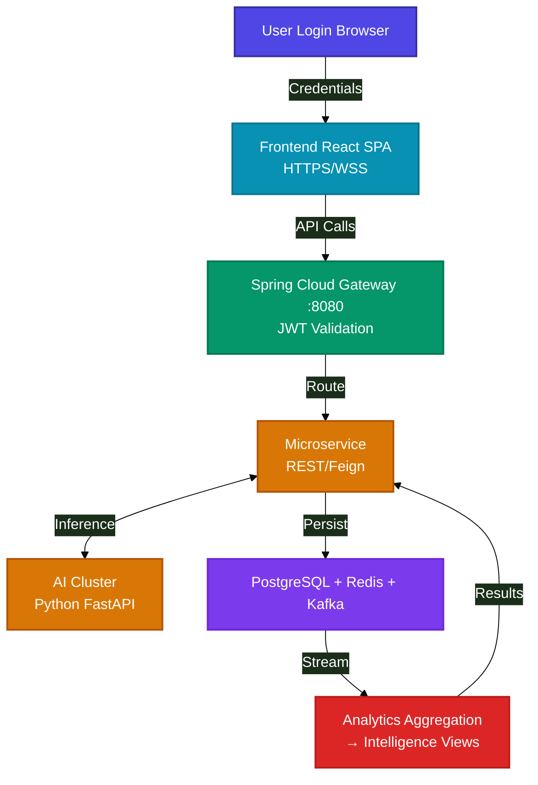
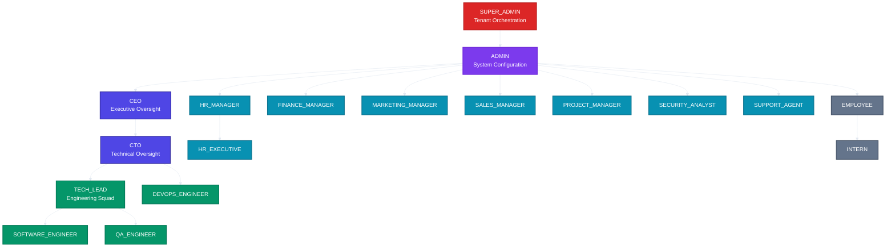
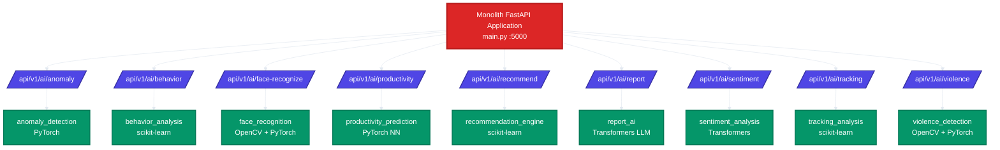

# WorkSphere Enterprise — Complete Project Overview

> **AI-Powered Enterprise Activity Intelligence Platform**
> Built for MNC-scale organizations (Zoho, Accenture, Cognizant-grade)

---

## Table of Contents

1. [Project Identity & Vision](#1-project-identity--vision)
2. [MVP Scope (Minimum Viable Product)](#2-mvp-scope-minimum-viable-product)
3. [Complete Technology Stack](#3-complete-technology-stack)
4. [System Architecture (7-Tier)](#4-system-architecture-7-tier)
5. [Database Design & Entity Relationships](#5-database-design--entity-relationships)
6. [18 Enterprise Roles & RBAC Matrix](#6-18-enterprise-roles--rbac-matrix)
7. [10 Microservices Breakdown](#7-10-microservices-breakdown)
8. [AI Services Cluster](#8-ai-services-cluster)
9. [Desktop Agent (Monitoring Engine)](#9-desktop-agent-monitoring-engine)
10. [Frontend Module Architecture](#10-frontend-module-architecture)
11. [Deployment Strategy](#11-deployment-strategy)
12. [What's Needed for Full Production](#12-whats-needed-for-full-production)
13. [Project File Structure (Full Map)](#13-project-file-structure-full-map)

---

## 1. Project Identity & Vision

| Attribute | Value |
|-----------|-------|
| **Name** | WorkSphere Enterprise (formerly LiveGuard Pro) |
| **Tagline** | AI-Powered Activity Intelligence Platform |
| **Target** | MNC-scale organizations (5000+ employees) |
| **Purpose** | Real-time employee monitoring, productivity analytics, biometric security, GPS fleet tracking, AI-driven insights, and modular role-based command center |
| **Value Prop** | Single Pane of Glass operational experience across 18 enterprise departments |

### Core Capabilities

- Zero-latency workstation activity tracking via Electron desktop agent
- AI-driven productivity scoring, anomaly detection, and burnout prediction
- Biometric facial recognition login + geofencing access control
- Deep-kernel malware scanning with auto-rectification
- Multi-node GPS fleet tracking with hardware signal verification
- Automated PDF/Excel forensic report generation
- Real-time WebSocket/Kafka event streaming across all dashboards
- React Native mobile companion app

---

## 2. MVP Scope (Minimum Viable Product)

### Phase 1 — Core Monitoring & Basic Dashboard (MVP)

```
Status: ✅ DONE (Code Complete)
```

| Feature | Description |
|---------|-------------|
| Electron Desktop Agent | Kernel-level window telemetry, active app polling, GPS location, malware scanning |
| Telemetry Backend (Node.js) | Express REST API + WebSocket broadcast hub, receives agent data |
| Frontend Dashboard | React 18 + Vite + TypeScript, TailwindCSS 4, glassmorphic UI |
| 3 Core Dashboards | SUPER_ADMIN (full system), EMPLOYEE (self-service), HR_MANAGER (attendance) |
| JWT Authentication | Bearer token login with role-based routing |
| Live GPS Tracking | Leaflet map with multi-node fleet overlay |
| Basic RBAC | Role-based view switching with 18 role definitions |
| System Monitoring | CPU/RAM/GPU gauges, active window telemetry, idle detection |

### Phase 2 — AI & Intelligence (Enhancement)

| Feature | Description |
|---------|-------------|
| Python FastAPI AI Cluster | 8 AI microservices (anomaly, face, productivity, behavior, etc.) |
| AI Productivity Scoring | Neural network prediction of active working efficiency |
| Face Recognition | Zero-input biometric facial capture login flow |
| Sentiment Analysis | Enterprise communication sentiment scoring |
| Report AI | LLM-assisted executive summary generation |

### Phase 3 — Enterprise Scale (Complete)

| Feature | Description |
|---------|-------------|
| 10 Spring Boot Microservices | Full decoupled service cluster with API gateway |
| 18 Role Dashboards | All departments: CEO, CTO, HR, Finance, Marketing, Sales, etc. |
| Multi-Cloud Deployment | AWS EKS, Azure AKS, GCP GKE with Terraform |
| Kubernetes Orchestration | StatefulSets, Deployments, Ingress, Services |
| CI/CD Pipelines | GitHub Actions automated build/test/deploy |
| React Native Mobile App | Employee attendance, notifications, GPS check-in |
| Prometheus + Grafana | Infrastructure monitoring and alerting |

---

## 3. Complete Technology Stack

### Frontend Tier

| Technology | Version | Purpose |
|-----------|---------|---------|
| React | 18.3.x | UI component library |
| TypeScript | 6.0.x | Type-safe JavaScript |
| Vite | 6.1.x | Build tool & HMR dev server |
| TailwindCSS | 4.0.x | Utility-first CSS framework |
| Redux Toolkit | 2.5.x | State management |
| Redux Saga | 1.3.x | Side effect middleware |
| React Router | 7.1.x | Client-side routing |
| Recharts | 2.15.x | Charting & data visualization |
| Framer Motion | 12.x | Animation library |
| Socket.IO Client | 4.8.x | Real-time WebSocket communication |
| jsPDF | 4.2.x | PDF report generation |
| Lucide React | 0.47.x | Icon library |
| @xyflow/react | 12.x | Node-based workflow UI |

### Backend Tier (Spring Boot)

| Technology | Version | Purpose |
|-----------|---------|---------|
| Java | 17 | Runtime language |
| Spring Boot | 3.2.5 | Application framework |
| Spring Security | 6.x | Authentication & authorization |
| Spring Data JPA | 3.x | ORM & database access |
| Spring WebSocket | 6.x | Real-time bidirectional communication |
| Spring Kafka | 3.x | Event streaming integration |
| Spring Data Redis | 3.x | Distributed caching |
| PostgreSQL | 15 | Primary relational database |
| JSON Web Tokens (jjwt) | 0.12.5 | Stateless authentication |
| Lombok | Latest | Boilerplate reduction |
| SpringDoc OpenAPI | 2.5.0 | API documentation (Swagger) |

### Backend Tier (Node.js)

| Technology | Version | Purpose |
|-----------|---------|---------|
| Node.js | 18+ | Runtime |
| Express | 4.x | REST API framework |
| Socket.IO | 4.x | WebSocket server |
| jsPDF | 2.x | Server-side PDF generation |

### Desktop Agent

| Technology | Version | Purpose |
|-----------|---------|---------|
| Electron | 31.x | Cross-platform desktop runtime |
| active-win | 9.x | Active window detection (Win/Mac/Linux) |
| screenshot-desktop | 1.x | Screen capture capability |
| PowerShell (WinRT) | N/A | Hardware GPS geolocation |

### AI Services (Python)

| Technology | Version | Purpose |
|-----------|---------|---------|
| Python | 3.10+ | Runtime |
| FastAPI | 0.110.x | ASGI web framework for inference endpoints |
| PyTorch | 2.2.x | Deep learning model execution |
| scikit-learn | 1.4.x | Classical ML algorithms |
| OpenCV | 4.9.x | Computer vision (face/violence detection) |
| Transformers | 4.38.x | HuggingFace NLP models |
| NumPy / Pandas | Latest | Data processing |
| Uvicorn | 0.28.x | ASGI server |

### Infrastructure & DevOps

| Technology | Purpose |
|-----------|---------|
| Docker | Containerization |
| Docker Compose | Local multi-container orchestration |
| Kubernetes | Container orchestration (production) |
| Terraform | Infrastructure as Code |
| Prometheus | Metrics collection |
| Grafana | Metrics visualization & dashboards |
| GitHub Actions | CI/CD pipelines |
| Nginx | Reverse proxy & load balancing |

### Messaging & Streaming

| Technology | Purpose |
|-----------|---------|
| Apache Kafka | Event streaming & message broker |
| Redis 7 | Distributed caching, pub/sub, session store |
| WebSocket / Socket.IO | Real-time bidirectional client-server communication |

### Mobile

| Technology | Purpose |
|-----------|---------|
| React Native | Cross-platform mobile app (Android + iOS) |
| Expo (app.json) | Mobile build configuration |

---

## 4. System Architecture (7-Tier)

```mermaid
%%{init: {'theme':'base', 'themeVariables': {'primaryColor': '#1a1a2e', 'primaryTextColor': '#ffffff', 'lineColor': '#e2e8f0', 'fontSize': '14px'}}}%%
graph TB

    classDef tier1 fill:#4f46e5,stroke:#3730a3,color:#fff,stroke-width:2px
    classDef tier2 fill:#0891b2,stroke:#0e7490,color:#fff,stroke-width:2px
    classDef tier3 fill:#059669,stroke:#047857,color:#fff,stroke-width:2px
    classDef tier4 fill:#d97706,stroke:#b45309,color:#fff,stroke-width:2px
    classDef tier5 fill:#7c3aed,stroke:#6d28d9,color:#fff,stroke-width:2px
    classDef tier6 fill:#dc2626,stroke:#b91c1c,color:#fff,stroke-width:2px
    classDef tier7 fill:#64748b,stroke:#475569,color:#fff,stroke-width:2px

    subgraph CLIENTS["TIER 1: CLIENTS"]
        B[Browser React SPA]
        EL[Electron Desktop Agent]
        MB[React Native Mobile App]
        EXT[External API Consumers]
    end

    subgraph GATEWAY["TIER 2: API GATEWAY (Spring Cloud Gateway :8080)"]
        GW[Gateway Routes]
        R1[/api/v1/auth/* → auth-service:8081]
        R2[/api/v1/employee/* → employee-service:8082]
        R3[/api/v1/hr/* → hr-service:8083]
        R4[/api/v1/analytics/* → analytics-service:8084]
        R5[/api/v1/ai/* → ai-service:8085]
        R6[/api/v1/notification/* → notification-service:8086]
        R7[/api/v1/monitoring/* → monitoring-service:8087]
        R8[/api/v1/gps/* → gps-service:8088]
        R9[/api/v1/report/* → report-service:8089]
    end

    subgraph MICROSERVICES["TIER 3: MICROSERVICES CLUSTER (Spring Boot :8081-8089)"]
        AS[auth-service :8081]
        EM[employee-service :8082]
        HR[hr-service :8083]
        AN[analytics-service :8084]
        AI[ai-service :8085]
        NT[notification-service :8086]
        MN[monitoring-service :8087]
        GP[gps-service :8088]
        RP[report-service :8089]
    end

    subgraph AI_CLUSTER["TIER 4: AI INFERENCE CLUSTER (Python FastAPI)"]
        AD[Anomaly Detection<br/>(PyTorch)]
        FC[Face Recognition<br/>(OpenCV/PyTorch)]
        PP[Productivity Predict<br/>(Neural Network)]
        BA[Behavior Analysis]
        SA[Sentiment Analysis]
        VD[Violence Detection]
        TA[Tracking Analysis]
        RA[Report AI (LLM)]
    end

    subgraph DATA["TIER 5: DATA LAYER"]
        PG[(PostgreSQL 15<br/>users, roles, employees<br/>monitoring, tracking<br/>analytics, reports)]
        RD[(Redis 7<br/>Sessions<br/>Pub/Sub<br/>Rate Limit)]
        KF[Apache Kafka<br/>telemetry-events<br/>location-updates<br/>security-threats<br/>notification-queue]
    end

    subgraph ANALYTICS["TIER 6: ANALYTICS & AGGREGATION ENGINE"]
        AE[Daily Productivity Aggregation<br/>Burnout Risk Scoring<br/>Attendance Compliance Reports<br/>Automated PDF/Excel Generation]
    end

    subgraph OBSERV["TIER 7: MONITORING & OBSERVABILITY"]
        PM[Prometheus<br/>Metrics]
        GR[Grafana<br/>Dashboards]
        EL[ELK / Log Aggregation<br/>Logs]
    end

    B & EL & MB & EXT -->|HTTPS/WSS| GW
    GW --> AS & EM & HR & AN & AI & NT & MN & GP & RP
    AI -->|Feign Client| AD & FC & PP & BA & SA & VD & TA & RA
    AS & EM & HR & MN & GP --> PG
    AS & EM & MN --> RD
    MN & GP -->|Produce| KF
    NT & AN -->|Consume| KF
    PG -->|Daily Aggregation| AE
    KF -->|Stream Events| AE
    AE -->|Store Results| PG
    PM -->|Scrape| GW & MN
    GR -->|Query| PM
    EL -->|Ingest Logs| MN & AS
    AE -->|Reports| RP

    class B,EL,MB,EXT tier1
    class GW,R1,R2,R3,R4,R5,R6,R7,R8,R9 tier2
    class AS,EM,HR,AN,AI,NT,MN,GP,RP tier3
    class AD,FC,PP,BA,SA,VD,TA,RA tier4
    class PG,RD,KF tier5
    class AE tier6
    class PM,GR,EL tier7
```

### Request Flow



---

## 5. Database Design & Entity Relationships

### Entity Relationship Diagram (Logical)

```mermaid
%%{init: {'theme':'base', 'themeVariables': {'primaryColor': '#1a1a2e', 'primaryTextColor': '#ffffff', 'lineColor': '#e2e8f0'}}}%%
erDiagram

    users {
        BIGINT id PK
        VARCHAR username UK
        VARCHAR password
        VARCHAR email UK
        BOOLEAN is_active
        TIMESTAMP created_at
        TIMESTAMP updated_at
    }

    roles {
        BIGINT id PK
        VARCHAR name UK
        TEXT description
        TIMESTAMP created_at
    }

    user_roles {
        BIGINT user_id FK
        BIGINT role_id FK
    }

    permissions {
        BIGINT id PK
        VARCHAR name UK
        TEXT description
    }

    role_permissions {
        BIGINT role_id FK
        BIGINT permission_id FK
    }

    employees {
        BIGINT id PK
        BIGINT user_id FK UK
        VARCHAR employee_id UK
        VARCHAR first_name
        VARCHAR last_name
        VARCHAR department
        VARCHAR designation
        DATE joining_date
        TIMESTAMP created_at
        TIMESTAMP updated_at
    }

    workstation_telemetry {
        BIGINT id PK
        BIGINT employee_id FK
        NUMERIC cpu_usage
        NUMERIC memory_usage
        VARCHAR active_window
        INT keystroke_rate
        INT mouse_clicks
        VARCHAR screenshot_url
        TIMESTAMPTZ recorded_at
    }

    live_tracking {
        BIGINT id PK
        BIGINT employee_id FK
        NUMERIC latitude
        NUMERIC longitude
        NUMERIC accuracy_meters
        VARCHAR signal_source
        TIMESTAMPTZ recorded_at
    }

    productivity_analytics {
        BIGINT id PK
        BIGINT employee_id FK
        DATE date
        NUMERIC productive_hours
        NUMERIC idle_hours
        NUMERIC burnout_risk_score
    }

    forensic_reports {
        BIGINT id PK
        VARCHAR report_id UK
        BIGINT generated_by FK
        VARCHAR title
        TEXT summary
        VARCHAR file_url
        TIMESTAMP created_at
    }

    users ||--o{ user_roles : has
    roles ||--o{ user_roles : includes
    roles ||--o{ role_permissions : grants
    permissions ||--o{ role_permissions : assigned
    users ||--|| employees : "1:1"
    employees ||--o{ workstation_telemetry : "1:N"
    employees ||--o{ live_tracking : "1:N"
    employees ||--o{ productivity_analytics : "1:N"
    users ||--o{ forensic_reports : generates
```

### Complete Schema Inventory

| Table | File | Description |
|-------|------|-------------|
| `users` | `schema/users.sql` | Core authentication & identity |
| `roles` | `schema/roles.sql` | 18 enterprise role definitions |
| `permissions` | `schema/permissions.sql` | 13 granular permissions |
| `user_roles` | `schema/roles.sql` | M:N user-to-role mapping |
| `role_permissions` | `schema/permissions.sql` | M:N role-to-permission mapping |
| `employees` | `schema/employees.sql` | Employee profiles & org hierarchy |
| `workstation_telemetry` | `schema/monitoring.sql` | High-frequency WinRT telemetry |
| `live_tracking` | `schema/tracking.sql` | Hardware GPS geolocation data |
| `productivity_analytics` | `schema/analytics.sql` | Daily aggregated productivity scores |
| `forensic_reports` | `schema/reports.sql` | Compliance & audit reports |
| Seed data | `schema/seed.sql` | Initial database population |

### Indexing Strategy

| Index | Table | Columns | Purpose |
|-------|-------|---------|---------|
| `idx_users_username` | users | username | Fast login lookups |
| `idx_users_email` | users | email | Email-based auth |
| `idx_users_is_active` | users | is_active | Filter active users |
| `idx_employees_emp_id` | employees | employee_id | Employee ID lookups |
| `idx_employees_dept` | employees | department | Department filtering |
| `idx_user_roles_user_id` | user_roles | user_id | User role queries |
| `idx_user_roles_role_id` | user_roles | role_id | Role membership queries |
| `idx_role_permissions_role_id` | role_permissions | role_id | Permission resolution |
| `idx_role_permissions_perm_id` | role_permissions | permission_id | Reverse lookups |
| `idx_telemetry_emp_id` | workstation_telemetry | employee_id | Employee telemetry queries |
| `idx_telemetry_recorded_at` | workstation_telemetry | recorded_at | Time-range queries |
| `idx_tracking_emp_id` | live_tracking | employee_id | Employee location queries |
| `idx_tracking_recorded_at` | live_tracking | recorded_at | Location history |
| `idx_analytics_emp_date` | productivity_analytics | employee_id, date | Daily analytics lookups |
| `idx_reports_report_id` | forensic_reports | report_id | Report ID lookups |
| `idx_reports_created_at` | forensic_reports | created_at | Report date filtering |

---

## 6. 18 Enterprise Roles & RBAC Matrix

### Role Hierarchy



### Role Detail Matrix

| # | Role | Dashboard Focus | Key Permissions |
|---|------|----------------|-----------------|
| 1 | **SUPER_ADMIN** | Global tenant orchestration, RBAC matrix | ADMIN_ACCESS, all permissions |
| 2 | **ADMIN** | System config, user provisioning, IT infra | CREATE_USER, UPDATE_USER, DELETE_USER |
| 3 | **CEO** | Revenue, headcount KPIs, executive insights | VIEW_REPORT, VIEW_ANALYTICS |
| 4 | **CTO** | Engineering velocity, cloud infra burn | VIEW_ANALYTICS, MANAGE_PROJECT |
| 5 | **HR_MANAGER** | Headcount, payroll, ATS recruitment | MANAGE_EMPLOYEE, VIEW_REPORT |
| 6 | **HR_EXECUTIVE** | Onboarding, attendance, grievances | MANAGE_EMPLOYEE |
| 7 | **FINANCE_MANAGER** | Budget burn, invoices, OPEX/CAPEX | MANAGE_FINANCE, VIEW_REPORT |
| 8 | **MARKETING_MANAGER** | Campaign ROI, ad spend, lead gen | VIEW_ANALYTICS, EXPORT_REPORT |
| 9 | **SALES_MANAGER** | Pipeline velocity, ARR/MRR quota | VIEW_ANALYTICS, VIEW_GPS |
| 10 | **PROJECT_MANAGER** | Sprint planning, burndown, resources | MANAGE_PROJECT, VIEW_REPORT |
| 11 | **TECH_LEAD** | PR reviews, git velocity, squad metrics | MANAGE_PROJECT, VIEW_ANALYTICS |
| 12 | **DEVOPS_ENGINEER** | CI/CD, K8s health, server uptime | VIEW_ANALYTICS, ADMIN_ACCESS (infra) |
| 13 | **QA_ENGINEER** | Test coverage, bug triage, RC verification | VIEW_REPORT, EXPORT_REPORT |
| 14 | **SECURITY_ANALYST** | Threat detection, malware, firewall | VIEW_REPORT, TRACK_EMPLOYEE |
| 15 | **SOFTWARE_ENGINEER** | Sprint tasks, git commits, working hours | VIEW_GPS, EXPORT_REPORT (self) |
| 16 | **SUPPORT_AGENT** | Ticket resolution, SLA, chat queue | VIEW_REPORT |
| 17 | **EMPLOYEE** | Attendance, productivity, tasks | VIEW_GPS (self) |
| 18 | **INTERN** | Learning path, mentor feedback, tasks | VIEW_REPORT (restricted) |

### 13 Granular Permissions

```
1. CREATE_USER     — Create new user accounts
2. UPDATE_USER     — Modify user profiles
3. DELETE_USER     — Remove user accounts
4. VIEW_REPORT     — Access reporting module
5. MANAGE_EMPLOYEE — Manage employee records
6. TRACK_EMPLOYEE  — Access employee tracking/GPS
7. VIEW_ANALYTICS  — View analytics dashboards
8. MANAGE_FINANCE  — Access financial data
9. MANAGE_PROJECT  — Manage projects and sprints
10. VIEW_GPS       — View GPS tracking data
11. EXPORT_REPORT  — Export reports (PDF/Excel)
12. AI_ACCESS      — Access AI inference features
13. ADMIN_ACCESS   — Full system administrative access
```

---

## 7. 10 Microservices Breakdown

| # | Service | Port | Tech | Routes | Responsibility |
|---|---------|------|------|--------|----------------|
| 1 | **gateway-service** | 8080 | Spring Cloud Gateway | All `/api/v1/*` | Centralized routing, JWT validation, rate limiting |
| 2 | **auth-service** | 8081 | Spring Boot + Security | `/api/v1/auth/*` | JWT generation/validation, MFA, OAuth2 |
| 3 | **employee-service** | 8082 | Spring Boot + JPA | `/api/v1/employee/*` | Employee profiles, attendance, tasks |
| 4 | **hr-service** | 8083 | Spring Boot + JPA | `/api/v1/hr/*` | Recruitment, payroll, leave, performance |
| 5 | **analytics-service** | 8084 | Spring Boot | `/api/v1/analytics/*` | KPI aggregation, productivity scoring |
| 6 | **ai-service** | 8085 | Spring Boot (bridge) | `/api/v1/ai/*` | Orchestrates calls to Python FastAPI cluster |
| 7 | **notification-service** | 8086 | Spring Boot + Kafka | `/api/v1/notification/*` | Real-time toast alerts, email, SMS |
| 8 | **monitoring-service** | 8087 | Spring Boot + JPA | `/api/v1/monitoring/*` | Ingests workstation telemetry from agent |
| 9 | **gps-service** | 8088 | Spring Boot + JPA | `/api/v1/gps/*` | GPS coordinate ingestion, geofence checking |
| 10 | **report-service** | 8089 | Spring Boot | `/api/v1/report/*` | PDF/Excel automated report generation |

### Inter-Service Communication

- **REST/Feign Clients**: Synchronous calls between microservices
- **Apache Kafka**: Asynchronous event streaming (telemetry, location, threats)
- **Redis Pub/Sub**: Real-time cache invalidation and session management

---

## 8. AI Services Cluster

The Python FastAPI cluster runs alongside the microservices and provides 8 specialized AI/ML inference engines:

| AI Module | Framework | Purpose |
|-----------|-----------|---------|
| `anomaly_detection/` | PyTorch | Keystroke velocity & firewall packet anomaly detection |
| `behavior_analysis/` | scikit-learn | User behavioral profiling & risk scoring |
| `face_recognition/` | OpenCV + PyTorch | Zero-input biometric facial capture & matching |
| `productivity_prediction/` | PyTorch (NN) | Neural network predicting active working efficiency |
| `recommendation_engine/` | scikit-learn | AI-driven workflow optimization suggestions |
| `report_ai/` | Transformers (LLM) | LLM-assisted executive summary generation |
| `sentiment_analysis/` | Transformers | Enterprise communication sentiment scoring |
| `tracking_analysis/` | scikit-learn | Geolocation anomaly & proxy-suppression detection |
| `violence_detection/` | OpenCV + PyTorch | Webcam feed visual workplace safety monitoring |

### AI Service Architecture



---

## 9. Desktop Agent (Monitoring Engine)

The Electron-based desktop agent runs on each employee's workstation and is the primary data collection point.

### Agent Capabilities

| Feature | Implementation | Frequency |
|---------|---------------|-----------|
| Active Window Detection | `active-win` npm module (cross-platform) | Every 1 second |
| App Title Parsing | Regex stripping of browser suffixes (Chrome, Edge, etc.) | Per snapshot |
| Idle/Break Detection | 60-second inactivity threshold → auto break logging | Continuous |
| Keystroke Velocity Simulation | Random 20-80 KPH range (non-recording) | Per snapshot |
| GPS Geolocation | PowerShell WinRT hardware API (`Get-Geolocation`) | Every 10 seconds |
| Signal Filtering | Accuracy tiers (Hardware <500m, Network <35km) | Per location |
| Malware Scanner | Heuristic file scanning against known patterns | On-demand |
| Threat Auto-Rectification | Automatic quarantine + IT notification | On detection |
| JSONL Logging | Write-ahead log with daily rotation | Continuous |
| Remote Suspend | Polls backend for tracking suspension status | Every 5 seconds |
| RBAC Integration | Role-based tray icon visibility | On role change |

### Agent Log Format (activity_log.jsonl)

```json
{
  "timestamp": "2026-05-27T10:30:00.000Z",
  "employeeId": "EMP-JOHN",
  "loginTime": "2026-05-27T09:00:00.000Z",
  "app": "Google Chrome",
  "title": "WorkSphere Dashboard",
  "appDuration": 120,
  "eventType": "system_snapshot",
  "keystrokeVelocity": 45,
  "mouseClicks": 3,
  "focused": true,
  "latitude": 12.9716,
  "longitude": 77.5946,
  "network": "Hardware (High)"
}
```

---

## 10. Frontend Module Architecture

The React frontend is organized as a consolidated modular ecosystem under `apps/enterprise-monitoring-system/frontend/`.

```
src/
├── api/               # Axios interceptors & REST API service clients
│   ├── auth/          # Login, register, MFA endpoints
│   ├── employee/      # Employee CRUD endpoints
│   ├── hr/            # HR module endpoints
│   ├── finance/       # Finance endpoints
│   ├── marketing/     # Marketing endpoints
│   ├── sales/         # Sales endpoints
│   ├── analytics/     # KPI & analytics endpoints
│   ├── tracking/      # GPS tracking endpoints
│   ├── monitoring/    # Telemetry endpoints
│   ├── reports/       # Report generation endpoints
│   ├── ai/            # AI inference endpoints
│   └── notification/  # Notification endpoints
│
├── app/               # Redux Toolkit store, rootReducer, rootSaga
├── assets/            # Icons, images, videos, fonts
├── auth/              # Login, Register, MFA, SessionTimeout
├── components/        # Reusable UI library
│   ├── common/        # Button, Modal, Loader, Table, Card, Input
│   ├── charts/        # BarChart, PieChart, HeatMap, ProductivityChart
│   ├── navbar/        # Top navigation bar
│   ├── sidebar/       # Role-based sidebar
│   ├── dashboard/     # Dashboard widgets
│   ├── reports/       # Report components
│   ├── tracking/      # GPS tracking map
│   ├── gps/           # GPS components
│   ├── ai/            # AI insight components
│   └── notifications/ # Toast & alert components
│
├── context/           # React Context providers (theme, socket)
├── hooks/             # Custom hooks (usePermissions, useTelemetry)
├── layouts/           # Role-specific layouts (Admin, Employee, HR, CEO, etc.)
├── models/            # TypeScript interfaces & types (18 roles, 13 permissions)
│   └── types.ts       # Role enums, permission enums, DTO interfaces
│
├── modules/           # Core enterprise modules
│   ├── chat/          # Real-time encrypted chat
│   ├── meeting/       # WebRTC video conferencing
│   └── webmail/       # Enterprise webmail
│
├── projects/          # Project management (Kanban, burndown)
│   └── ProjectManager.tsx
│
├── roles/             # 18 dedicated department dashboards
│   ├── admin/         # System configuration
│   ├── ceo/           # Executive macro dashboard
│   ├── cto/           # Engineering velocity
│   ├── devops_engineer/   # K8s & CI/CD
│   ├── employee/      # Personal attendance & tasks
│   ├── finance_manager/   # Budget & invoices
│   ├── hr_executive/  # Onboarding & grievances
│   ├── hr_manager/    # Headcount & ATS
│   ├── intern/        # Learning path
│   ├── marketing_manager/ # Campaign ROI
│   ├── project_manager/   # Sprint planning
│   ├── qa_engineer/   # Test coverage
│   ├── sales_manager/ # ARR/MRR quota
│   ├── security_analyst/ # Threat detection
│   ├── software_engineer/ # Git velocity
│   ├── super_admin/   # Global orchestration
│   ├── support_agent/ # Ticket triage
│   └── tech_lead/     # PR review queues
│
├── routes/            # ProtectedRoute, RoleBasedRoute, PermissionRoute
├── services/          # WebSocket, GPS, AI, JWT services
├── styles/            # Tailwind utility classes
├── utils/             # Constants, RBAC validators, formatters
├── websocket/         # Socket.IO client manager
├── App.jsx            # Root React component
└── main.jsx           # React DOM mount
```

### Frontend Tech Stack

| Library | Purpose |
|---------|---------|
| React 18 + TypeScript | UI framework |
| Vite 6 | Build & dev server |
| TailwindCSS 4 | Styling |
| Redux Toolkit + Saga | State management |
| React Router 7 | Routing |
| Recharts | Charts |
| Framer Motion | Animations |
| Socket.IO Client | Real-time updates |
| jsPDF | PDF export |
| Axios | HTTP client |
| Lucide React | Icons |
| @xyflow/react | Workflow diagrams |

---

## 11. Deployment Strategy

### Local Development (Docker Compose)

```yaml
Services:
  - postgres:15-alpine      :5432
  - redis:7-alpine          :6379
  - zookeeper               :2181
  - kafka                   :9092
  - prometheus              :9090
  - grafana                 :3000
  - gateway-service         :8080
  - auth-service            :8081
  - frontend (Nginx)        :80
```

### Cloud Deployment (Multi-Cloud IaC)

| Provider | Services Used | Manifests Location |
|----------|--------------|-------------------|
| **AWS** | EKS (K8s), RDS (PostgreSQL), ElastiCache (Redis), MSK (Kafka), CloudFront (CDN) | `deployment/aws/` |
| **Azure** | AKS (K8s), Azure SQL, Cache for Redis, Event Hubs, App Service | `deployment/azure/` |
| **GCP** | GKE (K8s), Cloud SQL, Memorystore, Pub/Sub, Cloud CDN | `deployment/gcp/` |

### Kubernetes Manifests

| File | Resource |
|------|----------|
| `namespace.yaml` | `worksphere` namespace |
| `postgres-deployment.yaml` | PostgreSQL StatefulSet |
| `gateway-deployment.yaml` | Gateway Service Deployment |
| `ingress.yaml` | Nginx Ingress Controller |

### CI/CD Pipeline (GitHub Actions)

```yaml
File: deployment/ci-cd/github-actions.yml

Stages:
  1. Build & Test (Java Maven + npm + Python pytest)
  2. Docker Image Build & Push
  3. Deploy to Dev (K8s)
  4. Integration Tests
  5. Deploy to Staging
  6. Deploy to Production (Blue/Green)
```

### Infrastructure as Code (Terraform)

```
deployment/terraform/
  ├── modules/
  │   ├── vpc/           # Network layer
  │   ├── rds/           # Database layer
  │   ├── eks/           # K8s cluster
  │   ├── redis/         # Cache layer
  │   └── kafka/         # Messaging layer
  ├── environments/
  │   ├── dev/
  │   ├── staging/
  │   └── prod/
  └── main.tf            # Root module
```

---

## 12. What's Needed for Full Production

### Critical Gaps to Address

| Area | Current State | Production Requirement |
|------|--------------|----------------------|
| **Authentication** | Basic JWT + mock MFA | Full OAuth2/OIDC with SSO (Okta, Azure AD), TOTP MFA, WebAuthn/FIDO2 |
| **Encryption** | None at DB level | AES-256 column-level encryption for PII, TLS 1.3 everywhere, HSM key management |
| **Audit Logging** | JSONL file-based | Centralized immutable audit trail (AWS CloudTrail / ELK), tamper-proof |
| **Rate Limiting** | Not implemented | API Gateway rate limiting (1000 req/min per tenant), DDoS protection |
| **Backup & DR** | Basic pg_dump scripts | Automated point-in-time recovery, cross-region replication, RPO < 1 min |
| **Monitoring** | Prometheus + Grafana configs | Full APM (Datadog/NewRelic), distributed tracing (Jaeger/Zipkin), SLO/SLI dashboards |
| **Secrets Management** | Hardcoded JWT secret | Vault/AWS Secrets Manager, rotated every 90 days |
| **Database** | 10 core tables | Add 30+ tables for payroll, leave, inventory, chat, notifications, etc. |
| **Testing** | Unit tests only | Integration tests, E2E (Cypress/Playwright), load tests (k6), chaos engineering |
| **Documentation** | Architecture docs exist | Full API docs (Swagger), runbooks, playbooks, SLA/SLO definitions |
| **Compliance** | Not addressed | SOC 2 Type II, GDPR, ISO 27001, HIPAA (if health data), audit trails |
| **Horizontal Scaling** | Single instance services | Auto-scaling policies, HPA (Horizontal Pod Autoscaler), read replicas |
| **Mobile App** | Framework in place | Full feature parity with web, offline sync, push notifications |
| **WebSocket Reliability** | Direct connections | Redis-backed Socket.IO adapter for multi-instance horizontal scaling |

### Production-Ready Checklist

#### Infrastructure
- [ ] Multi-region active-active deployment
- [ ] Auto-scaling for all microservices (HPA)
- [ ] Read replicas for PostgreSQL (reporting queries)
- [ ] Redis Cluster (not single instance)
- [ ] Kafka with replication factor 3
- [ ] CDN for static assets (CloudFront)
- [ ] WAF (Web Application Firewall) in front of API gateway
- [ ] DDoS protection (AWS Shield / Cloud Armor)

#### Security
- [ ] OAuth2/OIDC with enterprise IdP (Okta, Azure AD, Keycloak)
- [ ] TOTP/FIDO2 MFA enforced for all admin roles
- [ ] AES-256 encryption at rest (RDS encryption, EBS encryption)
- [ ] Secrets in Vault/AWS Secrets Manager, rotated regularly
- [ ] Signed JWTs with RS256 (not HMAC), short TTL (15 min)
- [ ] SQL injection prevention (parameterized queries — done via JPA)
- [ ] XSS/CSRF protection (CSP headers, same-site cookies)
- [ ] Regular penetration testing & vulnerability scanning

#### Observability
- [ ] Centralized logging (ELK / Loki + Grafana)
- [ ] Distributed tracing (OpenTelemetry + Jaeger)
- [ ] APM for all services (Datadog / NewRelic / Grafana Faro)
- [ ] SLO/SLI dashboards with alerting
- [ ] Synthetic monitoring (Checkly / Playwright)
- [ ] On-call rotation & incident management (PagerDuty/Opsgenie)

#### Data & Compliance
- [ ] Data retention policies (auto-delete telemetry > 90 days)
- [ ] PII masking/anonymization in analytics
- [ ] Consent management (employee acknowledgment of monitoring)
- [ ] GDPR right-to-erasure workflows
- [ ] SOC 2 Type II audit evidence collection
- [ ] Data encryption key rotation
- [ ] Immutable audit log storage

#### Reliability
- [ ] Health checks + readiness probes on all services
- [ ] Circuit breakers (Resilience4j) for inter-service calls
- [ ] Retry + dead-letter queues for Kafka consumers
- [ ] Graceful shutdown handling (drain connections)
- [ ] Rate limiting per tenant + per endpoint
- [ ] Bulkhead isolation for critical vs. non-critical services
- [ ] Automated failover testing (Chaos Monkey)

#### Development
- [ ] Feature flags (LaunchDarkly / Flagsmith)
- [ ] Blue/Green or Canary deployments
- [ ] Database migration tool (Flyway / Liquibase)
- [ ] API versioning strategy (URL-based or header-based)
- [ ] E2E tests in CI pipeline
- [ ] Load testing baseline (k6 / Gatling)
- [ ] Code quality gates (SonarQube, coverage > 80%)

---

## 13. Project File Structure (Full Map)

```
WorkSphere Enterprise-Grade Activity Intelligence/
│
├── project_overview/                           # ← THIS DOCUMENT
│   └── COMPLETE_PROJECT_OVERVIEW.md
│
├── apps/
│   ├── agent/                                  # 🖥️ Desktop Agent (Electron)
│   │   ├── main.js                             # Kernel-level window telemetry
│   │   ├── get_gps.ps1                         # WinRT hardware GPS script
│   │   ├── package.json                        # electron, active-win, screenshot-desktop
│   │   └── README.md
│   │
│   ├── dashboard/                              # 📊 Analytics Portal (Next.js + Node.js)
│   │   ├── backend/                            # Express telemetry hub
│   │   │   ├── server.js                       # REST API + WebSocket broadcast
│   │   │   ├── report_engine.js                # jsPDF report generator
│   │   │   ├── simulate_data.js                # Mock telemetry generator
│   │   │   └── API.md                          # WebSocket/REST documentation
│   │   └── daily-report.html                   # HTML report template
│   │
│   └── enterprise-monitoring-system/           # 🏢 Core Monolith + Microservices
│       │
│       ├── ai-services/                        # 🤖 Python FastAI Inference Cluster
│       │   ├── anomaly_detection/              # PyTorch anomaly models
│       │   ├── behavior_analysis/              # User profiling & risk scoring
│       │   ├── face_recognition/               # Biometric facial matching
│       │   ├── productivity_prediction/        # Neural network efficiency predictor
│       │   ├── recommendation_engine/          # Workflow optimizer
│       │   ├── report_ai/                      # LLM summary generation
│       │   ├── sentiment_analysis/             # Communication sentiment
│       │   ├── tracking_analysis/              # GPS anomaly detection
│       │   ├── violence_detection/             # Webcam safety monitoring
│       │   ├── main.py                         # FastAPI gateway & inference endpoints
│       │   ├── requirements.txt                # Python dependencies
│       │   └── Dockerfile                      # Multi-stage container
│       │
│       ├── backend/                            # ☕ Spring Boot 3 Central Hub
│       │   ├── src/main/java/com/company/enterprise/
│       │   │   ├── audit/                      # Compliance logging
│       │   │   ├── config/                     # Security, Kafka, Redis, WS configs
│       │   │   ├── controller/                 # REST endpoints for 18 roles
│       │   │   ├── dto/                        # Data Transfer Objects
│       │   │   ├── entity/                     # JPA entities
│       │   │   ├── exception/                  # Global exception handlers
│       │   │   ├── kafka/                      # Kafka producers/consumers
│       │   │   ├── logs/                       # Write-ahead logging
│       │   │   ├── mapper/                     # MapStruct DTO-entity mappers
│       │   │   ├── redis/                      # Redis pub/sub handlers
│       │   │   ├── repository/                 # Spring Data JPA repos
│       │   │   ├── scheduler/                  # Cron jobs
│       │   │   ├── security/                   # JWT, RBAC, UserDetailsService
│       │   │   ├── service/                    # Business logic
│       │   │   ├── websocket/                  # STOMP handlers
│       │   │   └── EnterpriseApplication.java  # Main class
│       │   ├── pom.xml                         # Maven config
│       │   ├── Dockerfile
│       │   └── data/ db.json                   # Mock data
│       │
│       ├── microservices/                      # 🕸️ 10 Decoupled Services
│       │   ├── gateway-service/                # Spring Cloud Gateway (:8080)
│       │   ├── auth-service/                   # JWT & MFA (:8081)
│       │   ├── employee-service/               # Employee CRUD (:8082)
│       │   ├── hr-service/                     # HR operations (:8083)
│       │   ├── analytics-service/              # KPI engine (:8084)
│       │   ├── ai-service/                     # AI bridge (:8085)
│       │   ├── notification-service/           # Alerts (:8086)
│       │   ├── monitoring-service/             # Telemetry (:8087)
│       │   ├── gps-service/                    # GPS data (:8088)
│       │   └── report-service/                 # PDF/Excel (:8089)
│       │
│       ├── frontend/                           # 🌐 React SPA
│       │   ├── dashboards/                     # Departmental view switcher
│       │   ├── models/                         # TypeScript types & enums
│       │   ├── modules/                        # Chat, Meeting, Webmail
│       │   ├── projects/                       # Kanban boards
│       │   ├── roles/                          # 18 Role Dashboards
│       │   │   ├── super_admin/
│       │   │   ├── admin/
│       │   │   ├── ceo/
│       │   │   ├── cto/
│       │   │   ├── hr_manager/
│       │   │   ├── hr_executive/
│       │   │   ├── finance_manager/
│       │   │   ├── marketing_manager/
│       │   │   ├── sales_manager/
│       │   │   ├── project_manager/
│       │   │   ├── tech_lead/
│       │   │   ├── devops_engineer/
│       │   │   ├── qa_engineer/
│       │   │   ├── security_analyst/
│       │   │   ├── software_engineer/
│       │   │   ├── support_agent/
│       │   │   ├── employee/
│       │   │   └── intern/
│       │   ├── src/                            # Shared code
│       │   │   ├── api/
│       │   │   ├── app/                        # Redux store
│       │   │   ├── assets/
│       │   │   ├── auth/
│       │   │   ├── components/
│       │   │   ├── context/
│       │   │   ├── hooks/
│       │   │   ├── layouts/
│       │   │   ├── routes/
│       │   │   ├── services/
│       │   │   ├── styles/
│       │   │   ├── utils/
│       │   │   ├── websocket/
│       │   │   ├── App.jsx
│       │   │   └── main.jsx
│       │   ├── package.json                    # react, redux, recharts, socket.io
│       │   └── vite.config.ts
│       │
│       ├── database/                           # 🗄️ Schema & Persistence
│       │   ├── schema/
│       │   │   ├── users.sql
│       │   │   ├── roles.sql
│       │   │   ├── permissions.sql
│       │   │   ├── employees.sql
│       │   │   ├── monitoring.sql
│       │   │   ├── tracking.sql
│       │   │   ├── reports.sql
│       │   │   ├── analytics.sql
│       │   │   └── seed.sql
│       │   ├── procedures/                     # Stored procedures
│       │   ├── triggers/                       # DB triggers
│       │   └── backup/                         # pg_dump scripts
│       │
│       ├── mobile-app/                         # 📱 React Native
│       │   ├── src/
│       │   │   ├── screens/
│       │   │   ├── components/
│       │   │   ├── navigation/
│       │   │   └── services/
│       │   ├── App.tsx
│       │   └── package.json
│       │
│       ├── deployment/                         # 🌩️ IaC & CI/CD
│       │   ├── aws/                            # EKS, RDS, CloudFront
│       │   ├── azure/                          # AKS, SQL, App Service
│       │   ├── gcp/                            # GKE, Cloud SQL
│       │   ├── kubernetes/                     # K8s manifests
│       │   ├── terraform/                      # Multi-cloud IaC
│       │   └── ci-cd/                          # GitHub Actions
│       │
│       ├── docker/                             # 🐳 Container Suite
│       │   ├── docker-compose.yml              # Multi-container orchestration
│       │   ├── postgres/
│       │   ├── redis/
│       │   ├── kafka/
│       │   ├── monitoring/                     # Prometheus + Grafana
│       │   ├── nginx/
│       │   ├── backend/
│       │   └── frontend/
│       │
│       ├── gateway/                            # Standalone gateway configs
│       ├── nginx/                              # Reverse proxy configs
│       ├── scripts/                            # Utility scripts
│       ├── websocket-server/                   # Standalone WS server
│       └── docs/                               # Architecture documentation
│           └── ARCHITECTURE.md
│
├── hr-data/                                    # 📋 HR flow documentation & diagrams
├── tracking/                                   # 📍 Tracking architecture
├── trackinh/                                   # 📍 Tracking microservice implementation
│
├── ENTERPRISE_HR_HUB_DOCUMENTATION.md          # HR microservice docs
├── Enterprise_Platform_README.docx             # Executive summary (Word)
├── full_project_over_view.md                   # End-to-end system overview
├── NEW_PROJECT.md                              # Architecture & scaffolding guide
├── README.md                                   # Main project README
└── run_all.bat                                 # One-click launch script
```

---

## Quick Start Commands

```powershell
# 1. Start Desktop Agent
cd apps/agent
npm install
npm start

# 2. Start Telemetry Backend (Node.js)
cd apps/dashboard/backend
npm install
npm start

# 3. Start Frontend Dev Server
cd apps/enterprise-monitoring-system/frontend
npm install
npm run dev

# 4. Start Infrastructure (Docker)
cd apps/enterprise-monitoring-system/docker
docker-compose up -d

# 5. One-Click Launch
.\run_all.bat
```

---

**Developed by Gagan CB — WorkSphere Enterprise Solutions**
