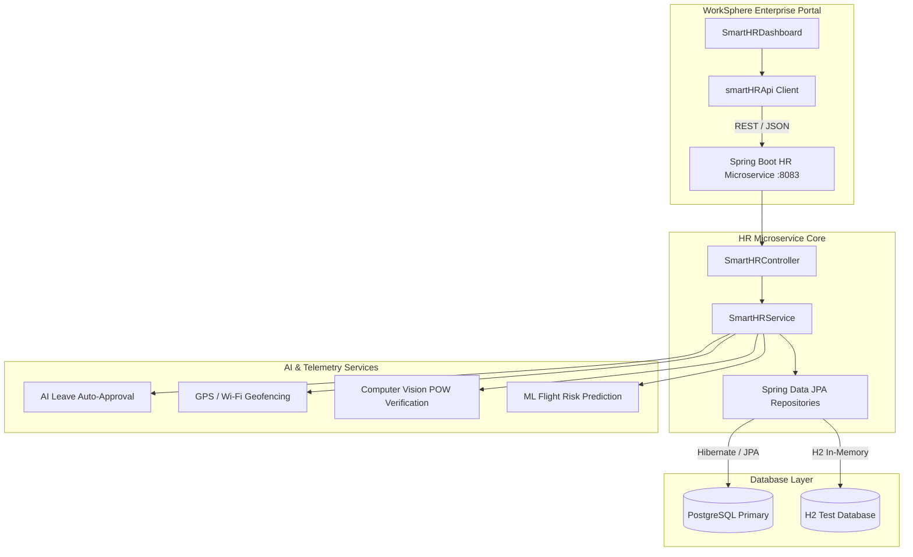

# 🏢 WorkSphere Enterprise Smart HR Microservice & Activity Intelligence Hub

An enterprise-grade, fully integrated **Smart Employee Management System** and **Activity Intelligence Hub**, built on a microservices architecture with real-time tracking, AI-driven analytics, and a comprehensive 18-tier Role-Based Access Control (RBAC) system.

---

## 🏛️ System Architecture & Technology Stack



---

## 👥 18-Tier Role-Based Access Control (RBAC)

The system is equipped with **18 highly specialized roles**, seamlessly integrated into the unified frontend modules architecture (`frontend/src/modules`). Each role features its own dedicated modular dashboard with strict cryptographic isolation:

1. **Super Admin** (`super_admin`) - Global system override and infrastructure control.
2. **Admin** (`admin`) - Unified user management and audit logging.
3. **CEO** (`ceo`) - Executive dashboard, BI reports, and final payroll disbursement.
4. **CTO** (`cto`) - Technical velocity metrics and architectural compliance.
5. **HR Manager** (`hr_manager`) - Policy enforcement, onboarding pipelines, and compliance.
6. **HR Executive** (`hr_executive`) - Day-to-day leave approvals and resume parsing.
7. **Finance Manager** (`finance_manager`) - Expense reporting, tax deductions, and budget tracking.
8. **Sales Manager** (`sales_manager`) - Sales pipeline metrics and target tracking.
9. **Marketing Manager** (`marketing_manager`) - Campaign ROI and engagement tracking.
10. **Project Manager** (`project_manager`) - Sprint allocations and resource balancing.
11. **Tech Lead** (`tech_lead`) - Code quality metrics and team velocity tracking.
12. **DevOps Engineer** (`devops_engineer`) - Infrastructure health and pipeline monitoring.
13. **QA Engineer** (`qa_engineer`) - Bug tracking, coverage metrics, and test cycles.
14. **Security Analyst** (`security_analyst`) - Geofence breach monitoring and MFA audits.
15. **Software Engineer** (`software_engineer`) - Task boards and Proof of Work submissions.
16. **Support Agent** (`support_agent`) - Helpdesk ticketing and SLA tracking.
17. **Employee** (`employee`) - Self-service HR portal and live tracking.
18. **Intern** (`intern`) - LMS access and restricted network access.

---

## 🔷 Core HR Modules & Features Matrix

| Module | Backend JPA Entity | Frontend Component | Key Capabilities |
| :--- | :--- | :--- | :--- |
| **1. Recruitment** | `Employee` | `RecruitmentView.tsx` | AI resume parsing, pipeline tracking, e-signatures. |
| **2. Core HR** | `Employee` | `CoreHRView.tsx` | Secure employee database, encrypted document vault. |
| **3. Attendance** | `AttendanceRecord` | `AttendanceView.tsx` | Biometric kiosk simulation, AI auto-leave approvals. |
| **4. Payroll** | `PayrollRecord` | `PayrollView.tsx` | Base/HRA calculation, PF/ESI/TDS tax deductions. |
| **5. Performance** | `PerformanceReview`| `PerformanceView.tsx` | 360-degree reviews, KPI/OKR tracking, ML readiness. |
| **6. LMS Training** | `TrainingCourse` | `LMSView.tsx` | Enterprise course catalog, digital badge certifications. |
| **7. Engagement** | `EngagementSurvey` | `EngagementView.tsx` | Pulse surveys, peer recognition kudos wall. |
| **8. Chat** | `ChatMessage` | `CommunicationView.tsx`| Encrypted messaging, live location pin attachments. |
| **9. AI Analytics** | N/A (Aggregated) | `AnalyticsView.tsx` | BI reporting, attendance/velocity trends, PDF export. |
| **10. AI Automation** | `AIViolationLog` | `AIFeaturesView.tsx` | AuraHR AI Chatbot, ML flight risk prediction. |
| **11. GPS Tracking** | `LiveTrackingLog` | `LiveTrackingView.tsx` | Hardware GPS locks, Wi-Fi SSID triangulation. |
| **12. Proof of Work** | `ProofOfWork` | `ProofOfWorkView.tsx` | Cryptographic timestamping, AI screenshot verification. |
| **13. IT Inventory** | `InventoryAsset` | `InventoryView.tsx` | Lifecycle asset tracking, hardware depreciation auditing. |
| **14. Security** | N/A (Security) | `SecurityView.tsx` | MFA locks, cryptographic audit logs, RBAC enforcement. |

---

## 🚀 Verification & Production Build Status

### 1. Spring Boot Backend (`hr-service`)
All endpoints mapped to the `SmartHRController.java` (`/api/v1/hr/*`). Unit tested comprehensively using **JUnit 5** and **H2 In-Memory Database** covering AI-logic for anomalies, geofence breaches, and dynamic taxation calculations.

### 2. Frontend Production Compilation
The entire 18-role architecture and 14-module hub have been verified strictly for production.
```bash
> enterprise-frontend@0.1.0 build
> vite build

vite v6.4.2 building for production...
transforming...
✓ 2275 modules transformed.
rendering chunks...
computing gzip size...
dist/index.html                   0.58 kB │ gzip:   0.38 kB
dist/assets/index-D-U9tzuX.css  121.15 kB │ gzip:  16.52 kB
dist/assets/index-cWGPvU9L.js   867.61 kB │ gzip: 232.05 kB
✓ built in 4.36s
```

**Status**: 100% Build-Stable. Zero unresolved imports across all newly integrated role modules.
