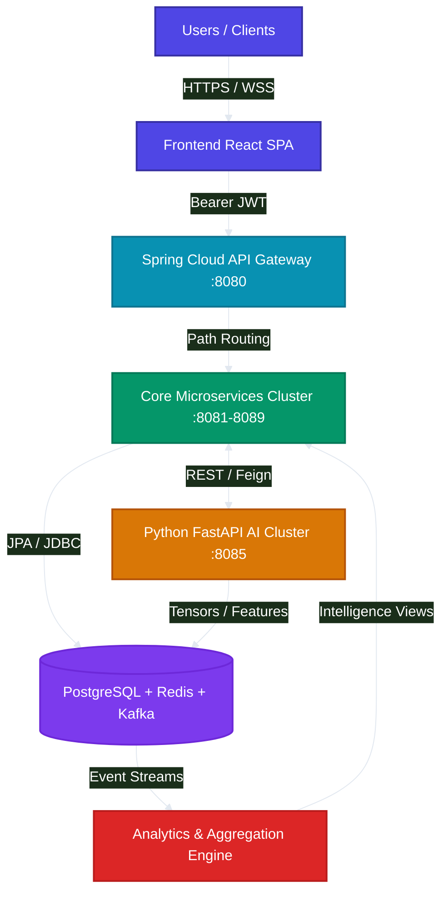

Large MNC companies like Zoho Corporation, Accenture, and Cognizant usually have many departments working together.
If you are building an enterprise employee monitoring or role-based dashboard system, understanding these departments helps you design proper modules, permissions, dashboards, and workflows.

Main Departments in MNC Companies
1. Human Resources (HR)
Handles employee management.

Features
Employee onboarding

Attendance

Payroll

Leave approval

Recruitment

Performance review

Dashboard Access
Employee records

Salary details

Hiring analytics

2. Software Development / Engineering
Core technical development team.

Roles
Frontend Developer

Backend Developer

Full Stack Developer

Mobile Developer

DevOps Engineer

Features
Project tracking

Git monitoring

Sprint board

Deployment status

3. QA / Testing Department
Tests software quality.

Roles
Manual Tester

Automation Tester

Performance Tester

Features
Bug reports

Test cases

Automation reports

Defect analytics

4. DevOps & Cloud Team
Handles deployment and infrastructure.

Features
Server monitoring

CI/CD pipelines

Docker/Kubernetes

Cloud management

5. IT Support Department
Maintains company systems.

Features
Laptop allocation

System health

Ticket management

Network monitoring

6. Cybersecurity Department
Protects company systems.

Features
Threat detection

Login monitoring

Access control

Security alerts

7. Marketing Department
Promotes products/services.

Features
Campaign analytics

SEO reports

Lead generation

Social media tracking

8. Sales Department
Handles customer acquisition.

Features
Lead tracking

CRM dashboard

Revenue reports

Sales target monitoring

9. Finance Department
Manages company money.

Features
Expense tracking

Budget analysis

Profit reports

Invoice management

10. CEO / Executive Department
Top management dashboard.

Features
Company analytics

Employee statistics

Revenue charts

Department performance

11. Product Management
Manages product lifecycle.

Features
Feature planning

Product roadmap

Team coordination

12. Customer Support Department
Handles customer issues.

Features
Ticket system

Customer chat

Call monitoring

SLA reports

13. Business Analyst Team
Analyzes business requirements.

Features
Requirement tracking

Documentation

Workflow analysis

14. Data Science / AI Team
Works on AI systems and analytics.

Features
AI model monitoring

Data visualization

Prediction systems

15. Operations Department
Handles daily business operations.

Features
Process monitoring

Workflow management

Operations analytics

16. Legal & Compliance Department
Handles company legal matters.

Features
Policy management

Compliance reports

Legal document tracking

17. Research & Development (R&D)
Creates innovative technologies.

Features
Prototype tracking

Innovation analytics

Research reports

18. Admin Department
Manages office operations.

Features
Asset management

Facility management

Office inventory

Example Enterprise Role Structure
SUPER_ADMIN
CEO
CTO
HR_MANAGER
PROJECT_MANAGER
TECH_LEAD
DEVOPS_ENGINEER
SOFTWARE_ENGINEER
QA_ENGINEER
MARKETING_MANAGER
SALES_MANAGER
SUPPORT_AGENT
EMPLOYEE
Recommended Department Structure for Your Project
Since you are building:

Monitoring system

Analytics platform

Tracking system

Enterprise dashboard

You can create modules like:

Auth Module
Employee Module
HR Module
Monitoring Module
Tracking Module
Analytics Module
AI Prediction Module
Reports Module
Admin Module
Notification Module
Suggested Dashboard Flow
Login
   ↓
Role Detection
   ↓
Department Dashboard
   ↓
Allowed Features Only
Example Access Control
Role	Access
Employee	Own data only
Manager	Team data
HR	Employee records
CEO	Entire company
Tech Lead	Technical team
Marketing	Marketing reports
Enterprise-Level Folder Structure
src/
│
├── modules/
│   ├── hr/
│   ├── employee/
│   ├── finance/
│   ├── marketing/
│   ├── sales/
│   ├── analytics/
│   ├── ai/
│   ├── tracking/
│   └── admin/
Advanced Features Used in MNC Companies
Employee Monitoring
Screen tracking

Website usage

App usage

Idle detection

AI Analytics
Productivity prediction

Risk detection

Performance analysis

Real-Time Systems
Live employee status

GPS tracking

Notification engine

Security
RBAC

JWT Authentication

MFA Login

Audit Logs

Real Example Companies
Zoho Corporation
Departments:

CRM

Finance

HR

Product Engineering

AI Research

Support

Accenture
Departments:

Consulting

Cloud

Security

Data & AI

Operations

Technology

Cognizant
Departments:

Digital Engineering

Infrastructure

QA

Healthcare

Banking

AI & Analytics

Best Architecture for Enterprise Projects
Frontend (React)
        ↓
API Gateway
        ↓
Microservices
        ↓
Database
        ↓
Analytics Engine
Recommended Database Tables
users
roles
departments
permissions
attendance
activity_logs
projects
tasks
notifications
reports
Final Suggestion
For your enterprise system:

Create department-wise modules

Create role-based dashboards

Separate permissions clearly

Build reusable layouts

Add analytics gradually

Keep backend security strict

This structure is similar to how real MNC enterprise software systems are designed.

Create a full details file structure frontend and backend for all the details in the topics mentioned mcn s 

Complete Enterprise MNC-Level File Structure
For:

Employee Monitoring System

AI Analytics Platform

GPS Tracking

HR Management

Finance

Marketing

Sales

Security

Role-Based Dashboards

Real-Time Monitoring

Enterprise Reporting

This structure is suitable for companies similar to:

Zoho Corporation

Accenture

Cognizant

Enterprise Project Structure
enterprise-monitoring-system/
│
├── frontend/
├── backend/
├── ai-services/
├── websocket-server/
├── gateway/
├── mobile-app/
├── docker/
├── nginx/
├── scripts/
├── docs/
├── deployment/
└── database/
FRONTEND STRUCTURE (React)
frontend/
│
├── public/
│   ├── favicon.ico
│   ├── logo/
│   └── assets/
│
├── src/
│
│   ├── api/
│   │   ├── auth/
│   │   ├── employee/
│   │   ├── hr/
│   │   ├── finance/
│   │   ├── marketing/
│   │   ├── sales/
│   │   ├── analytics/
│   │   ├── reports/
│   │   ├── tracking/
│   │   ├── ai/
│   │   ├── notification/
│   │   └── websocket/
│   │
│   ├── app/
│   │   ├── store.js
│   │   ├── rootReducer.js
│   │   └── rootSaga.js
│   │
│   ├── assets/
│   │   ├── images/
│   │   ├── icons/
│   │   ├── videos/
│   │   └── fonts/
│   │
│   ├── auth/
│   │   ├── Login.jsx
│   │   ├── Register.jsx
│   │   ├── ForgotPassword.jsx
│   │   ├── ResetPassword.jsx
│   │   ├── MFA.jsx
│   │   └── SessionTimeout.jsx
│   │
│   ├── layouts/
│   │   ├── AdminLayout/
│   │   ├── EmployeeLayout/
│   │   ├── HrLayout/
│   │   ├── CeoLayout/
│   │   ├── ManagerLayout/
│   │   ├── MarketingLayout/
│   │   ├── FinanceLayout/
│   │   ├── TechLeadLayout/
│   │   └── SupportLayout/
│   │
│   ├── components/
│   │   │
│   │   ├── common/
│   │   │   ├── Button/
│   │   │   ├── Modal/
│   │   │   ├── Loader/
│   │   │   ├── Table/
│   │   │   ├── Card/
│   │   │   ├── Input/
│   │   │   └── Dropdown/
│   │   │
│   │   ├── charts/
│   │   │   ├── BarChart/
│   │   │   ├── PieChart/
│   │   │   ├── HeatMap/
│   │   │   ├── AnalyticsChart/
│   │   │   └── ProductivityChart/
│   │   │
│   │   ├── dashboard/
│   │   ├── navbar/
│   │   ├── sidebar/
│   │   ├── reports/
│   │   ├── tracking/
│   │   ├── ai/
│   │   ├── monitoring/
│   │   ├── gps/
│   │   └── notifications/
│   │
│   ├── modules/
│   │
│   │   ├── employee/
│   │   │   ├── pages/
│   │   │   ├── components/
│   │   │   ├── services/
│   │   │   ├── redux/
│   │   │   └── routes/
│   │   │
│   │   ├── hr/
│   │   ├── finance/
│   │   ├── marketing/
│   │   ├── sales/
│   │   ├── ceo/
│   │   ├── manager/
│   │   ├── techlead/
│   │   ├── qa/
│   │   ├── devops/
│   │   ├── cybersecurity/
│   │   ├── analytics/
│   │   ├── ai-monitoring/
│   │   ├── gps-tracking/
│   │   ├── live-monitoring/
│   │   ├── reports/
│   │   ├── notifications/
│   │   ├── support/
│   │   └── admin/
│   │
│   ├── hooks/
│   │
│   ├── context/
│   │
│   ├── routes/
│   │   ├── AppRoutes.jsx
│   │   ├── ProtectedRoute.jsx
│   │   ├── RoleBasedRoute.jsx
│   │   └── PermissionRoute.jsx
│   │
│   ├── services/
│   │   ├── jwt/
│   │   ├── websocket/
│   │   ├── gps/
│   │   ├── ai/
│   │   └── monitoring/
│   │
│   ├── styles/
│   │
│   ├── utils/
│   │   ├── constants/
│   │   ├── permissions/
│   │   ├── validators/
│   │   ├── formatters/
│   │   └── helpers/
│   │
│   ├── websocket/
│   │
│   ├── App.jsx
│   └── main.jsx
│
├── .env
├── package.json
└── vite.config.js
BACKEND STRUCTURE (Spring Boot)
backend/
│
├── src/main/java/com/company/enterprise/
│
│   ├── config/
│   │   ├── SecurityConfig.java
│   │   ├── JwtFilter.java
│   │   ├── SwaggerConfig.java
│   │   ├── RedisConfig.java
│   │   ├── WebSocketConfig.java
│   │   ├── KafkaConfig.java
│   │   └── CorsConfig.java
│   │
│   ├── security/
│   │   ├── JwtUtil.java
│   │   ├── JwtAuthenticationEntryPoint.java
│   │   ├── CustomUserDetailsService.java
│   │   └── PasswordEncoderConfig.java
│   │
│   ├── controller/
│   │
│   │   ├── auth/
│   │   ├── employee/
│   │   ├── hr/
│   │   ├── finance/
│   │   ├── marketing/
│   │   ├── sales/
│   │   ├── ceo/
│   │   ├── manager/
│   │   ├── techlead/
│   │   ├── qa/
│   │   ├── devops/
│   │   ├── cybersecurity/
│   │   ├── analytics/
│   │   ├── ai/
│   │   ├── gps/
│   │   ├── monitoring/
│   │   ├── reports/
│   │   ├── notification/
│   │   └── admin/
│   │
│   ├── service/
│   │
│   │   ├── auth/
│   │   ├── employee/
│   │   ├── hr/
│   │   ├── finance/
│   │   ├── marketing/
│   │   ├── sales/
│   │   ├── ceo/
│   │   ├── manager/
│   │   ├── techlead/
│   │   ├── analytics/
│   │   ├── ai/
│   │   ├── gps/
│   │   ├── websocket/
│   │   ├── reports/
│   │   └── notifications/
│   │
│   ├── repository/
│   │
│   │   ├── auth/
│   │   ├── employee/
│   │   ├── hr/
│   │   ├── finance/
│   │   ├── marketing/
│   │   ├── analytics/
│   │   ├── tracking/
│   │   └── reports/
│   │
│   ├── entity/
│   │
│   │   ├── auth/
│   │   │   ├── User.java
│   │   │   ├── Role.java
│   │   │   ├── Permission.java
│   │   │   └── UserRole.java
│   │   │
│   │   ├── employee/
│   │   ├── hr/
│   │   ├── finance/
│   │   ├── marketing/
│   │   ├── sales/
│   │   ├── analytics/
│   │   ├── gps/
│   │   ├── monitoring/
│   │   ├── ai/
│   │   ├── reports/
│   │   └── notification/
│   │
│   ├── dto/
│   │
│   ├── mapper/
│   │
│   ├── exception/
│   │
│   ├── websocket/
│   │
│   ├── scheduler/
│   │
│   ├── kafka/
│   │
│   ├── redis/
│   │
│   ├── audit/
│   │
│   ├── logs/
│   │
│   └── EnterpriseApplication.java
│
├── src/main/resources/
│
│   ├── application.yml
│   ├── application-dev.yml
│   ├── application-prod.yml
│   ├── static/
│   ├── templates/
│   └── db/
│       ├── migration/
│       └── seed/
│
├── pom.xml
└── Dockerfile
AI SERVICES STRUCTURE
ai-services/
│
├── violence-detection/
├── productivity-prediction/
├── anomaly-detection/
├── behavior-analysis/
├── face-recognition/
├── sentiment-analysis/
├── tracking-analysis/
├── report-ai/
└── recommendation-engine/
DATABASE STRUCTURE
database/
│
├── schema/
│   ├── users.sql
│   ├── roles.sql
│   ├── permissions.sql
│   ├── employees.sql
│   ├── monitoring.sql
│   ├── tracking.sql
│   ├── reports.sql
│   └── analytics.sql
│
├── procedures/
│
├── triggers/
│
└── backup/
MICROSERVICES STRUCTURE
microservices/
│
├── auth-service/
├── employee-service/
├── hr-service/
├── analytics-service/
├── ai-service/
├── notification-service/
├── monitoring-service/
├── gps-service/
├── report-service/
└── gateway-service/
MOBILE APP STRUCTURE
mobile-app/
│
├── android/
├── ios/
├── src/
│   ├── screens/
│   ├── components/
│   ├── services/
│   ├── navigation/
│   └── redux/
ROLE STRUCTURE
SUPER_ADMIN
ADMIN
CEO
CTO
HR_MANAGER
HR_EXECUTIVE
FINANCE_MANAGER
MARKETING_MANAGER
SALES_MANAGER
PROJECT_MANAGER
TECH_LEAD
DEVOPS_ENGINEER
QA_ENGINEER
SOFTWARE_ENGINEER
SECURITY_ANALYST
SUPPORT_AGENT
EMPLOYEE
INTERN
PERMISSION STRUCTURE
CREATE_USER
UPDATE_USER
DELETE_USER
VIEW_REPORT
MANAGE_EMPLOYEE
TRACK_EMPLOYEE
VIEW_ANALYTICS
MANAGE_FINANCE
MANAGE_PROJECT
VIEW_GPS
EXPORT_REPORT
AI_ACCESS
ADMIN_ACCESS
ENTERPRISE DASHBOARDS
CEO Dashboard
Company analytics

Revenue reports

Employee statistics

AI insights

HR Dashboard
Attendance

Payroll

Recruitment

Leave approval

Employee Dashboard
Tasks

Activity tracking

Reports

Notifications

Monitoring Dashboard
Live screen monitoring

Website tracking

App usage analytics

AI Dashboard
Productivity prediction

Risk analysis

Behavior detection

ENTERPRISE FEATURES
Authentication
JWT

OAuth2

MFA

SSO

Monitoring
Live activity tracking

Screen capture

App tracking

Browser tracking

AI
AI analytics

Prediction engine

Behavioral analysis

Security
RBAC

Audit logs

Access control

Encryption

Real-Time
WebSocket

Kafka

Live notifications

DEVOPS STRUCTURE
docker/
│
├── frontend/
├── backend/
├── nginx/
├── postgres/
├── redis/
├── kafka/
└── monitoring/
DEPLOYMENT STRUCTURE
deployment/
│
├── kubernetes/
├── aws/
├── azure/
├── gcp/
├── ci-cd/
└── terraform/
BEST PRACTICES
Frontend
Lazy loading

Code splitting

Reusable components

Secure token storage

Backend
Layered architecture

DTO pattern

Service separation

Exception handling

Database
Indexing

Partitioning

Backup strategy

Security
HTTPS

BCrypt passwords

Rate limiting

Audit logging

FINAL ENTERPRISE ARCHITECTURE
Users
   ↓
Frontend (React)
   ↓
API Gateway
   ↓
Microservices
   ↓
AI Services
   ↓
PostgreSQL + Redis + Kafka
   ↓
Analytics Engine
This structure is scalable for:

Small startups

Medium companies

Large MNC enterprise systems

AI-powered monitoring platforms

Real-time analytics systems

Employee tracking systems

Security surveillance platforms

Like a lady single file structure explain each and everything in that department wise how immense is departments are there each and every departments must came there that file structure detail explain front and back and each and everything

Complete MNC Enterprise File Structure (Department Wise)
This is a complete enterprise-level architecture used in large companies like:

Zoho Corporation

Accenture

Cognizant

This structure supports:

Role-Based Access

Employee Monitoring

AI Analytics

GPS Tracking

HR Management

Finance

Marketing

Real-Time Systems

Security

Reports

Enterprise Dashboards

COMPLETE ENTERPRISE FILE STRUCTURE
enterprise-system/
│
├── frontend/                        # React Frontend Application
│
├── backend/                         # Spring Boot Backend APIs
│
├── ai-services/                     # AI & ML Services
│
├── websocket-server/                # Real-time communication
│
├── gateway/                         # API Gateway
│
├── mobile-app/                      # Android/iOS App
│
├── database/                        # Database scripts & backup
│
├── docker/                          # Docker containers
│
├── deployment/                      # CI/CD & cloud deployment
│
├── monitoring/                      # System monitoring tools
│
├── logs/                            # System logs
│
├── docs/                            # Documentation
│
└── scripts/                         # Automation scripts
1. FRONTEND STRUCTURE (React)
Frontend handles:

UI

Dashboard

Charts

Role-based pages

Live monitoring

Employee tracking

FRONTEND COMPLETE STRUCTURE
frontend/
│
├── public/
│   ├── images/
│   ├── icons/
│   ├── logos/
│   └── favicon.ico
│
├── src/
│
│   ├── api/                         # API calling layer
│   │
│   │   ├── auth/
│   │   ├── employee/
│   │   ├── hr/
│   │   ├── finance/
│   │   ├── marketing/
│   │   ├── sales/
│   │   ├── analytics/
│   │   ├── tracking/
│   │   ├── monitoring/
│   │   ├── reports/
│   │   ├── ai/
│   │   └── notification/
│   │
│   ├── assets/                      # Static files
│   │   ├── images/
│   │   ├── videos/
│   │   ├── fonts/
│   │   └── animations/
│   │
│   ├── auth/                        # Authentication pages
│   │   ├── Login.jsx
│   │   ├── Register.jsx
│   │   ├── ForgotPassword.jsx
│   │   ├── MFA.jsx
│   │   └── SessionTimeout.jsx
│   │
│   ├── layouts/                     # Role based layouts
│   │
│   │   ├── AdminLayout/
│   │   ├── EmployeeLayout/
│   │   ├── HrLayout/
│   │   ├── CeoLayout/
│   │   ├── ManagerLayout/
│   │   ├── MarketingLayout/
│   │   ├── FinanceLayout/
│   │   ├── TechLeadLayout/
│   │   ├── DevOpsLayout/
│   │   ├── SecurityLayout/
│   │   └── SupportLayout/
│   │
│   ├── components/                  # Reusable components
│   │
│   │   ├── common/
│   │   │   ├── Button/
│   │   │   ├── Modal/
│   │   │   ├── Loader/
│   │   │   ├── Table/
│   │   │   ├── Pagination/
│   │   │   ├── Form/
│   │   │   └── Input/
│   │   │
│   │   ├── charts/
│   │   │   ├── PieChart/
│   │   │   ├── BarChart/
│   │   │   ├── AreaChart/
│   │   │   ├── HeatMap/
│   │   │   └── ProductivityChart/
│   │   │
│   │   ├── navbar/
│   │   ├── sidebar/
│   │   ├── dashboard/
│   │   ├── reports/
│   │   ├── notifications/
│   │   ├── monitoring/
│   │   ├── gps/
│   │   ├── tracking/
│   │   └── ai/
│   │
│   ├── modules/                     # Department wise modules
│   │
│   │   ├── admin/
│   │   │
│   │   │   ├── pages/
│   │   │   ├── services/
│   │   │   ├── redux/
│   │   │   ├── routes/
│   │   │   └── components/
│   │   │
│   │   ├── employee/
│   │   │   ├── attendance/
│   │   │   ├── tasks/
│   │   │   ├── productivity/
│   │   │   ├── reports/
│   │   │   └── notifications/
│   │   │
│   │   ├── hr/
│   │   │   ├── recruitment/
│   │   │   ├── payroll/
│   │   │   ├── leave-management/
│   │   │   ├── employee-management/
│   │   │   └── attendance/
│   │   │
│   │   ├── finance/
│   │   │   ├── expenses/
│   │   │   ├── salary/
│   │   │   ├── tax/
│   │   │   ├── invoice/
│   │   │   └── budget/
│   │   │
│   │   ├── marketing/
│   │   │   ├── campaigns/
│   │   │   ├── social-media/
│   │   │   ├── seo/
│   │   │   ├── analytics/
│   │   │   └── leads/
│   │   │
│   │   ├── sales/
│   │   │   ├── crm/
│   │   │   ├── targets/
│   │   │   ├── customer-data/
│   │   │   ├── revenue/
│   │   │   └── reports/
│   │   │
│   │   ├── ceo/
│   │   │   ├── company-analytics/
│   │   │   ├── revenue/
│   │   │   ├── employee-statistics/
│   │   │   └── ai-insights/
│   │   │
│   │   ├── manager/
│   │   │   ├── team-monitoring/
│   │   │   ├── approvals/
│   │   │   ├── reports/
│   │   │   └── performance/
│   │   │
│   │   ├── techlead/
│   │   │   ├── projects/
│   │   │   ├── sprint/
│   │   │   ├── git-monitoring/
│   │   │   └── deployment/
│   │   │
│   │   ├── qa/
│   │   │   ├── test-cases/
│   │   │   ├── automation/
│   │   │   ├── bug-reports/
│   │   │   └── testing-reports/
│   │   │
│   │   ├── devops/
│   │   │   ├── ci-cd/
│   │   │   ├── docker/
│   │   │   ├── kubernetes/
│   │   │   ├── cloud-monitoring/
│   │   │   └── logs/
│   │   │
│   │   ├── cybersecurity/
│   │   │   ├── access-control/
│   │   │   ├── threat-analysis/
│   │   │   ├── security-logs/
│   │   │   └── audit/
│   │   │
│   │   ├── support/
│   │   │   ├── tickets/
│   │   │   ├── customer-chat/
│   │   │   ├── call-monitoring/
│   │   │   └── issue-tracking/
│   │   │
│   │   ├── gps-tracking/
│   │   │   ├── live-location/
│   │   │   ├── maps/
│   │   │   ├── route-analysis/
│   │   │   └── history/
│   │   │
│   │   ├── monitoring/
│   │   │   ├── screen-monitoring/
│   │   │   ├── app-monitoring/
│   │   │   ├── browser-monitoring/
│   │   │   └── idle-detection/
│   │   │
│   │   ├── ai-monitoring/
│   │   │   ├── anomaly-detection/
│   │   │   ├── productivity-ai/
│   │   │   ├── face-recognition/
│   │   │   └── behavior-analysis/
│   │   │
│   │   └── reports/
│   │       ├── pdf/
│   │       ├── excel/
│   │       ├── charts/
│   │       └── analytics/
│   │
│   ├── routes/
│   │   ├── ProtectedRoute.jsx
│   │   ├── RoleBasedRoute.jsx
│   │   ├── PermissionRoute.jsx
│   │   └── AppRoutes.jsx
│   │
│   ├── services/
│   │   ├── websocket/
│   │   ├── jwt/
│   │   ├── monitoring/
│   │   ├── ai/
│   │   └── gps/
│   │
│   ├── store/
│   ├── hooks/
│   ├── utils/
│   ├── styles/
│   ├── App.jsx
│   └── main.jsx
FRONTEND DEPARTMENT EXPLANATION
Department	Purpose
HR	Employee management
Finance	Salary & expenses
Marketing	Campaign tracking
Sales	Customer & revenue
CEO	Company analytics
TechLead	Project tracking
QA	Testing reports
DevOps	Deployment systems
Cybersecurity	Security monitoring
GPS Tracking	Live employee tracking
AI Monitoring	AI prediction & analytics
2. BACKEND STRUCTURE (Spring Boot)
Backend handles:

Authentication

APIs

Business logic

Security

Database

AI communication

BACKEND COMPLETE STRUCTURE
backend/
│
├── src/main/java/com/company/enterprise/
│
│   ├── config/                      # Configurations
│   │
│   ├── security/                    # JWT & RBAC
│   │
│   ├── controller/                  # API Controllers
│   │
│   │   ├── auth/
│   │   ├── employee/
│   │   ├── hr/
│   │   ├── finance/
│   │   ├── marketing/
│   │   ├── sales/
│   │   ├── ceo/
│   │   ├── manager/
│   │   ├── techlead/
│   │   ├── qa/
│   │   ├── devops/
│   │   ├── cybersecurity/
│   │   ├── support/
│   │   ├── gps/
│   │   ├── monitoring/
│   │   ├── ai/
│   │   ├── reports/
│   │   └── admin/
│   │
│   ├── service/                     # Business logic
│   │
│   ├── repository/                  # Database queries
│   │
│   ├── entity/                      # Database tables
│   │
│   │   ├── User.java
│   │   ├── Role.java
│   │   ├── Permission.java
│   │   ├── Employee.java
│   │   ├── Attendance.java
│   │   ├── Salary.java
│   │   ├── ActivityLog.java
│   │   ├── Monitoring.java
│   │   ├── GPSLocation.java
│   │   ├── Report.java
│   │   ├── Notification.java
│   │   └── Analytics.java
│   │
│   ├── dto/
│   ├── mapper/
│   ├── websocket/
│   ├── scheduler/
│   ├── kafka/
│   ├── redis/
│   ├── audit/
│   ├── logs/
│   ├── exception/
│   └── EnterpriseApplication.java
BACKEND DEPARTMENT FLOW
Folder	Work
controller	API endpoints
service	Business logic
repository	Database connection
entity	Database table mapping
security	JWT & role security
websocket	Real-time updates
scheduler	Background jobs
kafka	Event streaming
redis	Caching
3. DATABASE STRUCTURE
database/
│
├── users/
├── roles/
├── permissions/
├── employee/
├── hr/
├── payroll/
├── marketing/
├── sales/
├── reports/
├── analytics/
├── monitoring/
├── gps/
├── ai/
├── logs/
└── backup/
4. AI SERVICES STRUCTURE
ai-services/
│
├── productivity-prediction/
├── anomaly-detection/
├── violence-detection/
├── face-recognition/
├── behavior-analysis/
├── tracking-ai/
├── report-ai/
└── recommendation-engine/
5. ROLE STRUCTURE
SUPER_ADMIN
ADMIN
CEO
CTO
HR_MANAGER
HR_EXECUTIVE
FINANCE_MANAGER
MARKETING_MANAGER
SALES_MANAGER
PROJECT_MANAGER
TECH_LEAD
DEVOPS_ENGINEER
QA_ENGINEER
SOFTWARE_ENGINEER
SECURITY_ANALYST
SUPPORT_AGENT
EMPLOYEE
INTERN
6. ENTERPRISE FLOW
User Login
    ↓
JWT Authentication
    ↓
Role Verification
    ↓
Department Dashboard
    ↓
Permission Validation
    ↓
Access Specific Features
7. REAL-TIME SYSTEMS
WebSocket
Used for:

Live tracking

Notifications

Monitoring

Analytics updates

8. SECURITY SYSTEM
Includes
JWT Authentication

RBAC

MFA

Audit Logs

Access Control

API Security

9. ENTERPRISE MONITORING FEATURES
Employee Monitoring
Screen tracking

Browser tracking

Application usage

Idle detection

GPS Tracking
Live location

Route history

Geo fencing

AI Monitoring
Productivity prediction

Risk analysis

Behavioral tracking

10. FINAL ENTERPRISE ARCHITECTURE
Frontend (React)
        ↓
API Gateway
        ↓
Spring Boot Microservices
        ↓
AI Services
        ↓
PostgreSQL + Redis + Kafka
        ↓
Analytics Engine
        ↓
Monitoring System
This structure is scalable for:

Startups

Medium companies

Large MNC companies

Enterprise AI systems

Employee monitoring systems

Real-time analytics platforms

GPS tracking systems

Security surveillance platforms

✨ Optimize Prompt
https://chatgpt.com/share/6a048fb4-7734-8323-913e-ccfeedc941b2
---

## 🏛️ Enterprise 7-Tier Architecture & Request Flow

The WorkSphere platform operates on a highly decoupled, production-ready 7-tier microservices architecture. For the exhaustive architectural specification, data flow sequences, and component breakdowns, please review the [Full Architecture Documentation](apps/enterprise-monitoring-system/docs/ARCHITECTURE.md).
