# WorkSphere Enterprise — Flow Diagrams

---

## 1. System Architecture Flow (7-Tier)

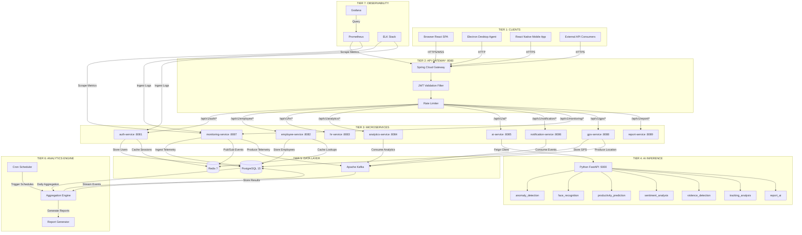

---

## 2. User Authentication & RBAC Flow

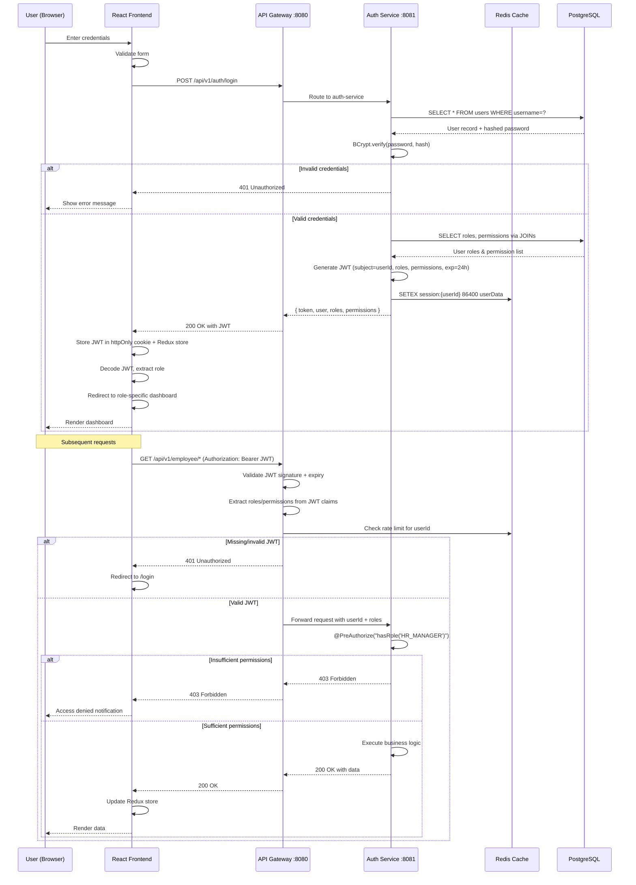

---

## 3. Desktop Agent Telemetry Flow

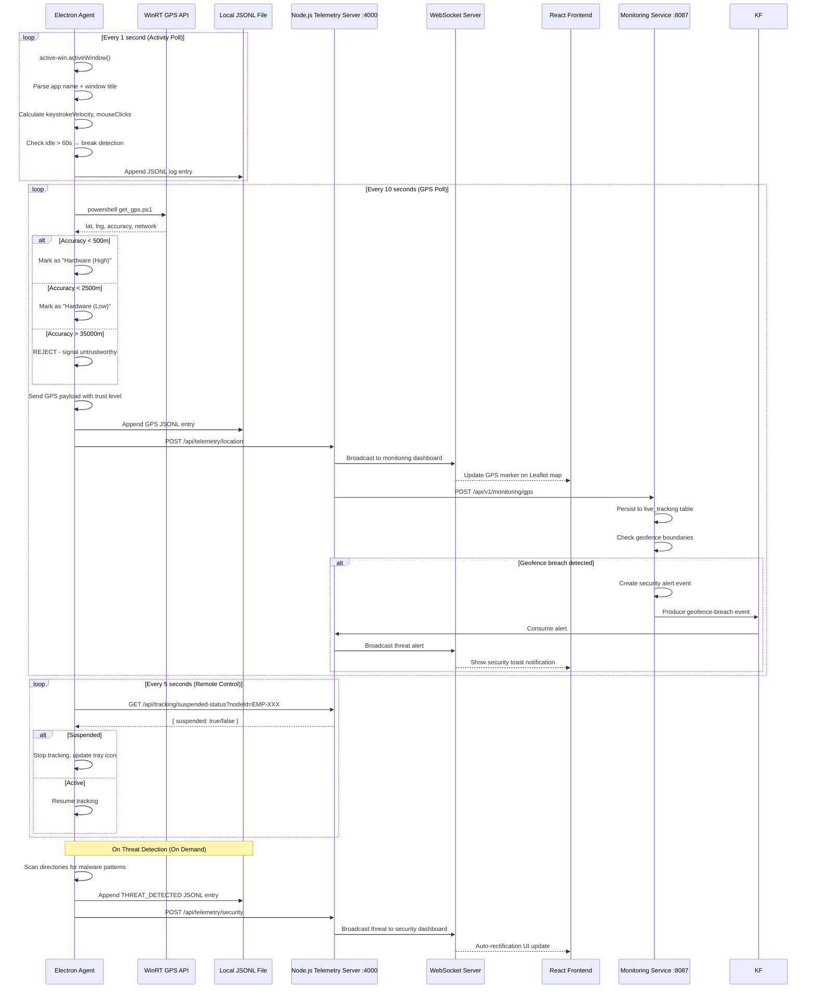

---

## 4. Kafka Event Streaming Flow

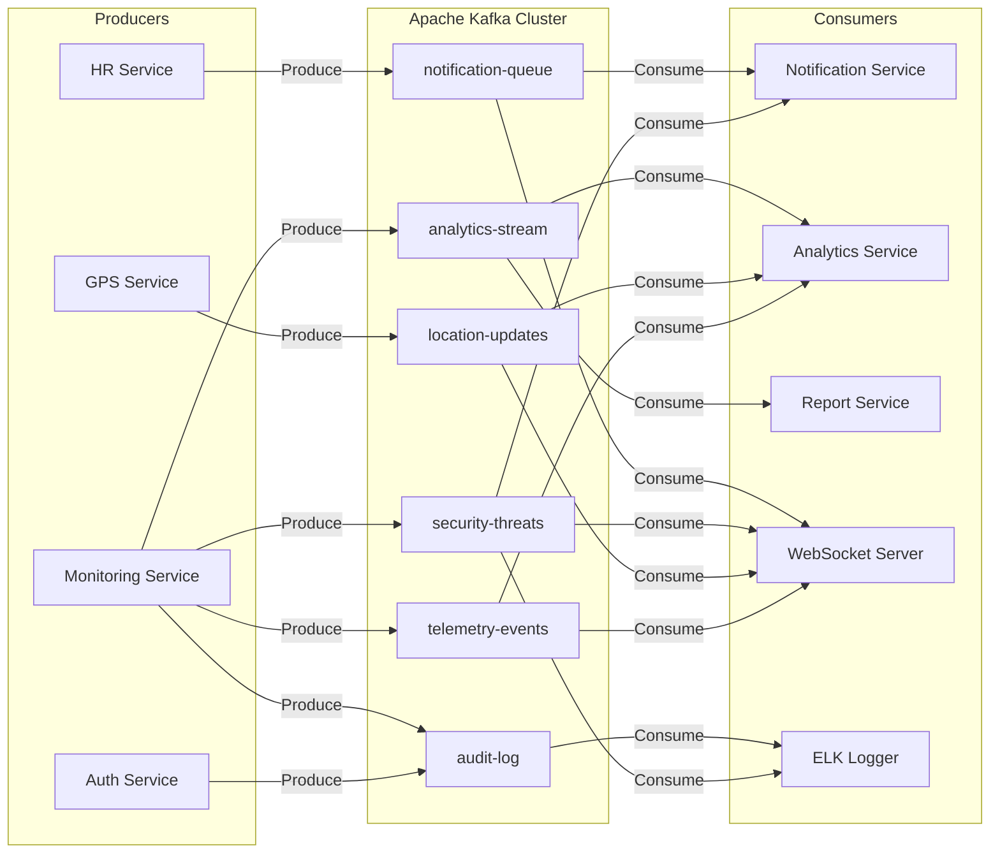

---

## 5. Database Migration & Schema Flow

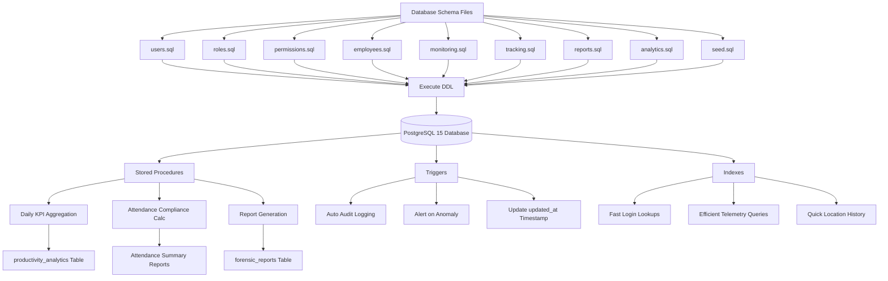

---

## 6. CI/CD Pipeline Flow

```mermaid
flowchart LR
    A[Developer Push] --> B[GitHub Repository]
    B --> C[GitHub Actions Trigger]

    subgraph CI["CI Pipeline"]
        C --> D[Checkout Code]
        D --> E[Setup Java 17 + Node 18 + Python 3.10]
        E --> F[Install Dependencies]
        F --> G1[Maven Build backend/]
        F --> G2[npm Build frontend/]
        F --> G3[pip Install ai-services/]
        G1 --> H1[Run Unit Tests JUnit 5]
        G2 --> H2[Run Lint ESLint]
        G3 --> H3[Run Python Tests pytest]
        H1 --> I1[SonarQube Analysis]
        H2 --> I1
        H3 --> I1
        I1 --> J{Quality Gate Pass?}
        J -->|No| K[Fail Build - Notify Team]
        J -->|Yes| L[Build Docker Images]
    end

    subgraph CD["CD Pipeline"]
        L --> M[Push to Container Registry]
        M --> N[Deploy to Dev K8s Cluster]
        N --> O[Run Integration Tests]
        O --> P{Tests Pass?}
        P -->|No| Q[Rollback Dev]
        P -->|Yes| R[Deploy to Staging]
        R --> S[Smoke Tests]
        S --> T{Smoke Pass?}
        T -->|No| U[Rollback Staging]
        T -->|Yes| V[Approve Production Deploy]
        V --> W[Blue/Green Deploy to Prod]
        W --> X[Health Check]
        X --> Y{Healthy?}
        Y -->|No| Z[Rollback to Green]
        Y -->|Yes| AA[Switch Traffic to Blue]
    end

    subgraph PostDeploy["Post-Deployment"]
        AA --> AB[Send Slack Notification]
        AB --> AC[Update Jira Tickets]
        AC --> AD[Prometheus Scrape New Version]
        AD --> AE[Grafana Dashboards Auto-Update]
    end
```

---

## 7. Frontend Component Data Flow

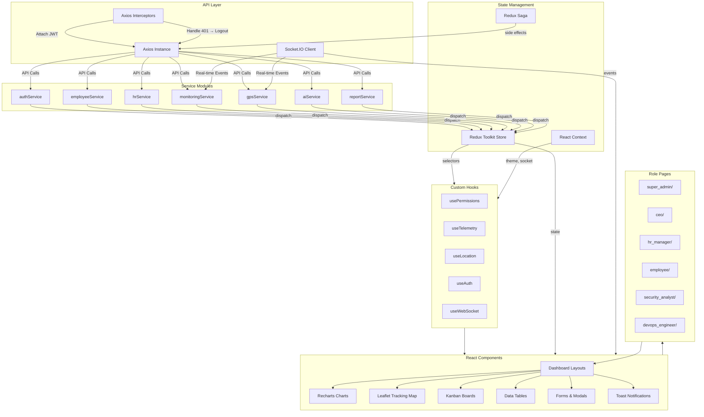

---

## 8. WebSocket Real-Time Event Flow

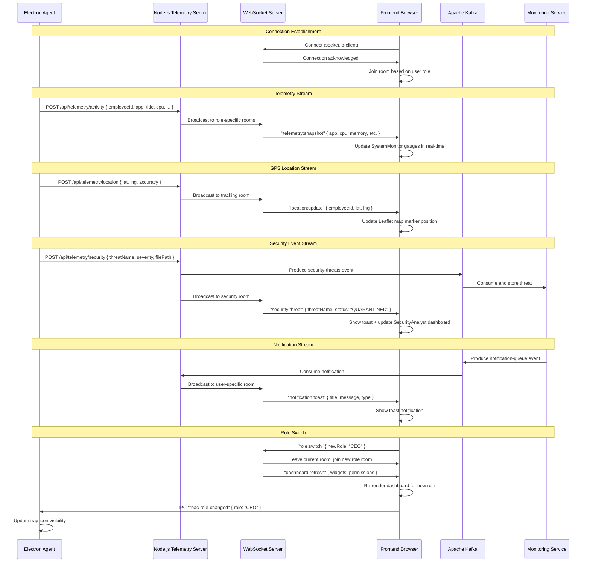

---

## 9. Deployment Architecture Flow

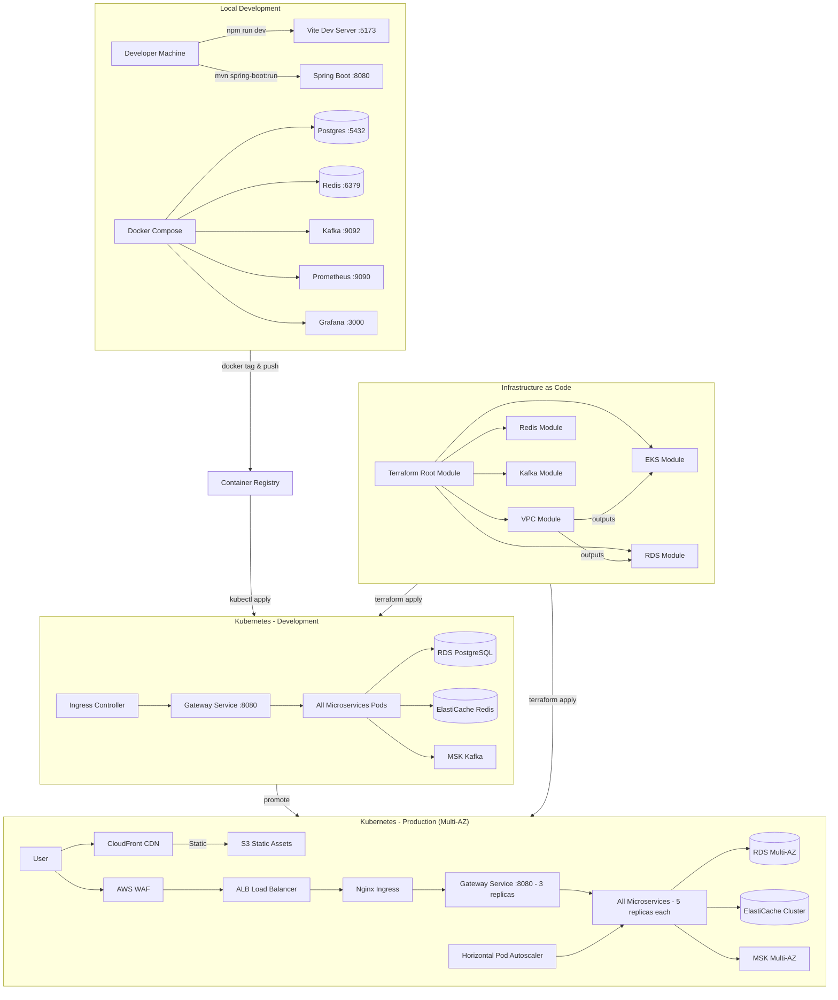

---

## 10. Role-Based Dashboard Navigation Flow

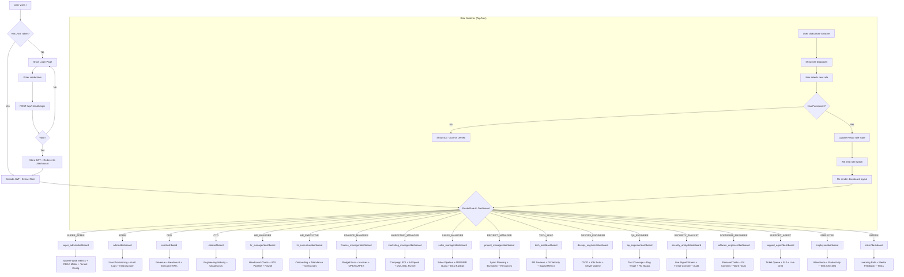

---

## 11. Microservices Inter-Communication Flow

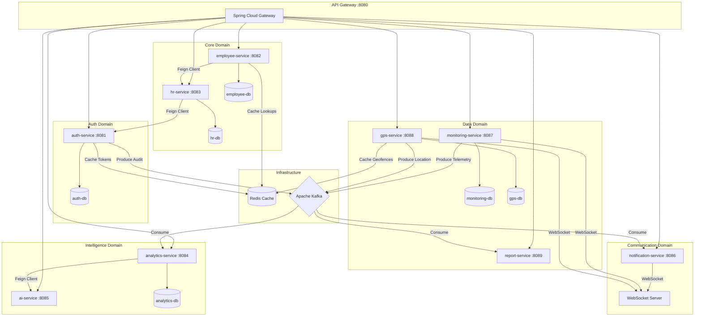

---

## 12. Data Flow: End-to-End Request Example

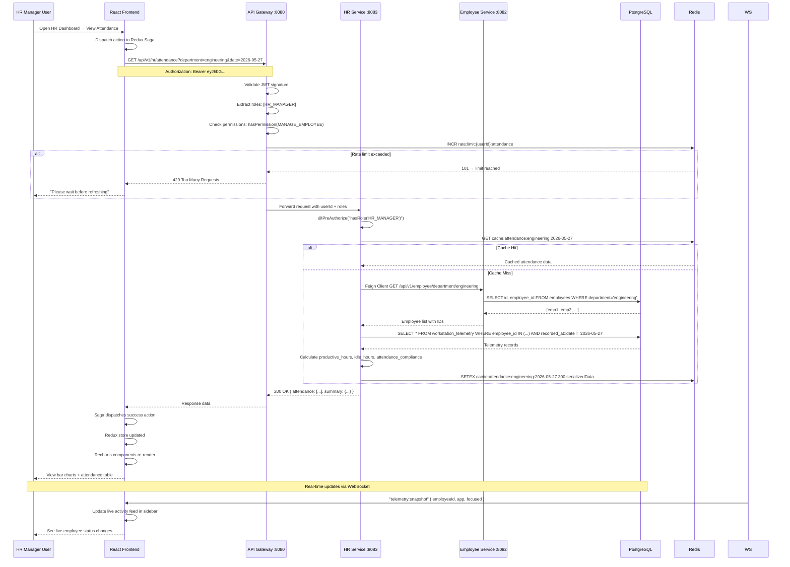

---

## Diagram Index

| # | Diagram | File Location | Description |
|---|---------|---------------|-------------|
| 1 | System Architecture (7-Tier) | `FLOW_DIAGRAMS.md` §1 | Full component topology from clients → observability |
| 2 | Auth & RBAC Flow | `FLOW_DIAGRAMS.md` §2 | Login sequence, JWT validation, role checking |
| 3 | Desktop Agent Telemetry | `FLOW_DIAGRAMS.md` §3 | Agent polling, GPS verification, threat detection |
| 4 | Kafka Event Streaming | `FLOW_DIAGRAMS.md` §4 | Producers, topics, consumers |
| 5 | Database Schema Flow | `FLOW_DIAGRAMS.md` §5 | DDL execution, procedures, triggers, indexes |
| 6 | CI/CD Pipeline | `FLOW_DIAGRAMS.md` §6 | Build → Test → Deploy → Monitor |
| 7 | Frontend Component Flow | `FLOW_DIAGRAMS.md` §7 | Redux, services, hooks, components |
| 8 | WebSocket Real-Time Events | `FLOW_DIAGRAMS.md` §8 | Live telemetry, GPS, security, notifications |
| 9 | Deployment Architecture | `FLOW_DIAGRAMS.md` §9 | Local → Dev K8s → Prod K8s → IaC |
| 10 | Role-Based Navigation | `FLOW_DIAGRAMS.md` §10 | Route resolution, 18 dashboards, role switcher |
| 11 | Microservices Communication | `FLOW_DIAGRAMS.md` §11 | Gateway routing, Feign clients, Kafka, Redis |
| 12 | End-to-End Data Flow | `FLOW_DIAGRAMS.md` §12 | HR attendance request: UI → Gateway → Services → DB → Cache → UI |
